# 🔗 Blockchain SCF API Flow Diagrams với Events Sync

This document contains Mermaid flow diagrams for all API endpoints across the **Multi-Peer Blockchain SCF System** with **gRPC Events Sync Architecture**.

## 📋 System Overview

### Architecture Components
- **Peer Services**: Independent microservices for each business role
  - `peer-anchor` (Port 8084): Contract creation + Events Sync
  - `peer-main-bank` (Port 8082): Bank approvals, token issuance + Events Sync
  - `peer-supplier` (Port 8083): Supplier approvals, token transfers & settlements + Events Sync
- **Orderer Cluster**: PBFT consensus + Events Sync handler
- **gRPC**: Direct communication between peers and orderer (SubmitTx + SubmitEvent)
- **MongoDB**: Dual-database architecture (blockchain_private + blockchain_public)

### Flow Patterns
- 🟢 **Start/End**: Process start or end
- 🔵 **Process**: Main business logic step
- 🟡 **Decision**: Conditional check
- 🟠 **Database**: Database operation (private peer DB)
- 🟣 **Response**: API response
- 🔴 **Error**: Error handling
- 🟡 **gRPC**: Direct communication (SubmitTx/SubmitEvent)
- 🏛️ **Orderer**: PBFT consensus & Events Sync
- 🔵 **Events Sync**: Synchronization to public blockchain

---

## 🔗 **Contract Management APIs**

### **Peer Anchor (Port 8084)**

### POST /contract/create - Anchor Creates Contract
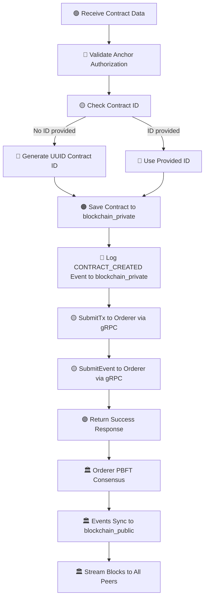

### **Peer Main Bank (Port 8082)**

### POST /contract/{id}/approve-bank - Bank Approves Contract & Issues Token
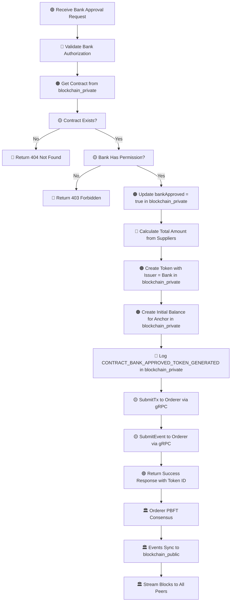

### **Peer Supplier (Port 8083)**

### POST /contract/{id}/approve - Supplier Approves Contract
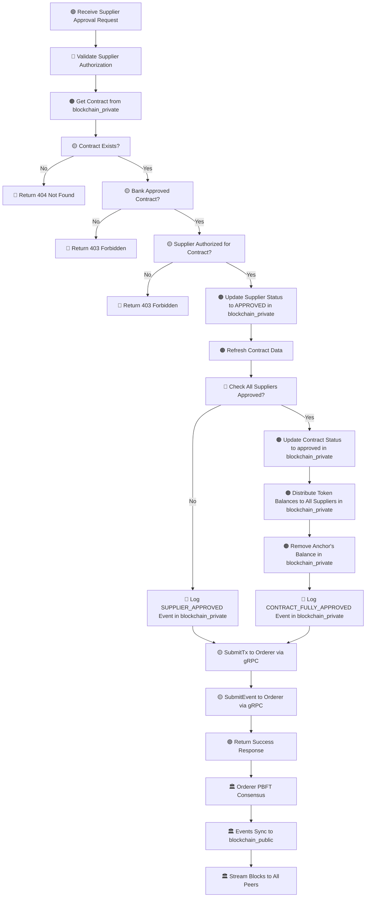

---

## 💰 **Token Management APIs**

### POST /token/transfer - Supplier Transfers Token (Peer Supplier)
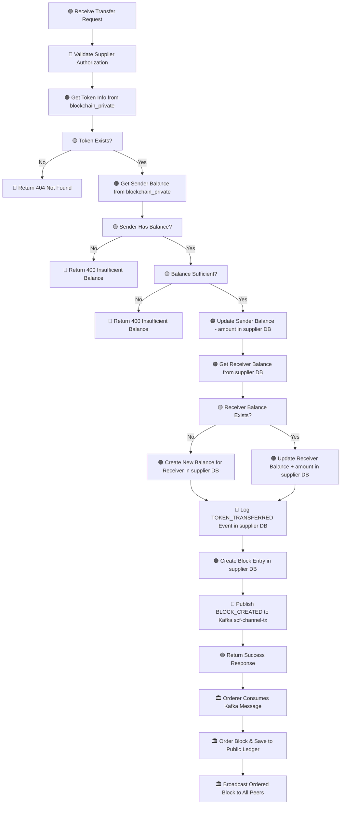

### POST /token/settle - Supplier Settles Token with Bank (Peer Supplier)
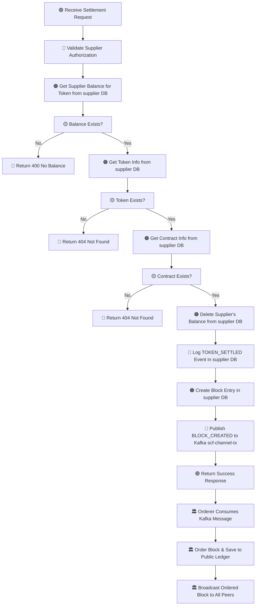

### GET /token/{id} - Get Token Information
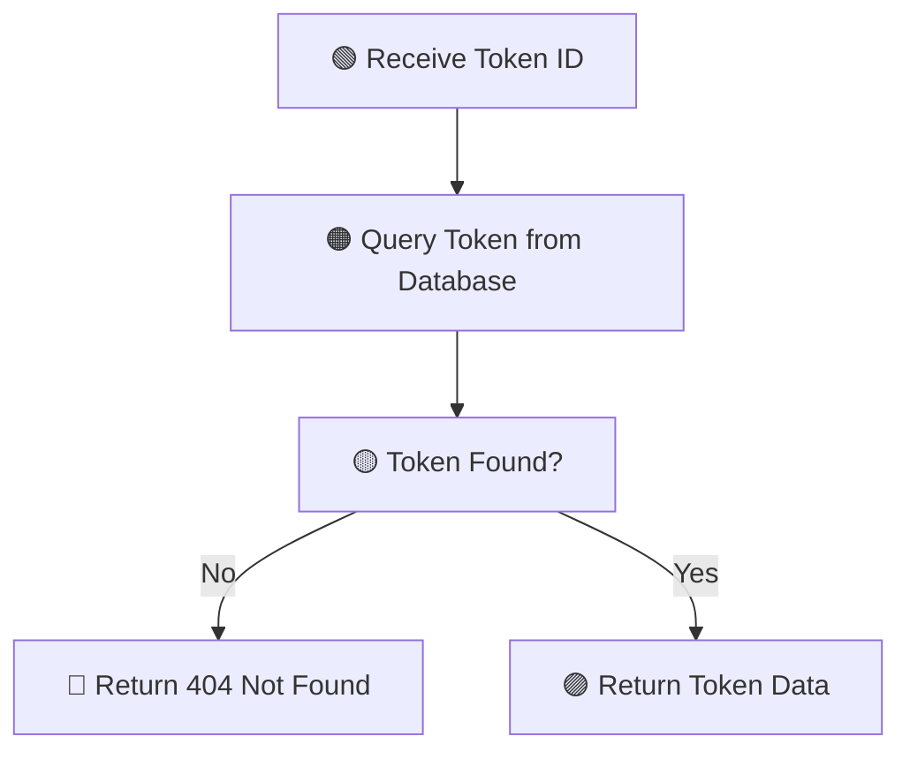

---

## 🔍 **Query APIs**

### GET /contract/list - Get All Contracts (Peer Anchor)
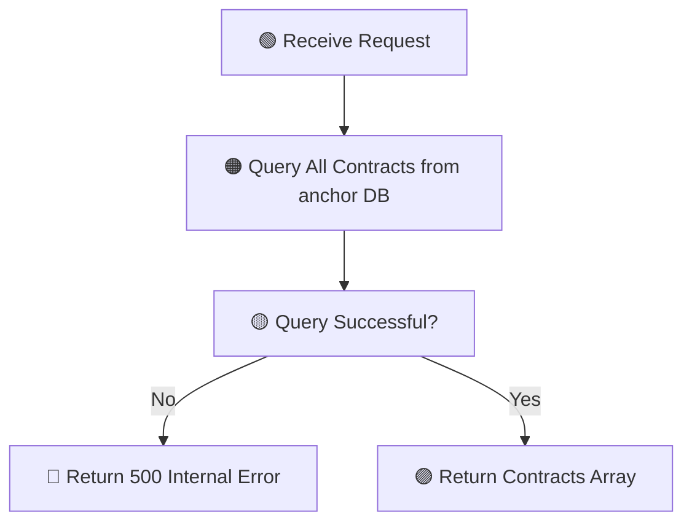

### GET /contract/list - Get All Contracts (Peer Main Bank)


### GET /tokens - Get All Tokens (Peer Main Bank)
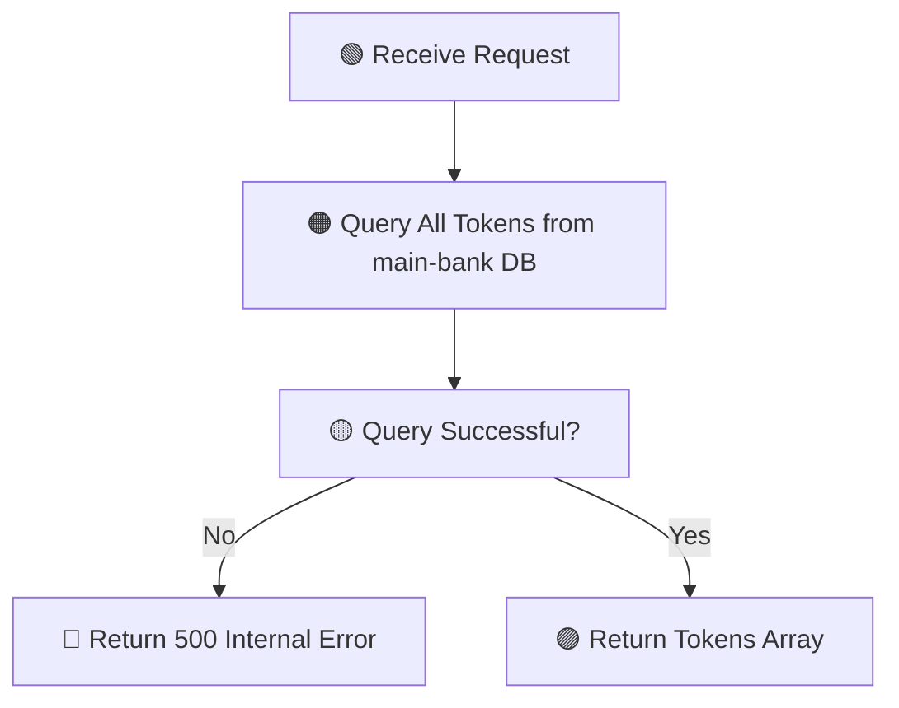

### GET /balances/account/{accountId} - Get Account Balances (Peer Supplier)
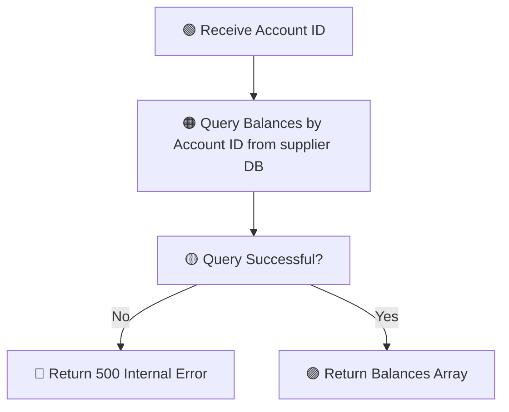

### GET /suppliers - Get All Suppliers (Peer Supplier)
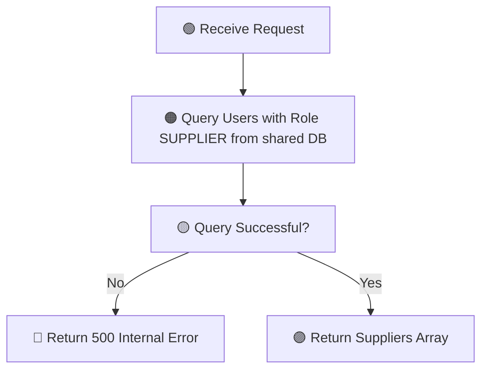

---

## Ledger & Block APIs

### GET /contract/{id}/ledger - Get Contract Ledger
```mermaid
flowchart TD
    A[🟢 Receive Contract ID] --> B[🟠 Query Events for Contract]
    B --> C[🟠 Query Events for Token (token_contractId)]
    C --> D[🔵 Combine All Events]
    D --> E[🟠 Query Blocks Containing Event IDs]
    E --> F[🟠 Query Token Balances]
    F --> G[🟡 All Queries Successful?]
    G -->|No| H[🔴 Return 500 Internal Error]
    G -->|Yes| I[🟣 Return Ledger Data]
```

### POST /blocks/hash/update - Update Block Hashes
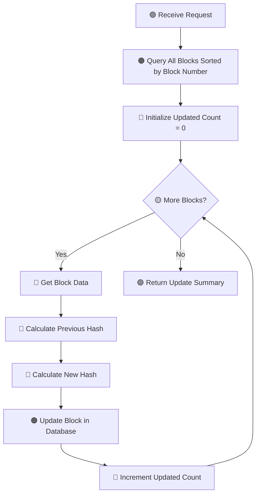

---

### **Complete System Flow**

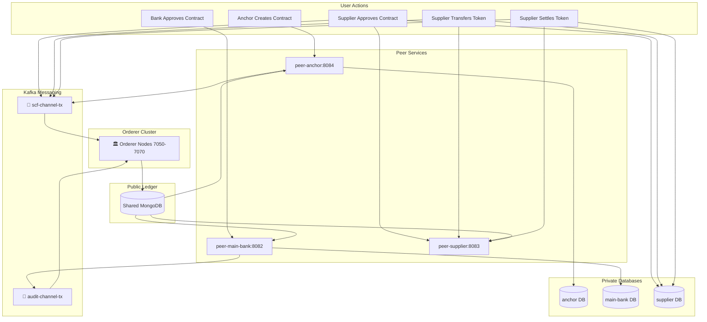

---

## 🏗️ **Multi-Peer Architecture Patterns**

### **Database Collections Per Peer**
| Collection | Peer Anchor | Peer Main Bank | Peer Supplier | Shared DB |
|------------|-------------|----------------|---------------|-----------|
| **contracts** | ✅ Private | ✅ Private | ✅ Private | ❌ |
| **tokens** | ❌ | ✅ Private | ✅ Private | ❌ |
| **balances** | ❌ | ✅ Private | ✅ Private | ❌ |
| **events** | ✅ Private | ✅ Private | ✅ Private | ✅ Public |
| **blocks** | ✅ Private | ✅ Private | ✅ Private | ❌ |
| **users** | ❌ | ❌ | ❌ | ✅ Public |

### **Business Logic Distribution**

#### **Contract Management Flow**
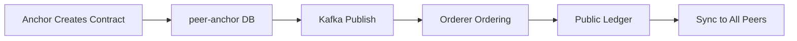

#### **Token Issuance Flow**
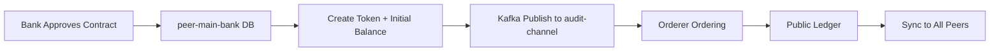

#### **Token Circulation Flow**
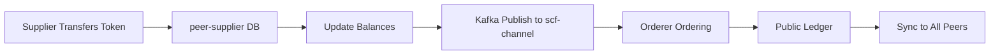

#### **Token Settlement Flow**
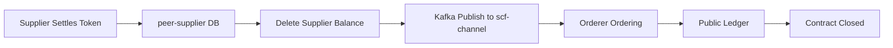

### **Event Streaming Patterns**

#### **Kafka Topic Usage**
- **`scf-channel-tx`**: Contract operations, token transfers, settlements
- **`audit-channel-tx`**: Bank approvals, compliance events
- **`scf-channel-blocks`**: Ordered SCF blocks broadcast
- **`audit-channel-blocks`**: Ordered audit blocks broadcast

#### **Orderer Processing**
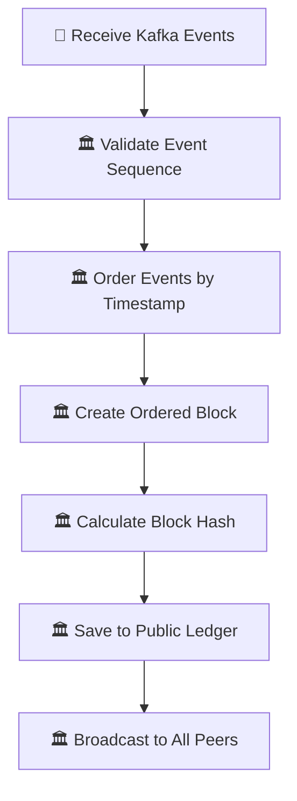

### **Data Consistency Guarantees**

#### **Eventual Consistency**
- Private peer databases maintain local state
- Public shared database maintains global ledger
- Kafka ensures reliable message delivery
- Orderer ensures global ordering

#### **Audit Trail**
- Every operation creates immutable event
- Events grouped into ordered blocks
- Block hash chain ensures integrity
- Public ledger provides universal truth

---

## 📋 **API Summary by Peer Service**

### **Peer Anchor (Port 8084)**
| Method | Endpoint | Description |
|--------|----------|-------------|
| POST | `/contract/create` | Create contract + Kafka publish |
| GET | `/contract/list` | List contracts |
| GET | `/contract/{id}` | Get contract details |
| GET | `/health` | Health check |

### **Peer Main Bank (Port 8082)**
| Method | Endpoint | Description |
|--------|----------|-------------|
| POST | `/contract/{id}/approve-bank` | Bank approve + token issuance |
| GET | `/contract/list` | List all contracts |
| GET | `/contract/{id}` | Get contract details |
| GET | `/contract/{id}/ledger` | Contract audit trail |
| GET | `/token/issued/{bankId}` | Tokens issued by bank |
| GET | `/tokens` | All tokens issued by bank |

### **Peer Supplier (Port 8083)**
| Method | Endpoint | Description |
|--------|----------|-------------|
| POST | `/contract/{id}/approve` | Supplier approve contract |
| POST | `/token/transfer` | Transfer tokens between suppliers |
| POST | `/token/settle` | Settle token with bank |
| GET | `/balances/account/{accountId}` | Account balances |
| GET | `/suppliers` | List all suppliers |
| GET | `/health` | Health check |

### **Common Query Endpoints**
| Method | Endpoint | Available On |
|--------|----------|--------------|
| GET | `/token/{id}` | All peers |
| GET | `/balances/token/{tokenId}` | All peers |

---

## 🔄 **Complete API Flow Reference**

**This document provides comprehensive flow diagrams for all APIs in the Multi-Peer Blockchain SCF System with Events Sync, showing the complete journey from user action through peer processing, gRPC communication, PBFT consensus, to public blockchain synchronization.**
