# Blockchain API Flow Diagrams

This document contains Mermaid flow diagrams for all API endpoints in the Golang blockchain microservice.

## Legend
- 🟢 **Start/End**: Process start or end
- 🔵 **Process**: Main processing step
- 🟡 **Decision**: Conditional check
- 🟠 **Database**: Database operation
- 🟣 **Response**: API response
- 🔴 **Error**: Error handling

---

## Contract Management APIs

### POST /contract/create - Create New Contract
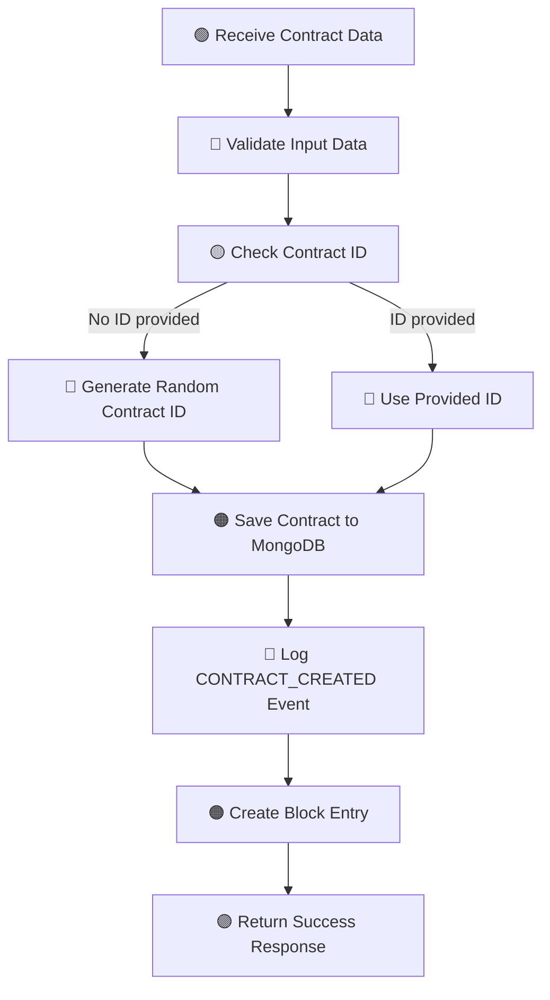

### POST /contract/{id}/approve-bank - Bank Approve Contract
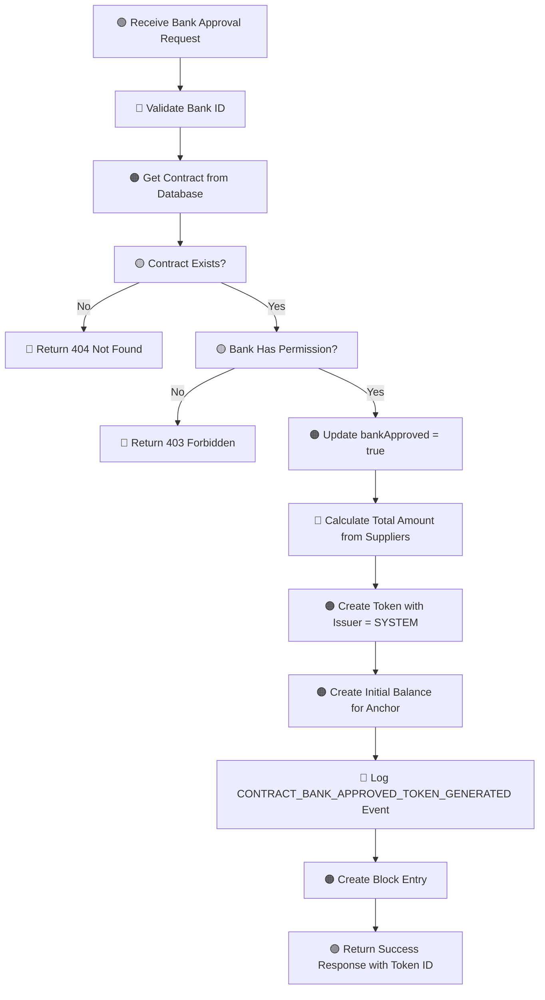

### POST /contract/{id}/approve - Supplier Approve Contract
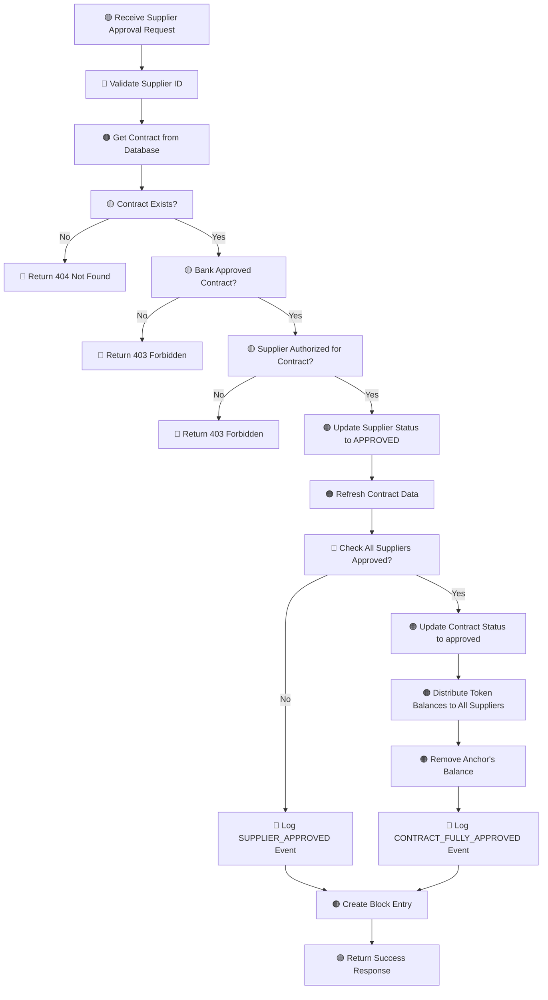

---

## Token Management APIs

### POST /token/transfer - Transfer Token Between Accounts
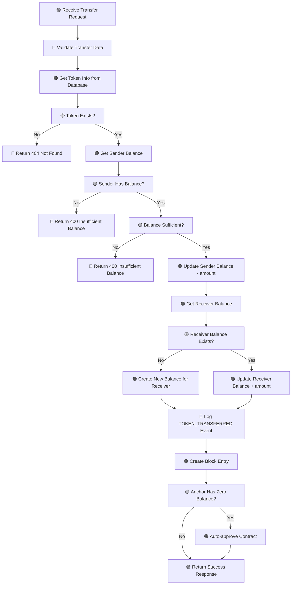

### POST /token/settle - Settle Token with Bank
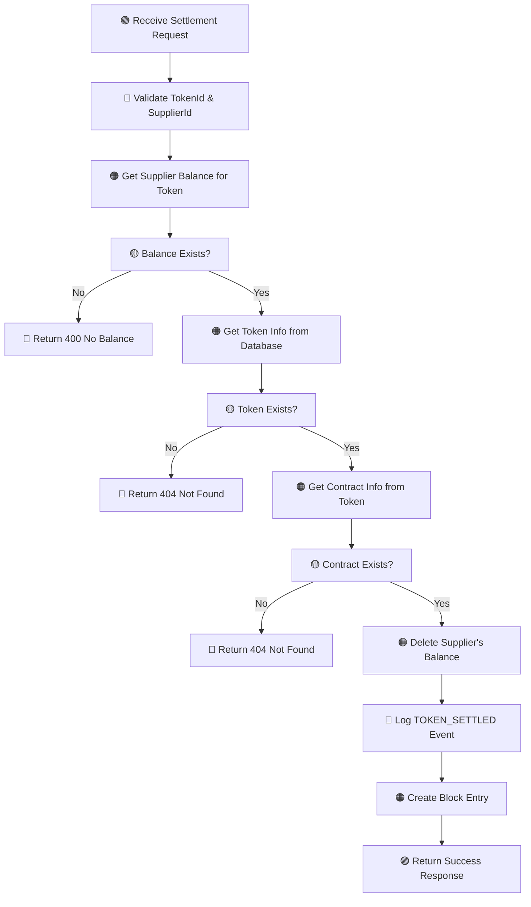

### GET /token/{id} - Get Token Information
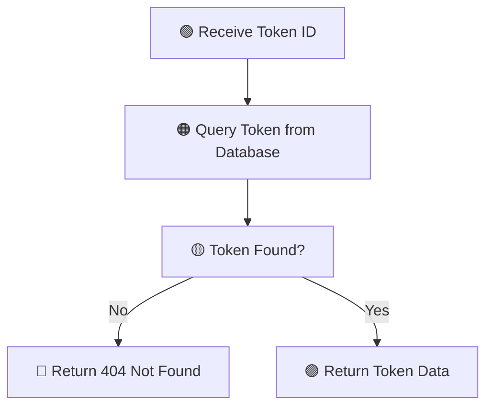

---

## Query APIs

### GET /contract/list - Get All Contracts
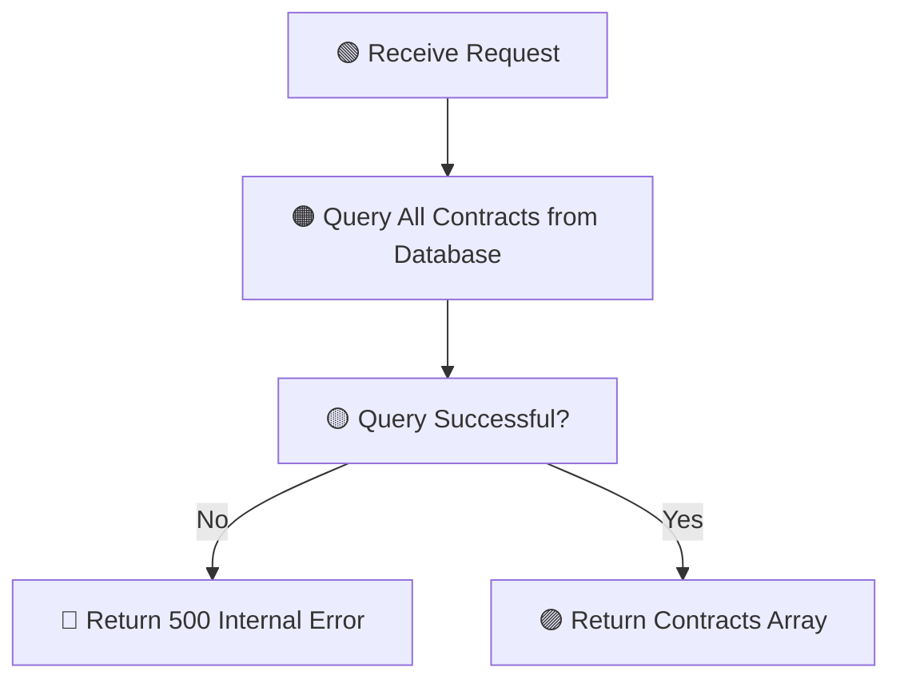

### GET /tokens - Get All Tokens
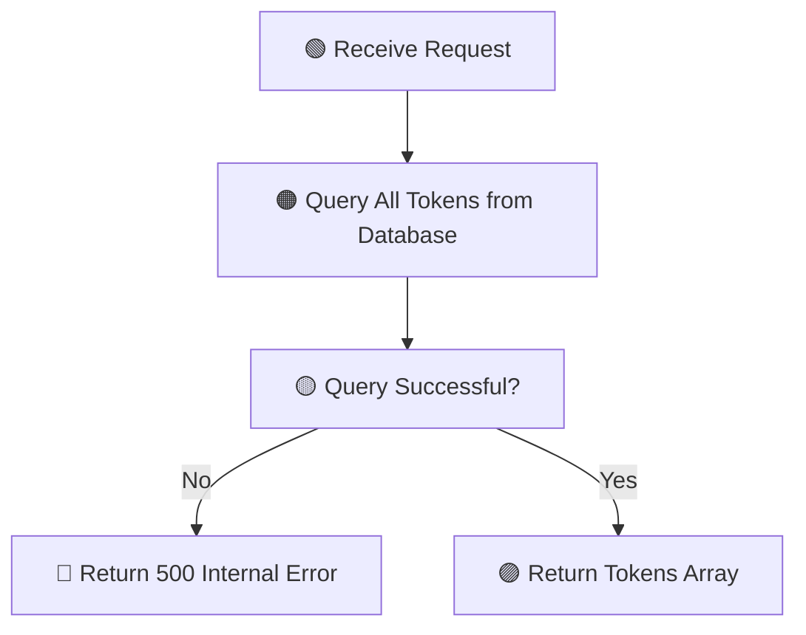

### GET /balances/account/{accountId} - Get Account Balances
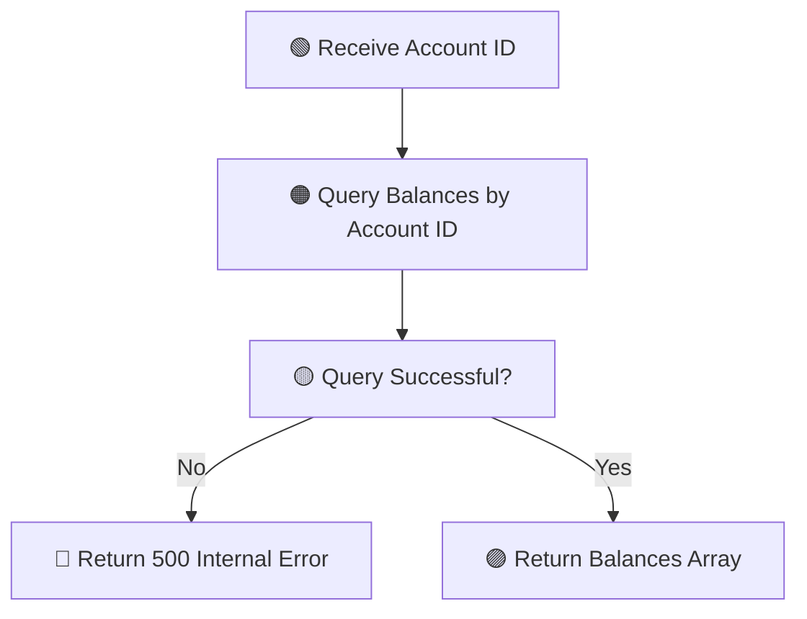

### GET /suppliers - Get All Suppliers
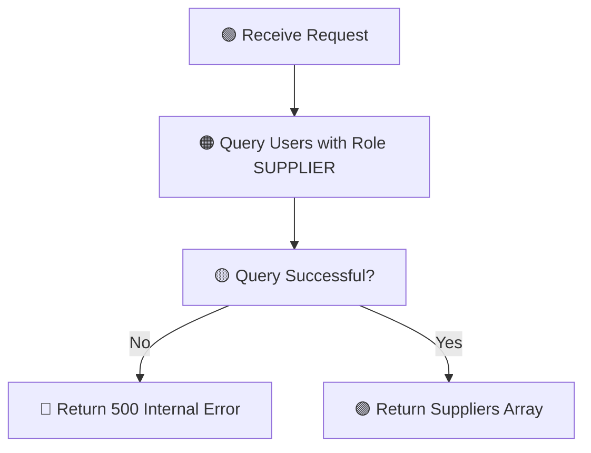

---

## Ledger & Block APIs

### GET /contract/{id}/ledger - Get Contract Ledger
```mermaid
flowchart TD
    A[🟢 Receive Contract ID] --> B[🟠 Query Events for Contract]
    B --> C[🟠 Query Events for Token (token_contractId)]
    C --> D[🔵 Combine All Events]
    D --> E[🟠 Query Blocks Containing Event IDs]
    E --> F[🟠 Query Token Balances]
    F --> G[🟡 All Queries Successful?]
    G -->|No| H[🔴 Return 500 Internal Error]
    G -->|Yes| I[🟣 Return Ledger Data]
```

### POST /blocks/hash/update - Update Block Hashes
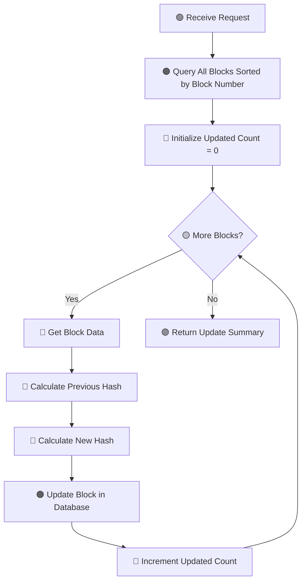

---

## Common Block Creation Flow
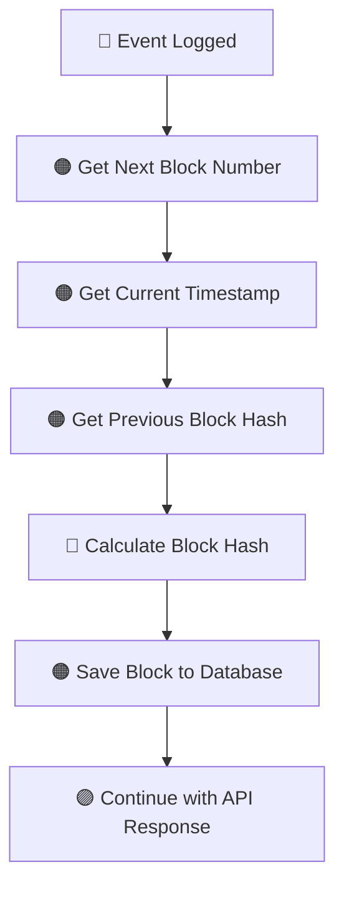

---

## Error Handling Patterns
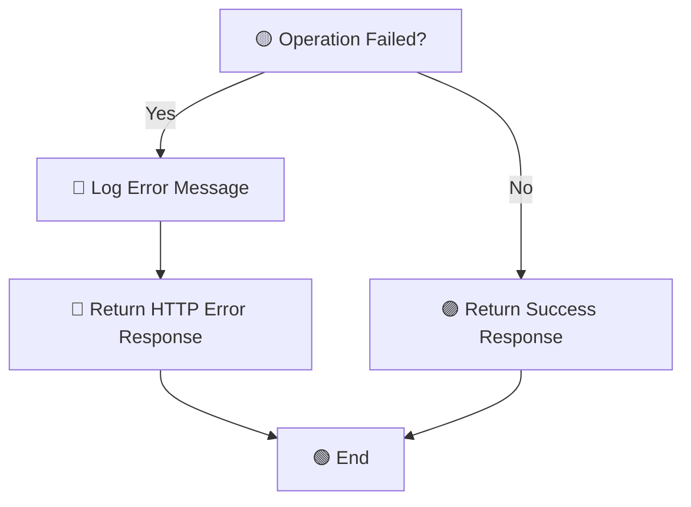

## Database Collections Used
- **contracts**: Contract information and approval status
- **tokens**: Token metadata (issuer, owner, total amount)
- **balances**: Token balances per account
- **events**: Audit trail of all blockchain operations
- **blocks**: Block data with hashes and event references
- **users**: User information and roles

## Key Business Logic Flows

### Token Lifecycle
1. **Creation**: Bank approves contract → System creates token → Anchor receives initial balance
2. **Distribution**: All suppliers approve → Token distributed to suppliers → Anchor balance removed
3. **Transfer**: Suppliers transfer tokens between themselves
4. **Settlement**: Supplier settles with bank → Balance removed → Contract closed

### Block Creation
Every significant operation creates:
1. An event record with details
2. A block containing the event
3. Block hash calculated from previous block + current data
4. Immutable audit trail maintained
