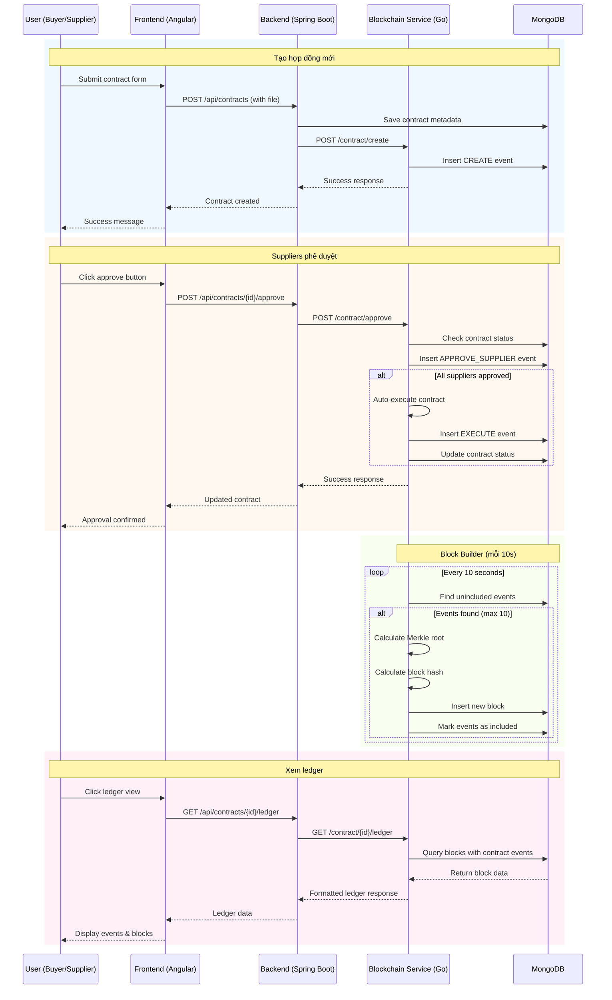

# Blockchain Supply Chain Finance (SCF) System

Hệ thống blockchain permissioned cho Supply Chain Finance, cho phép các bên tham gia (Buyer, Bank, Supplier) thực hiện các giao dịch tài trợ chuỗi cung ứng một cách minh bạch và bất biến.

## Mục lục

1. [Giới thiệu](#giới-thiệu)
2. [Kiến trúc tổng quan](#kiến-trúc-tổng-quan)
3. [Mô hình dữ liệu](#mô-hình-dữ-liệu)
4. [Luồng nghiệp vụ](#luồng-nghiệp-vụ)
5. [Sơ đồ Sequence](#sơ-đồ-sequence)
6. [API chính](#api-chính)
7. [Frontend](#frontend)
8. [Thiết kế blockchain](#thiết-kế-blockchain)
9. [Cách chạy hệ thống](#cách-chạy-hệ-thống)

## Giới thiệu

### Mục tiêu hệ thống

Hệ thống blockchain SCF permissioned được thiết kế để:

- **Minh bạch**: Tất cả giao dịch được ghi nhận trên blockchain và có thể truy vết
- **Bất biến**: Dữ liệu đã ghi không thể thay đổi
- **Phân quyền**: Chỉ các bên được ủy quyền mới có thể tham gia
- **Tự động hóa**: Quy trình phê duyệt và thực thi hợp đồng được tự động hóa

### Các bên tham gia

- **Buyer (Người mua)**: Khởi tạo hợp đồng SCF, yêu cầu tài trợ
- **Bank (Ngân hàng)**: Cung cấp tài trợ, phê duyệt hợp đồng
- **Supplier (Người bán)**: Nhận tài trợ, phê duyệt hợp đồng

## Kiến trúc tổng quan

Hệ thống được xây dựng theo kiến trúc microservices với 4 thành phần chính:

### Frontend (Angular)
- **Công nghệ**: Angular framework
- **Chức năng**: Giao diện người dùng cho tất cả các bên tham gia
- **Port**: 4200 (qua nginx proxy)

### Backend (Spring Boot)
- **Công nghệ**: Java Spring Boot với JWT authentication
- **Chức năng**:
  - Quản lý người dùng và xác thực
  - Lưu trữ metadata hợp đồng
  - Upload và quản lý file hợp đồng
  - Tích hợp với blockchain service
- **Port**: 8080

### ms-blockchain (Go)
- **Công nghệ**: Golang với MongoDB
- **Chức năng**:
  - Quản lý blockchain ledger
  - Tạo và xác thực blocks
  - API truy vấn blockchain data
  - Block builder tự động
- **Port**: 8081

### MongoDB
- **Chức năng**: Cơ sở dữ liệu lưu trữ tất cả dữ liệu
- **Collections**:
  - `users`: Thông tin người dùng
  - `contracts`: Metadata hợp đồng
  - `events`: Sự kiện blockchain
  - `blocks`: Blocks của blockchain
- **Port**: 27017

### Docker Compose
Tất cả services được orchestrate bởi Docker Compose với network chung `blockchain-network` để đảm bảo kết nối an toàn giữa các services.

## Mô hình dữ liệu

### Contracts Collection
Lưu trữ metadata của hợp đồng SCF:
```json
{
  "contractId": "string",
  "description": "string",
  "buyer": "string",
  "suppliers": [
    {
      "supplierId": "string",
      "name": "string",
      "allocatedAmount": 100000.0,
      "status": "PENDING|READY_TO_EXECUTE|EXECUTED|FAILED"
    }
  ],
  "totalAmount": 500000.0,
  "status": "PENDING|PARTIALLY_APPROVED|READY_TO_EXECUTE|EXECUTED",
  "fileUrl": "string",
  "createdAt": "timestamp",
  "updatedAt": "timestamp",
  "history": [...]
}
```

### Events Collection
Lưu trữ các sự kiện blockchain chưa được include vào block:
```json
{
  "eventId": "string",
  "contractId": "string",
  "type": "CREATE|APPROVE_SUPPLIER|EXECUTE",
  "actorId": "string",
  "payload": {...},
  "timestamp": "timestamp",
  "included": false
}
```

### Blocks Collection
Lưu trữ các block của blockchain (immutable):
```json
{
  "blockNumber": 1,
  "timestamp": "timestamp",
  "events": [...],
  "prevHash": "string",
  "hash": "string",
  "merkleRoot": "string"
}
```

### Mối quan hệ dữ liệu

- **Contracts ↔ Events**: Mỗi contract có history events
- **Events → Blocks**: Events được gom nhóm thành blocks
- **Blocks**: Chuỗi liên kết qua hash, tạo thành immutable ledger
- **World State**: Trạng thái hiện tại của contracts được derive từ events trong blocks

## Luồng nghiệp vụ

### 1. Buyer tạo hợp đồng
1. Buyer đăng nhập và tạo hợp đồng mới
2. Hệ thống tạo event `CREATE` trong collection `events`
3. Contract được lưu với status `PENDING`

### 2. Suppliers phê duyệt
1. Suppliers xem danh sách hợp đồng cần phê duyệt
2. Mỗi supplier approve → tạo event `APPROVE_SUPPLIER`
3. Khi tất cả suppliers đã approve → contract status = `READY_TO_EXECUTE`

### 3. Hệ thống thực thi tự động
1. Khi đủ điều kiện, hệ thống tự động thực thi
2. Tạo event `EXECUTE` với kết quả thực thi
3. Cập nhật status contract và suppliers

### 4. Block builder tạo blocks
1. Block builder chạy định kỳ mỗi 10 giây
2. Gom tối đa 10 events chưa included
3. Tạo block mới với:
   - Merkle root từ SHA256 các event IDs
   - Block hash = SHA256(prevHash + merkleRoot + timestamp)
4. Đánh dấu events đã included

### 5. Immutable ledger
- Blocks được append-only, không thể modify
- Ledger = chuỗi blocks + events bên trong
- World state được tính toán từ events trong tất cả blocks

## Sơ đồ Sequence

Dưới đây là sơ đồ sequence mô tả luồng tương tác đầy đủ của hệ thống SCF:



## API chính

### Backend APIs (Spring Boot)

#### Tạo hợp đồng
```
POST /api/contracts
Content-Type: multipart/form-data
- file: MultipartFile (optional)
- contract: JSON string

Response: Contract object
```

#### Lấy danh sách hợp đồng
```
GET /api/contracts
Authorization: Bearer {token}

Response: Array of contracts
```

#### Phê duyệt hợp đồng
```
POST /api/contracts/{id}/approve
Authorization: Bearer {token}

Response: Updated contract
```

#### Lấy ledger của hợp đồng
```
GET /api/contracts/{id}/ledger
Authorization: Bearer {token}

Response: Ledger data với events và blocks
```

### Blockchain APIs (Go service)

#### Tạo contract event
```
POST /contract/create
{
  "contractId": "string",
  "description": "string",
  "buyer": "string",
  "suppliers": [...],
  "totalAmount": number
}

Response: {"contractId": "string", "status": "success"}
```

#### Phê duyệt contract
```
POST /contract/approve
{
  "contractId": "string",
  "supplierId": "string"
}

Response: {"status": "success"}
```

#### Lấy ledger của contract
```
GET /contract/{id}/ledger

Response: {
  "contractId": "string",
  "events": [...],
  "total": number
}
```

#### Lấy danh sách blocks
```
GET /ledger/blocks

Response: Array of block info
```

## Frontend

Giao diện web được chia thành 4 tab chính:

### Tab 1: Tạo hợp đồng (`/contracts/new`)
- Form tạo hợp đồng mới
- Upload file hợp đồng (PDF)
- Chọn suppliers và phân bổ số tiền
- Chỉ Buyer có quyền truy cập

### Tab 2: Phê duyệt hợp đồng (`/contracts/approve`)
- Hiển thị danh sách hợp đồng chờ phê duyệt
- Suppliers có thể approve/reject
- Theo dõi tiến độ phê duyệt

### Tab 3: Trạng thái hợp đồng (`/contracts`)
- Dashboard tổng quan
- Danh sách tất cả hợp đồng
- Chi tiết status và history

### Tab 4: Ledger Viewer (`/ledger`)
- Truy cập blockchain ledger
- Xem chi tiết các blocks
- Audit trail của tất cả transactions

## Thiết kế blockchain

### Permissioned Blockchain
- Chỉ các node được ủy quyền mới tham gia
- Mỗi bên (Bank, Buyer, Supplier) giữ bản sao ledger
- Consensus dựa trên sự đồng thuận của các bên

### Event Sourcing Architecture
- Tất cả thay đổi trạng thái được ghi thành events
- Events là nguồn sự thật duy nhất
- World state được rebuild từ events

### Block Structure
- **Block Number**: Số thứ tự block
- **Timestamp**: Thời gian tạo block
- **Events**: Mảng các events được include
- **PrevHash**: Hash của block trước
- **Hash**: SHA256(prevHash + merkleRoot + timestamp)
- **Merkle Root**: Merkle tree root của các event IDs

### Immutable Ledger
- Blocks chỉ có thể append, không modify
- Mỗi block tham chiếu đến block trước qua hash
- Tạo thành chuỗi hash liên kết bất biến

### World State Derivation
- Trạng thái hiện tại của contracts được tính từ events
- Không lưu state riêng biệt, chỉ derive khi cần
- Đảm bảo tính nhất quán và audit-able

## Cách chạy hệ thống

### Yêu cầu hệ thống
- Docker và Docker Compose
- Ít nhất 4GB RAM
- Port 4200, 8080, 8081, 27017 khả dụng

### Lệnh chạy
```bash
# Clone repository (nếu có)
# git clone <repository-url>
# cd blockchain

# Build và chạy tất cả services
docker-compose up --build

# Chạy background
docker-compose up -d --build
```

### Truy cập hệ thống
- **Frontend**: http://localhost:4200
- **Backend API**: http://localhost:8080
- **Blockchain API**: http://localhost:8081
- **MongoDB**: localhost:27017

### Tài khoản test
- **Anchor (Buyer)**: username: `anchor`, password: `123456`
- **Supplier 1-10**: username: `supplier1` đến `supplier10`, password: `123456`

### Kiểm tra logs
```bash
# Xem logs tất cả services
docker-compose logs -f

# Xem logs cụ thể service
docker-compose logs -f backend
docker-compose logs -f ms-blockchain
```

### Dừng hệ thống
```bash
# Dừng và xóa containers
docker-compose down

# Dừng và xóa volumes (xóa data)
docker-compose down -v
```
