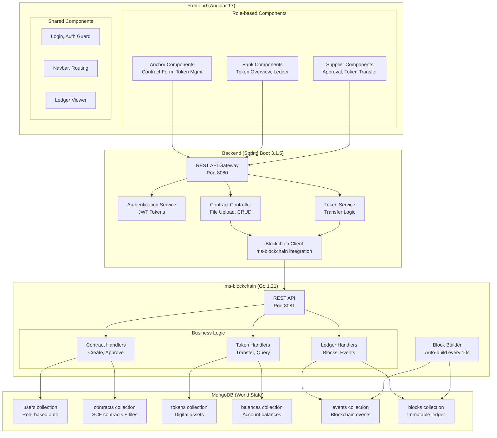
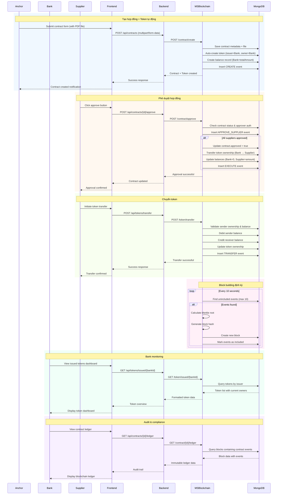
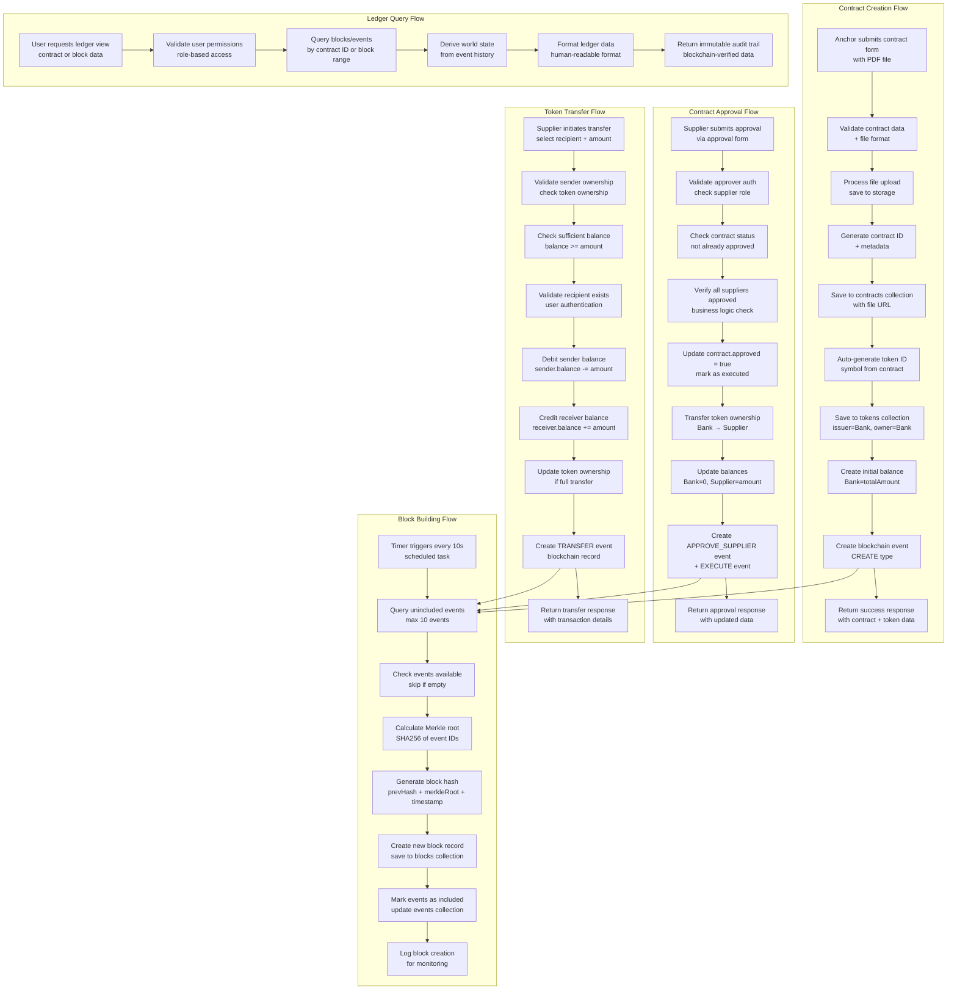
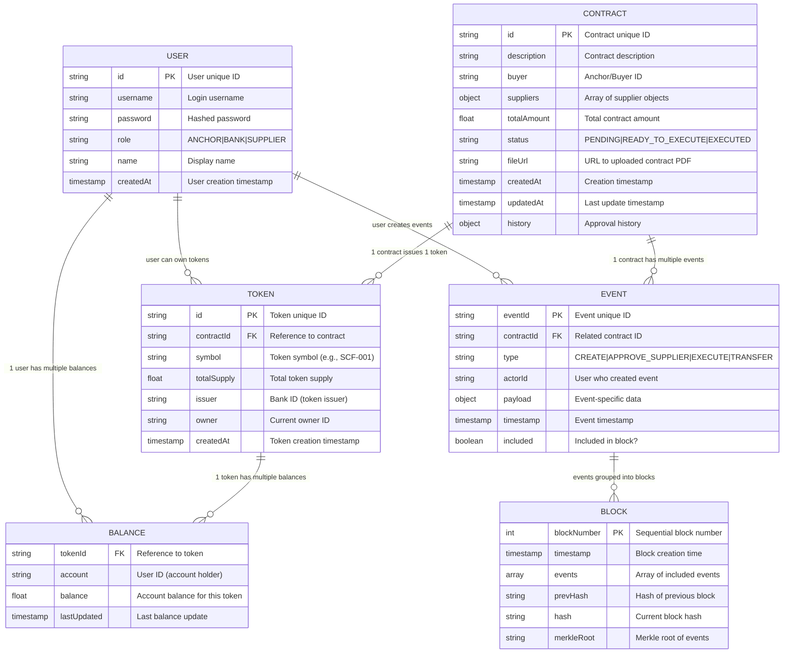
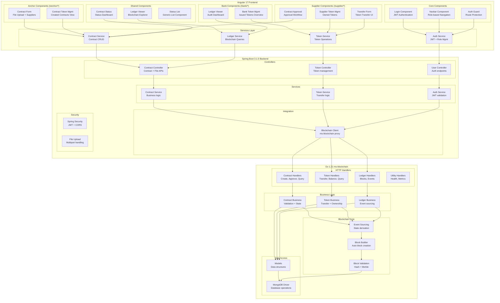
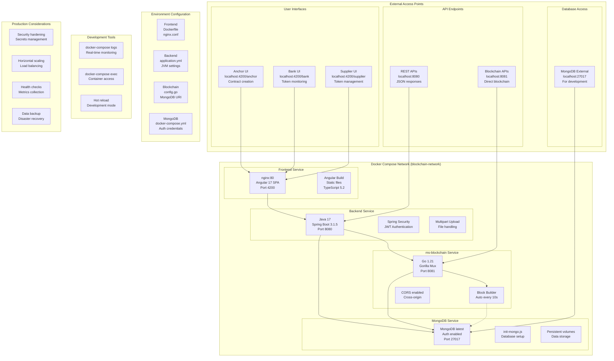

# Hệ thống Blockchain Supply Chain Finance (SCF) với Token Management

## Tổng quan kiến trúc

Hệ thống blockchain permissioned cho Supply Chain Finance với đầy đủ chức năng quản lý hợp đồng và token transfer, bao gồm:

- **Permissioned Blockchain**: Chỉ các node được ủy quyền tham gia
- **Event Sourcing**: Tất cả thay đổi được ghi thành events
- **Token Issuance**: Tự động phát hành token khi tạo hợp đồng
- **Token Transfer**: Chuyển giao token giữa các bên
- **Immutable Ledger**: Audit trail không thể thay đổi

## Luồng nghiệp vụ chi tiết

### Quy trình Supply Chain Finance hoàn chỉnh:

## Data Flow Architecture

### Luồng xử lý dữ liệu hoàn chỉnh:

## Database Schema

### Mô hình dữ liệu MongoDB hoàn chỉnh:

### Mối quan hệ dữ liệu chính:
- **Contract → Token**: Mỗi hợp đồng tạo ra một token duy nhất
- **Token → Balances**: Một token có thể có nhiều balance records cho các accounts khác nhau
- **Contract → Events**: Mỗi thay đổi trên contract được ghi thành event
- **Events → Blocks**: Events được nhóm lại thành blocks theo thời gian
- **User → Balances**: User có thể sở hữu nhiều tokens (nhiều balance records)
- **Event Sourcing**: World state được derive từ chuỗi events trong blocks

## Component Architecture

### Kiến trúc components chi tiết:

## Deployment Architecture

### Kiến trúc triển khai với Docker Compose:

### Docker Compose Services:

| Service | Image | Ports | Dependencies | Environment |
|---------|-------|-------|--------------|-------------|
| **frontend** | nginx:alpine | 4200:80 | backend | Static files |
| **backend** | openjdk:17 | 8080:8080 | mongo, ms-blockchain | Spring profiles |
| **ms-blockchain** | golang:1.21 | 8081:8081 | mongo | MongoDB URI |
| **mongo** | mongo:latest | 27017:27017 | - | Root credentials |

### Network Architecture:
- **Internal Network**: `blockchain-network` (bridge driver)
- **Service Discovery**: DNS resolution giữa containers
- **Security**: Isolated network, controlled access
- **Scalability**: Services có thể scale independently

## Business Process Summary

### Quy trình Supply Chain Finance hoàn chỉnh:

1. **Anchor tạo hợp đồng** → Upload file PDF + phân bổ suppliers → Bank tự động phát hành token
2. **Suppliers phê duyệt** → Khi tất cả approve → Token transfer từ Bank → Supplier + Contract executed
3. **Token circulation** → Suppliers có thể transfer tokens cho nhau (P2P transfers)
4. **Bank monitoring** → Xem tất cả tokens đã phát hành + audit trail qua blockchain ledger
5. **Immutable audit** → Tất cả giao dịch được ghi vào blockchain với block building tự động

### Các tính năng chính:
- **Permissioned Blockchain**: Chỉ authorized nodes tham gia
- **Event Sourcing**: State derive từ event history
- **Token Issuance**: Auto token creation per contract
- **Token Transfer**: Secure P2P token transfers
- **Audit Trail**: Immutable ledger với Merkle trees

## API Endpoints Summary

### Backend REST APIs (Spring Boot):

| Method | Endpoint | Description | Authentication |
|--------|----------|-------------|----------------|
| POST | `/api/auth/login` | User authentication | - |
| POST | `/api/contracts` | Anchor tạo hợp đồng với file | JWT Bearer |
| GET | `/api/contracts` | Lấy danh sách contracts | JWT Bearer |
| POST | `/api/contracts/{id}/approve` | Supplier phê duyệt contract | JWT Bearer |
| GET | `/api/contracts/{id}/ledger` | Xem contract ledger | JWT Bearer |
| GET | `/api/tokens/{id}` | Thông tin chi tiết token | JWT Bearer |
| POST | `/api/tokens/transfer` | Transfer token giữa users | JWT Bearer |
| GET | `/api/tokens/issued/{bankId}` | Bank xem tokens đã phát hành | JWT Bearer |

### Blockchain APIs (Go ms-blockchain):

| Method | Endpoint | Description |
|--------|----------|-------------|
| POST | `/contract/create` | Tạo contract + auto token issuance |
| POST | `/contract/approve` | Phê duyệt contract + token transfer |
| GET | `/contract/{id}` | Chi tiết contract |
| GET | `/contract/list` | Danh sách contracts |
| GET | `/contract/{id}/ledger` | Contract audit trail |
| GET | `/token/{id}` | Token information |
| POST | `/token/transfer` | Direct token transfer |
| GET | `/token/issued/{bankId}` | Tokens issued by bank |
| GET | `/tokens` | All tokens |
| GET | `/balances/account/{accountId}` | Account balances |
| GET | `/balances/token/{tokenId}` | Token balances |
| GET | `/suppliers` | Supplier list |
| POST | `/blocks/hash/update` | Update block hashes |

### Database Collections:
- `users`: User accounts với roles
- `contracts`: SCF contracts với file URLs
- `tokens`: Digital assets từ contracts
- `balances`: Account balances per token
- `events`: Blockchain events (event sourcing)
- `blocks`: Immutable ledger blocks

### Key Features:
- **JWT Authentication**: Role-based access control
- **File Upload**: Contract PDF storage
- **Event Sourcing**: State từ event history
- **Auto Block Building**: Every 10 seconds
- **Merkle Trees**: Block integrity
- **Audit Trail**: Immutable transaction history
