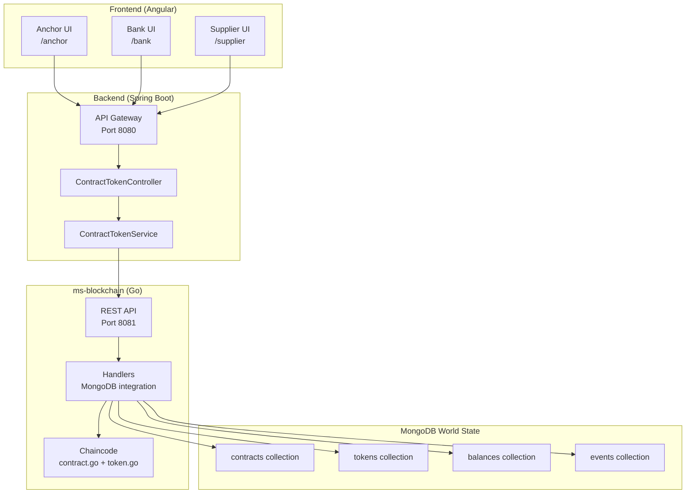
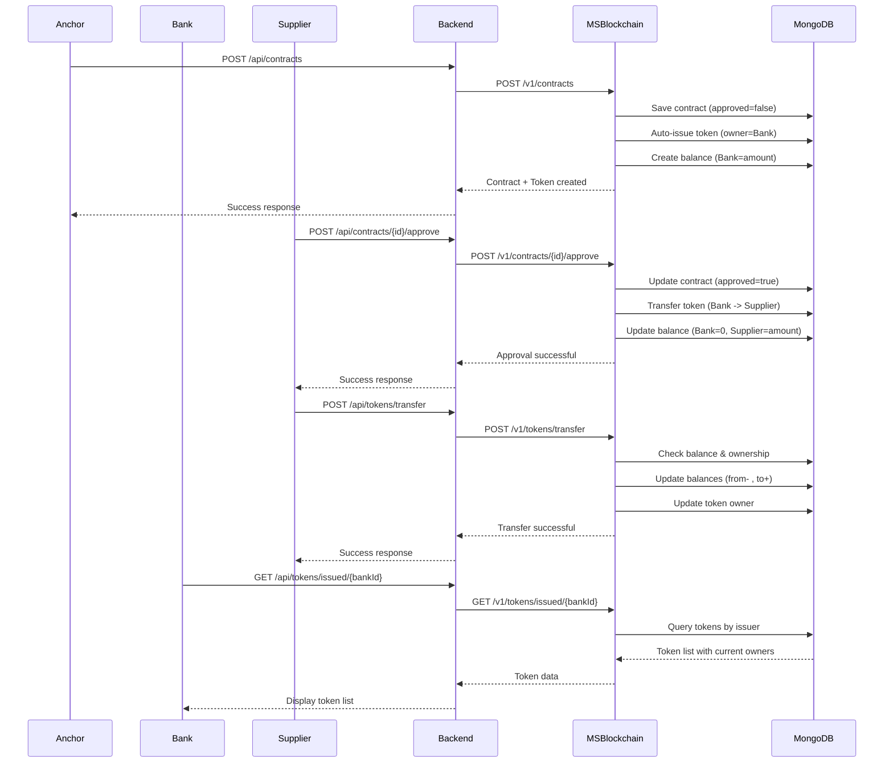
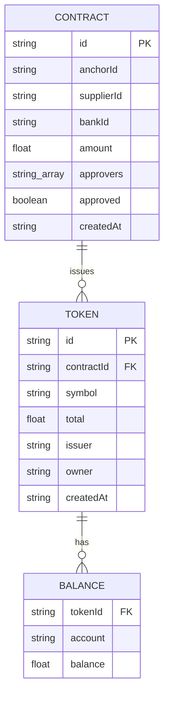
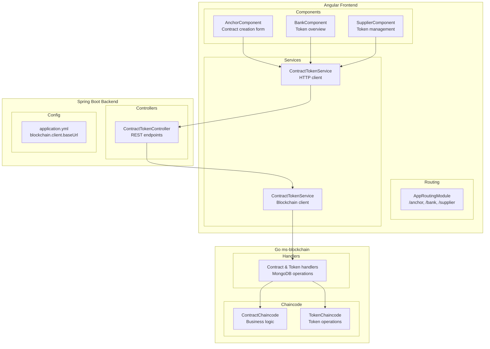
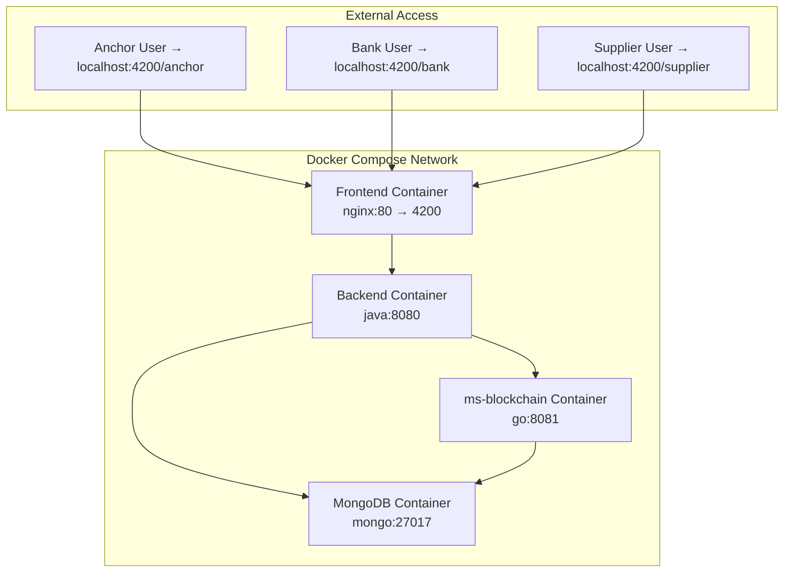

# Hệ thống Blockchain + Contract + Token Issuance

## Tổng quan kiến trúc

## Luồng nghiệp vụ chi tiết

## Data Flow Architecture

```mermaid
flowchart TD
    subgraph "Contract Creation Flow"
        C1[Anchor submits contract form]
        C2[Validate contract data]
        C3[Generate contract ID]
        C4[Save to contracts collection]
        C5[Auto-generate token ID]
        C6[Save to tokens collection]
        C7[Create initial balance for Bank]
        C8[Return success response]
    end

    subgraph "Contract Approval Flow"
        A1[Approver submits approval]
        A2[Validate approver authorization]
        A3[Check contract not already approved]
        A4[Update contract.approved = true]
        A5[Transfer token ownership: Bank → Supplier]
        A6[Update balances: Bank=0, Supplier=amount]
        A7[Return approval response]
    end

    subgraph "Token Transfer Flow"
        T1[Supplier initiates transfer]
        T2[Validate sender ownership]
        T3[Check sufficient balance]
        T4[Debit sender balance]
        T5[Credit receiver balance]
        T6[Update token ownership]
        T7[Return transfer response]
    end

    C1 --> C2 --> C3 --> C4 --> C5 --> C6 --> C7 --> C8
    A1 --> A2 --> A3 --> A4 --> A5 --> A6 --> A7
    T1 --> T2 --> T3 --> T4 --> T5 --> T6 --> T7
```

## Database Schema

## Component Architecture

## Deployment Architecture

## Business Process Summary

1. **Anchor** tạo hợp đồng → **Bank** tự động phát hành token (owner = Bank)
2. **Approvers** duyệt hợp đồng → Token chuyển từ **Bank** → **Supplier**
3. **Supplier** có thể:
   - Chuyển token cho **Supplier** khác
   - Trả lại token cho **Bank** (early payment)
4. **Bank** query toàn bộ token đã phát hành + trạng thái hiện tại

## API Endpoints Summary

| Method | Endpoint | Description |
|--------|----------|-------------|
| POST | `/api/contracts` | Anchor tạo hợp đồng |
| POST | `/api/contracts/{id}/approve` | Approver duyệt hợp đồng |
| GET | `/api/contracts/{id}` | Chi tiết hợp đồng |
| GET | `/api/tokens/{id}` | Thông tin token |
| POST | `/api/tokens/transfer` | Supplier chuyển token |
| GET | `/api/tokens/issued/{bankId}` | Bank xem tokens đã phát hành |
