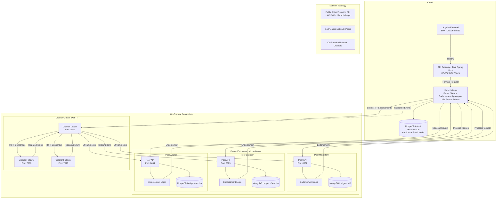

# System Design Document - Blockchain-SCF (Hybrid Cloud Deployment)

## 1. Overview
This document describes the system design of the Blockchain-SCF platform when deployed in a **Hybrid Cloud model**. 
The goal is to combine the scalability and integration capabilities of cloud infrastructure with the security and compliance of on-premise ledger hosting.

---

## 2. Architecture Principles
- **Hybrid Cloud**: 
  - Cloud for user-facing services, API integration, and read-model analytics.
  - On-Premise for sensitive ledger data and consensus.
- **Fabric-style Flow**: 
  - blockchain-gw as the Fabric Client.
  - Peers as endorsers + committers.
  - Orderer cluster runs PBFT consensus.

---

## 3. Components

### Cloud Components
- **Frontend (Angular, SPA)**  
  - Hosted on cloud storage + CDN (AWS S3 + CloudFront, GCP Cloud Storage + Cloud CDN).

- **API Gateway (Java Spring Boot, Port 8080)**  
  - Entry point for client requests.  
  - Authentication, JWT management, routing.  
  - Deployed on Kubernetes (EKS/GKE/AKS).

- **blockchain-gw (Port 9090)**  
  - Deployed on Kubernetes (Cloud Private Subnet).  
  - Roles:  
    - Fabric Client (Proposal creation, endorsement aggregation).  
    - Endorsement Policy check.  
    - SubmitTx to Orderer.  
    - Event Subscriber for block events.  
  - Manages Shared DB (application-level read model).

- **Shared DB (MongoDB Atlas / DocumentDB / CosmosDB)**  
  - Stores world state in a **read model** format.  
  - Managed by blockchain-gw for API queries.  
  - Not a replacement for peer ledger.

---

### On-Premise Components

- **Peers (Endorsers + Committers)**  
  - Each participant (Main Bank, Supplier, Anchor) hosts their own Peer node.  
  - Functions:  
    - Execute chaincode logic when ProposalRequest received.  
    - Return Endorsement (RW Set + Signature).  
    - Commit blocks received from Orderer.  
  - Each Peer maintains a private MongoDB ledger.

- **Orderer Cluster (PBFT)**  
  - 3+ nodes distributed across consortium members.  
  - Consensus flow: Pre-Prepare → Prepare → Commit → Finalize.  
  - Creates blocks and streams them to peers.  
  - Fabric-like consensus layer.

- **Private DBs**  
  - MongoDB local instances for each peer.  
  - Store full ledger and world state (authoritative source).

---

## 4. Transaction Flow

1. **User → API Gateway**  
   - Angular frontend sends request → API Gateway (cloud).

2. **API Gateway → blockchain-gw**  
   - Forwarded to blockchain-gw (cloud private subnet).

3. **blockchain-gw → Peers**  
   - Sends ProposalRequest to all endorsing peers (on-prem).

4. **Peers → blockchain-gw**  
   - Execute chaincode logic.  
   - Return endorsements (RW set + signatures).

5. **blockchain-gw → Orderer**  
   - Collect endorsements, check policy.  
   - SubmitTx + endorsements to Orderer cluster (on-prem).

6. **Orderer → Peers**  
   - Run PBFT consensus, generate block.  
   - Stream finalized block to all peers.  
   - Peers commit block to local ledgers.

7. **blockchain-gw → Shared DB**  
   - Subscribe to block events from Orderer.  
   - Update application read model.  
   - Return transaction result to API Gateway → User.

---

## 5. Network Topology

- **Public Cloud Network**: Frontend, API Gateway, blockchain-gw, Shared DB.  
- **Private On-Prem Network**: Peers + Local MongoDB.  
- **Orderer Network**: Orderer cluster nodes.  
- Connectivity: Secured via VPN/Direct Connect/Private Link.  
- Communication: Enforced via mTLS and service mesh (Istio/Linkerd).

---

## 6. Security Considerations
- **mTLS** between blockchain-gw and peers/orderers.  
- **HSM integration** for signing keys at blockchain-gw.  
- **Role-based endorsement policy** (e.g., Main Bank + Anchor required).  
- **API Gateway Security**: WAF, OAuth2/JWT, rate limiting.  
- **Compliance**: Ledger data never leaves on-prem DBs.

---

## 7. Scalability & Operations
- **Cloud Auto-Scaling**: blockchain-gw and API Gateway scale horizontally.  
- **On-Premise Peers**: scale by adding more peer nodes.  
- **Orderer Cluster**: add more nodes (3f+1) for fault tolerance.  
- **Monitoring**:  
  - Cloud: CloudWatch/Stackdriver/AppInsights.  
  - On-Prem: Prometheus + Grafana.  

---

## 8. Deployment Diagram

---

## 9. Conclusion
- Cloud hosts **application-facing** components (FE, API GW, blockchain-gw, Read Model).  
- On-Prem hosts **consensus-critical** components (Peers, Ledgers, Orderers).  
- This hybrid approach balances **scalability** and **compliance** for banking-grade blockchain SCF.
