# Tài liệu Thiết kế Hệ thống Blockchain SCF với gRPC Direct Communication & PBFT Consensus

## Mục lục
1. [Tổng quan hệ thống](#tổng-quan-hệ-thống)
2. [Kiến trúc hệ thống](#kiến-trúc-hệ-thống)
3. [Blockchain Gateway](#blockchain-gateway)
4. [gRPC Direct Communication](#grpc-direct-communication)
5. [PBFT Consensus](#pbft-consensus)
6. [Luồng Use Case](#luồng-use-case)
7. [Luồng Sequence Diagram](#luồng-sequence-diagram)
8. [Thiết kế API](#thiết-kế-api)
9. [Thiết kế Database](#thiết-kế-database)
10. [Luồng Xử lý Nghiệp vụ](#luồng-xử-lý-nghiệp-vụ)

## Tổng quan hệ thống

### Mục đích
Hệ thống Blockchain Permissioned Network với gRPC Direct Communication cho Supply Chain Finance là nền tảng phân quyền sử dụng kiến trúc microservices hiện đại. Hệ thống cho phép:

- **🔗 Blockchain Gateway**: Transaction aggregator và gateway service chịu trách nhiệm tổng hợp và gửi transactions sang Orderer cluster
- **📡 gRPC Direct Communication**: Real-time communication giữa Peer nodes và Orderer cluster, loại bỏ message broker
- **🏛️ PBFT Consensus**: Practical Byzantine Fault Tolerance đảm bảo global transaction ordering
- **⚡ High Throughput**: Direct gRPC streaming với load balancing và connection pooling
- **🛡️ Fault Tolerance**: PBFT consensus với f=1 fault tolerance trong orderer cluster
- **🔄 Real-time Sync**: gRPC streaming đảm bảo peers nhận blocks ngay lập tức
- **🏗️ Decoupled Architecture**: Business logic tách biệt, dễ maintain và scale

### Phạm vi
- **Direct Communication Architecture**: gRPC làm communication backbone cho tất cả blockchain operations
- **Blockchain Gateway**: Business logic tích hợp trong từng peer service (endorsement layer), blockchain gateway chỉ tổng hợp và gửi transactions
- **Real-time Processing**: Peers → Blockchain Gateway → Orderer → PBFT Consensus → Block Streaming
- **PBFT Consensus**: Byzantine fault tolerant consensus với 3f+1 nodes (f=1)
- **State Management**: Blockchain gateway quản lý tất cả contract và token state
- **Load Distribution**: Client-side load balancing và leader affinity routing
- **Network Isolation**: Private networks cho peers, orderers, và blockchain gateway

## Kiến trúc hệ thống

### 🆕 **Kiến trúc mới: Blockchain Gateway & gRPC Direct Communication**

#### Tổng quan kiến trúc mới
Hệ thống đã được nâng cấp với **Blockchain Gateway** - transaction aggregator và gateway service:

- **🔗 Blockchain Gateway**: Blockchain Gateway chạy trên port 9090 làm transaction aggregator
- **📡 Peer Services**: REST API gateways với integrated chaincode + gRPC clients để invoke blockchain gateway methods
- **🏗️ Decoupled Architecture**: Business logic tách biệt, dễ maintain và scale
- **💾 State Management**: Blockchain gateway quản lý tất cả contract và token state
- **⚡ Real-time Communication**: gRPC Direct Communication loại bỏ message broker
- **🏛️ PBFT Consensus**: Byzantine fault tolerant consensus với 3-node cluster

#### Smart Contract Methods
```go
// Contract Management
CreateContract(anchorID, suppliers[], totalAmount, fileHash)
ApproveContract(contractID, supplierID)
FinalizeContract(contractID)

// Token Management
IssueToken(contractID, issuer, totalSupply)
TransferToken(tokenID, from, to, amount)
SettleToken(tokenID, supplierID, bankID)
```

#### gRPC Communication Protocol
- **Protocol Buffers**: Định nghĩa RPC interfaces trong `share/smartcontract.proto`
- **Generated Code**: Auto-generated gRPC clients/servers từ protobuf
- **High Performance**: Binary serialization, bidirectional streaming
- **Connection Management**: Persistent connections với retry logic
- **Error Handling**: Comprehensive error propagation và recovery

### Mô hình kết nối với gRPC Direct Communication & Blockchain Gateway


## Blockchain Gateway

### Tổng quan
Blockchain Gateway là transaction aggregator và gateway service chịu trách nhiệm tổng hợp và gửi transactions sang Orderer cluster:

- **🔗 Microservice Architecture**: Chạy độc lập trên port 9090
- **📡 gRPC Server**: Protocol Buffers-based RPC interface
- **💾 Transaction Aggregation**: Tổng hợp transactions từ peers
- **🏗️ Gateway Service**: Submit transactions sang orderer cluster
- **⚡ High Performance**: Transaction batching và validation

### Kiến trúc Blockchain Gateway

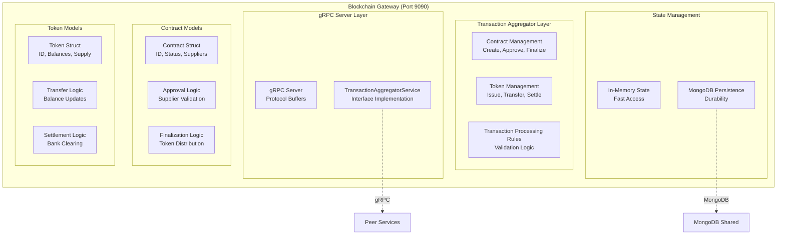

### Smart Contract Methods

#### Contract Operations

##### CreateContract
```protobuf
message CreateContractRequest {
  string anchorId = 1;
  repeated string suppliers = 2;
  double totalAmount = 3;
  string fileHash = 4;
}

message ContractResponse {
  string contractId = 1;
  string status = 2;
  string message = 3;
}
```

**Transaction Aggregator:**
1. Validate anchor permissions
2. Generate unique contract ID
3. Initialize contract with PENDING status
4. Store contract metadata trong MongoDB
5. Return contract ID

##### ApproveContract
```protobuf
message ApproveContractRequest {
  string contractId = 1;
  string supplierId = 2;
}

message ContractResponse {
  string contractId = 1;
  string status = 2;
  string message = 3;
}
```

**Transaction Aggregator:**
1. Validate supplier permissions cho contract
2. Update supplier approval status
3. Check if all suppliers approved
4. Update contract status accordingly

##### FinalizeContract
```protobuf
message FinalizeContractRequest {
  string contractId = 1;
}

message ContractResponse {
  string contractId = 1;
  string status = 2;
  string message = 3;
}
```

**Transaction Aggregator:**
1. Validate all suppliers approved
2. Distribute tokens proportionally
3. Update contract status to EXECUTED
4. Create token transfer records

#### Token Operations

##### IssueToken
```protobuf
message IssueTokenRequest {
  string contractId = 1;
  string issuer = 2;
  double totalSupply = 3;
}

message TokenResponse {
  string tokenId = 1;
  string status = 2;
  string message = 3;
}
```

**Transaction Aggregator:**
1. Validate contract is approved
2. Generate unique token ID
3. Initialize token với total supply
4. Assign initial ownership to issuer
5. Create balance records

##### TransferToken
```protobuf
message TransferTokenRequest {
  string tokenId = 1;
  string from = 2;
  string to = 3;
  double amount = 4;
}

message TokenResponse {
  string tokenId = 1;
  string status = 2;
  string message = 3;
}
```

**Transaction Aggregator:**
1. Validate sender balance sufficient
2. Update sender balance (-amount)
3. Update receiver balance (+amount)
4. Create transfer record
5. Validate total supply conservation

##### SettleToken
```protobuf
message SettleTokenRequest {
  string tokenId = 1;
  string supplierId = 2;
  string bankId = 3;
}

message TokenResponse {
  string tokenId = 1;
  string status = 2;
  string message = 3;
}
```

**Transaction Aggregator:**
1. Validate supplier has balance
2. Remove supplier balance
3. Create settlement record
4. Update token circulation

### Transaction Processing Rules Validation

#### Contract Rules:
- **Anchor Authorization**: Chỉ anchors có thể tạo contracts
- **Supplier Validation**: Chỉ assigned suppliers có thể approve
- **Approval Quorum**: Tất cả suppliers phải approve trước khi execution
- **Status Transitions**: PENDING → APPROVED → EXECUTED

#### Token Rules:
- **Single Issuance**: Mỗi contract tạo ra exactly một token
- **Supply Conservation**: Total balance luôn bằng total supply
- **Transfer Validation**: Sufficient balance required
- **Settlement Authorization**: Chỉ token holders có thể settle

## gRPC Direct Communication

### Tổng quan
gRPC Direct Communication loại bỏ hoàn toàn message broker trung gian, cho phép peers giao tiếp trực tiếp với orderer cluster:

- **📡 Direct Communication**: Peers ↔ Orderers giao tiếp qua gRPC APIs
- **⚡ Real-time Processing**: Persistent gRPC streams cho block delivery
- **🔄 Connection Management**: Automatic reconnection với retry logic
- **📊 Load Balancing**: Client-side load balancing across orderer nodes
- **🛡️ Error Handling**: Comprehensive error propagation và recovery

### gRPC Communication Protocol

#### Blockchain Gateway Interface
```protobuf
service BlockchainGatewayService {
  // Transaction Aggregation
  rpc AggregateTransactions(AggregateTransactionsRequest) returns (AggregateTransactionsResponse);
  rpc SubmitToOrderer(SubmitToOrdererRequest) returns (SubmitToOrdererResponse);
  rpc ValidateTransactions(ValidateTransactionsRequest) returns (ValidateTransactionsResponse);
  
  // Endorsement Management
  rpc ManageEndorsements(ManageEndorsementsRequest) returns (ManageEndorsementsResponse);
  rpc CollectEndorsements(CollectEndorsementsRequest) returns (CollectEndorsementsResponse);
  
  // Transaction Status
  rpc GetTransactionStatus(GetTransactionStatusRequest) returns (GetTransactionStatusResponse);
  rpc GetTransactionHistory(GetTransactionHistoryRequest) returns (GetTransactionHistoryResponse);
}
```

#### Orderer Service Interface
```protobuf
service OrdererService {
  // Submit transaction trực tiếp đến orderer cluster
  rpc SubmitTransaction(SubmitTransactionRequest) returns (SubmitTransactionResponse);

  // Streaming blocks từ orderer đến peer
  rpc StreamBlocks(StreamBlocksRequest) returns (stream Block);

  // Query block information
  rpc GetBlockInfo(GetBlockInfoRequest) returns (GetBlockInfoResponse);
}
```

### Transaction Processing Flow

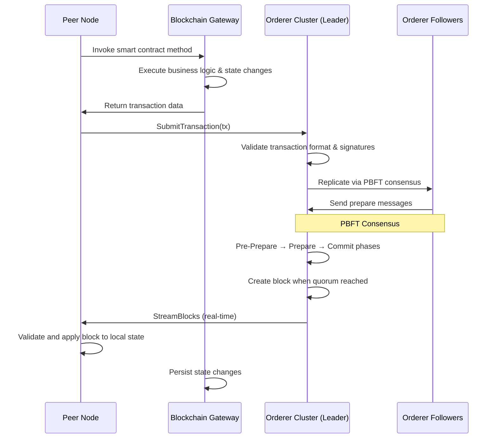

### Connection Management

```go
// gRPC Connection với retry logic
func connectToOrderer(endpoint string) (*grpc.ClientConn, error) {
    return grpc.Dial(endpoint,
        grpc.WithTransportCredentials(insecure.NewCredentials()),
        grpc.WithConnectParams(grpc.ConnectParams{
            Backoff:           backoff.DefaultConfig,
            MinConnectTimeout: 5 * time.Second,
        }),
        grpc.WithKeepaliveParams(keepalive.ClientParameters{
            Time:                10 * time.Second,
            Timeout:             5 * time.Second,
            PermitWithoutStream: true,
        }),
    )
}
```

### Error Handling

#### gRPC Error Codes:
- `INVALID_ARGUMENT`: Transaction data không đúng format
- `PERMISSION_DENIED`: Peer không có quyền submit
- `NOT_FOUND`: Transaction ID không tìm thấy
- `UNAVAILABLE`: Orderer cluster không thể truy cập
- `DEADLINE_EXCEEDED`: gRPC timeout
- `INTERNAL`: Lỗi internal của orderer

#### Recovery Mechanisms:
- **Transaction Resubmission**: Failed transactions có thể resubmit với exponential backoff
- **Block Synchronization**: Peers có thể gọi `GetBlocks()` để sync missing blocks
- **Stream Reconnection**: gRPC streams tự động reconnect với resume capability
- **State Validation**: Peers validate blockchain state consistency

## PBFT Consensus

### Tổng quan
Practical Byzantine Fault Tolerance (PBFT) consensus đảm bảo transaction ordering và fault tolerance trong orderer cluster:

- **🏛️ Byzantine Fault Tolerance**: Chịu được f=1 faulty nodes trong 3-node cluster
- **⚡ Fast Consensus**: Pre-Prepare → Prepare → Commit phases
- **🔐 Cryptographic Signatures**: ECDSA signatures cho block validation
- **📊 Quorum Requirements**: 2f+1 signatures để commit blocks
- **🔄 Leader Election**: Automatic leader election khi leader fails

### PBFT Consensus Process


### PBFT Phases

#### 1. Pre-Prepare Phase
- Leader orderer nhận transaction từ peer
- Validate transaction format và signatures
- Broadcast Pre-Prepare message đến followers
- Include proposed block với transaction

#### 2. Prepare Phase
- Followers nhận Pre-Prepare message
- Validate proposed block
- Send Prepare message đến leader
- Quorum 2f+1 Prepare messages required

#### 3. Commit Phase
- Leader nhận Prepare messages
- Broadcast Commit message đến followers
- Followers send Commit message đến leader
- Quorum 2f+1 Commit messages required

#### 4. Finalize Phase
- Block được finalized với ECDSA signatures
- Calculate Merkle root và block hash
- Stream finalized block đến peers
- Peers validate và apply block

### PBFT Configuration

```yaml
pbft_config:
  fault_tolerance: 1       # f=1
  total_nodes: 3           # 3f+1 = 4 nodes minimum, we use 3
  consensus_timeout: 3000ms
  block_creation:
    min_transactions: 5      # Create block với ít nhất 5 tx
    max_wait_time: 5000ms    # Hoặc sau 5 giây
    max_block_size: 100      # Tối đa 100 tx per block
```

### Cryptographic Signatures

#### ECDSA Signature Process:
1. **Key Generation**: Mỗi orderer có ECDSA key pair
2. **Block Signing**: Orderer ký block với private key
3. **Signature Verification**: Peers verify signatures với public keys
4. **Quorum Validation**: 2f+1 signatures required để validate block

#### Block Hash Calculation:
```
blockHash = SHA256(prevBlockHash + merkleRoot + blockTimestamp)
```

### Fault Tolerance

#### Byzantine Fault Tolerance:
- **f=1**: Hệ thống chịu được 1 faulty node
- **3f+1 nodes**: Tối thiểu 4 nodes, chúng ta dùng 3 nodes
- **Quorum**: 2f+1 = 3 signatures required
- **Leader Election**: Automatic khi leader fails

#### Failure Scenarios:
1. **Leader Failure**: Automatic leader election
2. **Follower Failure**: Consensus continues với remaining nodes
3. **Network Partition**: Consensus stops until network recovery
4. **Byzantine Behavior**: Malicious nodes detected và isolated

### Kiến trúc Microservices với Multi-peer Network

```
┌─────────────────────────────────────────────────────────────────────┐
│                         Client Layer                                │
│  ┌─────────────────────────────────────────────────────────────┐    │
│  │                 Angular Frontend                           │    │
│  │  - Components: Contract, Token, Supplier, Bank            │    │
│  │  - Services: API calls, Auth, Data management             │    │
│  │  - UI: Material Design, Responsive                         │    │
│  └─────────────────────────────────────────────────────────────┘    │
└─────────────────────────────────────────────────────────────────────┘
                                     │
                        HTTP/REST API (Port 8080)
                                     │
┌─────────────────────────────────────────────────────────────────────┐
│                     Smart API Gateway Layer                         │
│  ┌─────────────────────────────────────────────────────────────┐    │
│  │            Java Spring Boot API Gateway                    │    │
│  │  - Controllers: Contract, Token, Supplier                  │    │
│  │  - PeerRoutingService: Business logic routing              │    │
│  │  - Models: DTOs, Entities                                  │    │
│  │  - Auth: JWT validation, Role-based access                 │    │
│  └─────────────────────────────────────────────────────────────┘    │
└─────────────────────────────────────────────────────────────────────┘
                                     │
                  Smart HTTP Routing (Transaction Aggregator Based)
                                     │
┌─────────────────────────────────────────────────────────────────────┐
│                   Permissioned Peer Network                          │
│  ┌─────┬─────┬─────┐    ┌─────┬─────┬─────┐    ┌─────┬─────┐         │
│  │MB   │SUP  │ANC  │    │MB   │SUP  │ANC  │    │MB   │SUP  │ANC  │  │
│  │REST │REST │REST │    │gRPC │gRPC │gRPC │    │DB   │DB   │DB   │  │
│  │API  │API  │API  │    │Srv  │Srv  │Srv  │    │Inst │Inst │Inst │  │
│  └─────┴─────┴─────┘    └─────┴─────┴─────┘    └─────┴─────┴─────┘  │
│     Port: 8082-8084         Port: 9092-9094        Isolated DBs     │
└─────────────────────────────────────────────────────────────────────┘
                                     │
                          gRPC Cross-peer Communication
                                     │
┌─────────────────────────────────────────────────────────────────────┐
│                     Orderer Cluster (Public)                        │
│  ┌─────┬─────┬─────┐    ┌─────────────────────────────┐             │
│  │ORD1 │ORD2 │ORD3 │    │      Raft Consensus         │             │
│  │7050 │7060 │7070 │    │  - Global Block Ordering    │             │
│  └─────┴─────┴─────┘    │  - Transaction Sequencing   │             │
│                         │  - Consensus Protocol       │             │
│                         └─────────────────────────────┘             │
└─────────────────────────────────────────────────────────────────────┘
                                     │
                           Globally Ordered Blocks
                                     │
┌─────────────────────────────────────────────────────────────────────┐
│                    Distributed World State                           │
│  ┌─────┬─────┬─────┬─────┐    ┌─────┬─────┬─────┬─────┐             │
│  │CTR  │TOK  │BAL  │EVT  │    │CTR  │TOK  │BAL  │EVT  │   ...       │
│  │Main │Main│Main │Main │    │Sup  │Sup  │Sup  │Sup  │   ...       │
│  │Bank │Bank│Bank │Bank │    │Bank │Bank │Bank │Bank │             │
│  └─────┴─────┴─────┴─────┘    └─────┴─────┴─────┴─────┘             │
│     Isolated Collections             Isolated Collections            │
└─────────────────────────────────────────────────────────────────────┘
```

### Private-Public Blockchain Integration

#### 1. Transaction Submission Flow

Khi một peer node cần thực hiện một blockchain operation, nó sẽ:
1. Invoke Blockchain Gateway để tổng hợp transactions
2. Submit transaction trực tiếp lên orderer cluster thông qua gRPC
3. Nhận block stream từ orderer và apply state changes


**Các bước chi tiết:**

1. **Chaincode Invocation**
   - Peer gọi gRPC methods của Blockchain Gateway
   - Chaincode thực thi business logic và tạo transaction data
   - State changes được persist trong MongoDB

2. **Direct gRPC Submission**
   - Peer submit transaction trực tiếp đến orderer leader qua gRPC
   - Orderer validate transaction format và digital signatures
   - Không còn channel-based permissions

3. **PBFT Consensus**
   - Leader orderer broadcast Pre-Prepare message
   - Followers gửi Prepare messages
   - Quorum 2f+1 signatures để commit block
   - f=1 fault tolerance với 3 nodes

4. **Real-time Block Streaming**
   - Orderer stream finalized blocks trực tiếp đến peers
   - Peers validate blocks và apply state changes
   - Persistent gRPC connections đảm bảo real-time delivery

#### 2. gRPC Communication Protocol

**Blockchain Gateway Service Interface:**

```protobuf
service BlockchainGatewayService {
  // Contract Management
  rpc CreateContract(CreateContractRequest) returns (CreateContractResponse);
  rpc ApproveContract(ApproveContractRequest) returns (ApproveContractResponse);
  rpc FinalizeContract(FinalizeContractRequest) returns (FinalizeContractResponse);

  // Token Management
  rpc IssueToken(IssueTokenRequest) returns (IssueTokenResponse);
  rpc TransferToken(TransferTokenRequest) returns (TransferTokenResponse);
  rpc SettleToken(SettleTokenRequest) returns (SettleTokenResponse);

  // Query Operations
  rpc GetContract(GetContractRequest) returns (GetContractResponse);
  rpc GetToken(GetTokenRequest) returns (GetTokenResponse);
  rpc GetBalances(GetBalancesRequest) returns (GetBalancesResponse);
}

**Orderer Service Interface:**

```protobuf
service OrdererService {
  // Submit transaction trực tiếp đến orderer cluster
  rpc SubmitTransaction(SubmitTransactionRequest) returns (SubmitTransactionResponse);

  // Streaming blocks từ orderer đến peer
  rpc StreamBlocks(StreamBlocksRequest) returns (stream Block);

  // Query block information
  rpc GetBlockInfo(GetBlockInfoRequest) returns (GetBlockInfoResponse);
}

message SubmitTransactionRequest {
  string transaction_id = 1;    // Unique transaction ID
  string sender_id = 2;         // Peer node ID (peer_main_bank, peer_supplier, etc.)
  string transaction_type = 3;  // CONTRACT_CREATE, TOKEN_TRANSFER, etc.
  bytes transaction_data = 4;   // Serialized transaction payload
  bytes signature = 5;          // Digital signature của peer
  int64 timestamp = 6;          // Unix timestamp của khi submit
}

message SubmitTransactionResponse {
  string transaction_id = 1;
  string status = 2;            // "ACCEPTED", "REJECTED"
  string message = 3;           // Status message
  int64 estimated_commit_time = 4; // Estimated time transaction sẽ được commit
  int64 current_block_height = 5; // Current block height
}

message StreamBlocksRequest {
  int64 start_block = 1;        // Block number bắt đầu stream (0 = từ latest)
  string peer_id = 2;           // Peer ID để authorization
}

message Block {
  int64 block_number = 1;
  int64 timestamp = 2;
  string previous_hash = 3;
  string hash = 4;
  string channel = 5;
  repeated Transaction transactions = 6;
  string merkle_root = 7;
  BlockMetadata metadata = 8;
}

message Transaction {
  string transaction_id = 1;
  string transaction_type = 2;
  bytes transaction_data = 3;
  string sender_id = 4;
  int64 timestamp = 5;
  bytes signature = 6;
  TransactionStatus status = 7;
}

message BlockMetadata {
  string creator_id = 1;        // Orderer node tạo block
  int64 transaction_count = 2;
  string channel = 3;
}

enum TransactionStatus {
  UNKNOWN = 0;
  PENDING = 1;
  COMMITTED = 2;
  FAILED = 3;
}
```

#### 3. Unified Transaction Processing

Hệ thống sử dụng kiến trúc unified cho tất cả transaction types, không phân biệt channels. Tất cả peers có quyền submit transactions và receive blocks:

**Transaction Types:**
- **Contract Operations**: Create, approve, finalize contracts
- **Token Operations**: Issue, transfer, settle tokens
- **Query Operations**: Get contracts, tokens, balances

**Processing Configuration:**

```yaml
transaction_processing:
  orderer_endpoints:
    - "orderer-ord1:7050"
    - "orderer-ord2:7060"
    - "orderer-ord3:7070"
  grpc_service: "OrdererService"
  permissions:
    submit:  # All peers can submit transactions
      - peer_main_bank
      - peer_supplier
      - peer_anchor
    stream:  # All peers can stream blocks
      - peer_main_bank
      - peer_supplier
      - peer_anchor
  block_creation:
    min_transactions: 5      # Create block with at least 5 tx
    max_wait_time: 5000ms    # Or after 5 seconds
    max_block_size: 100      # Maximum 100 tx per block
  pbft_config:
    fault_tolerance: 1       # f=1
    total_nodes: 3           # 3f+1 = 4 nodes minimum, we use 3
    consensus_timeout: 3000ms

#### 4. Consensus và Ordering Mechanism

**PBFT Consensus trong Orderer Cluster:**

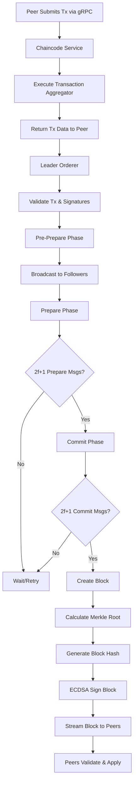

**PBFT Ordering Rules:**
1. **Pre-Prepare Phase**: Leader broadcasts proposed block to followers
2. **Prepare Phase**: Followers validate và send prepare messages
3. **Commit Phase**: Quorum 2f+1 signatures required to commit
4. **Fault Tolerance**: f=1 với 3 nodes (tối thiểu 3f+1 = 4 nodes)
5. **Block Creation Triggers**:
   - Minimum transaction count (5 tx)
   - Maximum wait time timeout (5 giây)
   - Maximum block size limit (100 tx)
6. **Block Hash Calculation**: `SHA256(prevBlockHash + merkleRoot + blockTimestamp)`

**PBFT Message Structure:**
```go
type PBFTMessage struct {
    Type          string // "PRE-PREPARE", "PREPARE", "COMMIT"
    ViewNumber    int64
    SequenceNumber int64
    Block         *Block
    SenderID      string
    Signature     []byte
    Timestamp     int64
}
```

#### 5. Error Handling và Recovery

**gRPC Error Codes:**
- `INVALID_ARGUMENT`: Transaction data không đúng format hoặc missing required fields
- `PERMISSION_DENIED`: Peer không có quyền submit lên channel hoặc subscribe blocks
- `NOT_FOUND`: Channel không tồn tại hoặc transaction ID không tìm thấy
- `UNAVAILABLE`: Orderer cluster không thể truy cập (network issues)
- `DEADLINE_EXCEEDED`: gRPC timeout
- `INTERNAL`: Lỗi internal của orderer (consensus failure, storage error)

**Recovery Mechanisms:**
- **Transaction Resubmission**: Failed transactions có thể resubmit với exponential backoff
- **Block Synchronization**: Peers có thể gọi `GetBlocks()` để sync missing blocks
- **Stream Reconnection**: gRPC streams tự động reconnect với resume capability
- **State Validation**: Peers validate blockchain state consistency across network
- **Leader Election**: Raft tự động elect new leader nếu current leader fails

**Connection Management:**
```go
// gRPC Connection với retry logic
func connectToOrderer(endpoint string) (*grpc.ClientConn, error) {
    return grpc.Dial(endpoint,
        grpc.WithTransportCredentials(insecure.NewCredentials()),
        grpc.WithConnectParams(grpc.ConnectParams{
            Backoff:           backoff.DefaultConfig,
            MinConnectTimeout: 5 * time.Second,
        }),
        grpc.WithKeepaliveParams(keepalive.ClientParameters{
            Time:                10 * time.Second,
            Timeout:             5 * time.Second,
            PermitWithoutStream: true,
        }),
    )
}
```

#### 6. Performance Optimizations

**gRPC Streaming:**
- **Bi-directional Streams**: Peers maintain persistent gRPC streams cho real-time block delivery
- **Flow Control**: gRPC flow control prevents memory overflow trong high-throughput scenarios
- **Compression**: Message compression cho large transaction payloads

**Load Balancing & Scaling:**
- **Client-side Load Balancing**: Peers distribute requests across orderer nodes
- **Leader Affinity**: Transaction submissions route to current Raft leader
- **Connection Pooling**: Reused gRPC connections reduce connection overhead

**Caching & Optimization:**
- **Block Cache**: Peers cache recent blocks để reduce validation time
- **Merkle Proofs**: Efficient state proofs cho large blockchains
- **Batch Validation**: Validate multiple transactions together

**Monitoring & Metrics:**
- **gRPC Metrics**: Request latency, error rates, connection health
- **Consensus Metrics**: Leader election time, replication lag
- **Block Metrics**: Creation time, transaction throughput, block size distribution
- **Peer Health**: Sync status, block height, connection stability

**Performance Benchmarks:**
- **Transaction Submission**: <50ms average latency
- **Block Propagation**: <200ms to all peers
- **Block Validation**: <100ms per block
- **Throughput**: 1000+ TPS per channel

### Công nghệ sử dụng với kiến trúc mới

| Layer | Technology | Version | Purpose |
|-------|------------|---------|---------|
| **Frontend** | Angular | 17 | Single Page Application với role-based components |
| **API Gateway** | Java Spring Boot | 3.1.5 | Smart routing, authentication, business logic |
| **Peer Nodes** | Golang | 1.21 | Permissioned blockchain operations, gRPC clients |
| **Orderer Cluster** | Golang | 1.21 | Raft consensus, global transaction ordering |
| **Databases** | MongoDB | 7.x | Isolated World State databases per peer |
| **Communication** | gRPC + REST | - | Direct peer-to-orderer và API access |
| **Consensus** | Raft | - | Distributed consensus protocol |
| **Streaming** | gRPC Streams | - | Real-time block broadcasting |
| **Container** | Docker | 24.x | Multi-service containerization |
| **Orchestration** | Docker Compose | 2.20 | Complex network topology management |
| **Networks** | Docker Networks | - | Isolated public/private/orderer networks |

## Luồng Use Case

### UC-001: Tạo hợp đồng thương mại
**Actor**: Anchor (Người mua)
**Mô tả**: Anchor tạo hợp đồng mới với danh sách suppliers và thông tin chi tiết
**Điều kiện tiên quyết**: Anchor đã đăng nhập
**Luồng chính**:
1. Anchor nhập thông tin hợp đồng
2. Hệ thống tạo ID hợp đồng
3. Lưu hợp đồng vào database
4. Ghi event và tạo block
5. Thông báo thành công

### UC-002: Ngân hàng phê duyệt hợp đồng
**Actor**: Bank (Ngân hàng)
**Mô tả**: Bank phê duyệt hợp đồng và hệ thống tự động phát hành token
**Điều kiện tiên quyết**: Hợp đồng tồn tại, chưa được bank phê duyệt
**Luồng chính**:
1. Bank chọn hợp đồng cần phê duyệt
2. Hệ thống kiểm tra quyền hạn
3. Cập nhật trạng thái bankApproved = true
4. Tính tổng giá trị hợp đồng
5. Tạo token với Issuer = "SYSTEM"
6. Tạo balance ban đầu cho Anchor
7. Ghi event và tạo block
8. Thông báo thành công

### UC-003: Supplier phê duyệt hợp đồng
**Actor**: Supplier (Người bán)
**Mô tả**: Supplier phê duyệt phần của mình trong hợp đồng
**Điều kiện tiên quyết**: Hợp đồng đã được bank phê duyệt
**Luồng chính**:
1. Supplier chọn hợp đồng cần phê duyệt
2. Hệ thống kiểm tra quyền hạn
3. Cập nhật trạng thái supplier
4. Kiểm tra tất cả suppliers đã phê duyệt
5. Nếu tất cả đã phê duyệt:
   - Phân phối token cho tất cả suppliers
   - Xóa balance của Anchor
   - Cập nhật trạng thái hợp đồng
6. Ghi event và tạo block
7. Thông báo thành công

### UC-004: Chuyển nhượng token
**Actor**: Supplier
**Mô tả**: Supplier chuyển token cho supplier khác
**Điều kiện tiên quyết**: Supplier có balance token > 0
**Luồng chính**:
1. Supplier chọn token và số lượng
2. Chọn người nhận
3. Hệ thống kiểm tra balance đủ
4. Cập nhật balance người gửi (-)
5. Cập nhật balance người nhận (+)
6. Ghi event và tạo block
7. Kiểm tra nếu Anchor hết token thì tự động hoàn tất hợp đồng

### UC-005: Tất toán token với ngân hàng
**Actor**: Supplier
**Mô tả**: Supplier tất toán toàn bộ token với ngân hàng
**Điều kiện tiên quyết**: Supplier có balance token > 0
**Luồng chính**:
1. Supplier chọn token cần tất toán
2. Hệ thống kiểm tra balance
3. Xóa toàn bộ balance của supplier
4. Ghi event tất toán
5. Tạo block
6. Thông báo thành công

### UC-006: Xem lịch sử giao dịch
**Actor**: Tất cả users
**Mô tả**: Xem tất cả events và blocks liên quan đến một hợp đồng
**Luồng chính**:
1. Chọn hợp đồng
2. Query tất cả events liên quan
3. Query blocks chứa events
4. Query balances hiện tại
5. Hiển thị ledger hoàn chỉnh

## Luồng Sequence Diagram

### SD-001: Tạo và phê duyệt hợp đồng hoàn chỉnh với gRPC Direct Communication

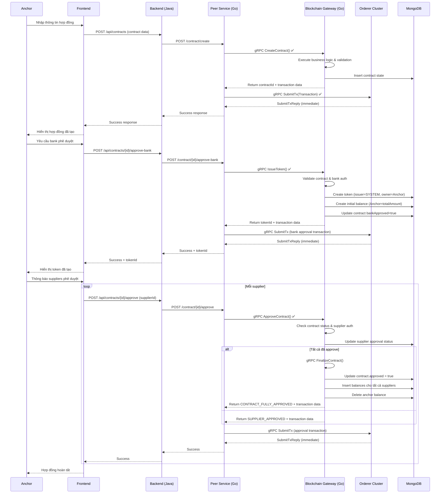

### SD-002: Chuyển nhượng token với gRPC Direct Communication

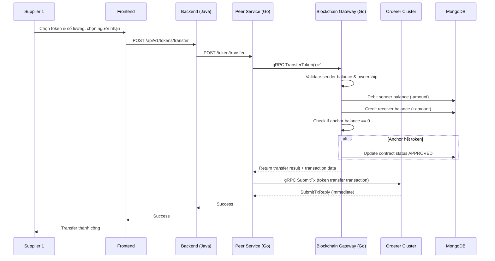

### SD-003: Tất toán token với gRPC Direct Communication

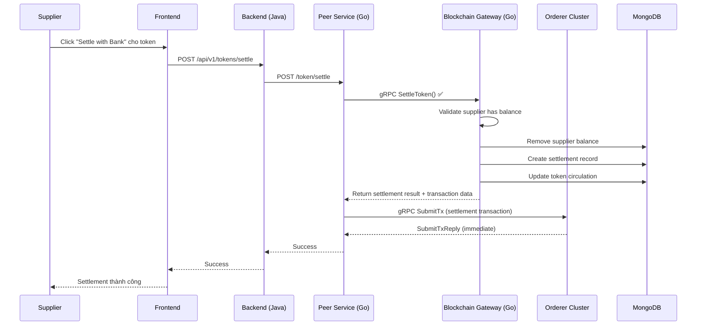

## Thiết kế API

### API Gateway (Java Spring Boot - Port 8080)

#### 1. Authentication APIs

##### POST /api/auth/login
**Mô tả**: Xác thực người dùng và trả về JWT token

**Input**:
```json
{
  "username": "bank_user",
  "password": "secure_password"
}
```

**Output (Success - 200)**:
```json
{
  "token": "eyJhbGciOiJIUzI1NiIsInR5cCI6IkpXVCJ9...",
  "user": {
    "id": "BANK001",
    "username": "bank_user",
    "role": "BANK",
    "name": "Main Bank"
  },
  "expiresIn": 3600
}
```

**Mã lỗi**:
- 400: Missing username or password
- 401: Invalid credentials
- 403: Account disabled
- 500: Internal server error

**Flowchart**:
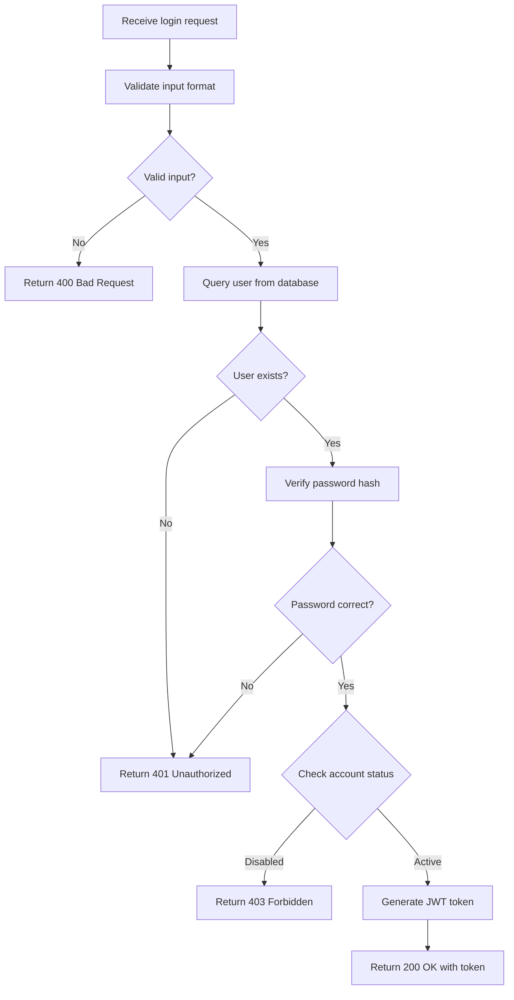

#### 2. Contract APIs

##### POST /api/v1/contracts - Create Contract
**Mô tả**: Anchor tạo hợp đồng mới với file upload

**Input** (FormData):
```
buyer: "ANCHOR001"
bankId: "BANK001"
description: "Supply Chain Contract Q1 2024"
suppliers: [
  {
    "supplierId": "SUP001",
    "name": "ABC Corp",
    "allocatedAmount": 30000.00
  },
  {
    "supplierId": "SUP002",
    "name": "XYZ Ltd",
    "allocatedAmount": 20000.00
  }
]
totalAmount: 50000.00
file: [PDF file upload]
```

**Output (Success - 200)**:
```json
{
  "contractId": "3ef8cdb0-266f-451d-a6f6-fa163502360b",
  "tokenId": "token_3ef8cdb0-266f-451d-a6f6-fa163502360b",
  "status": "created",
  "message": "Contract created successfully"
}
```

**Mã lỗi**:
- 400: Invalid contract data or file format
- 401: Unauthorized (invalid JWT)
- 403: Insufficient permissions (not ANCHOR role)
- 413: File too large (>10MB)
- 422: Invalid PDF file
- 500: Internal server error

**Flowchart**:
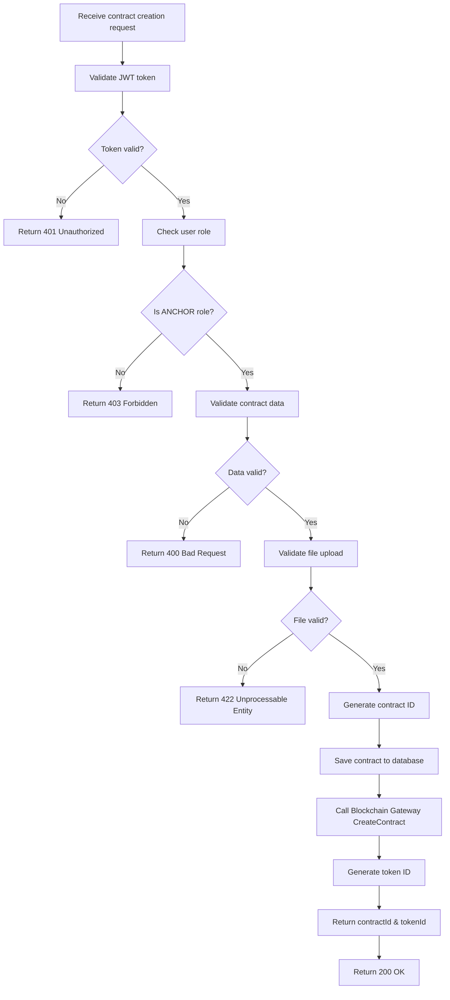

##### GET /api/v1/contracts - List Contracts
**Mô tả**: Lấy danh sách contracts theo role

**Headers**:
```
Authorization: Bearer <jwt_token>
```

**Query Parameters**:
- status: "PENDING", "BANK_APPROVED", "EXECUTED"
- page: 0 (default)
- size: 20 (default)

**Output (Success - 200)**:
```json
{
  "contracts": [
    {
      "_id": "3ef8cdb0-266f-451d-a6f6-fa163502360b",
      "description": "Supply Chain Contract Q1",
      "anchorId": "ANCHOR001",
      "bankId": "BANK001",
      "bankApproved": true,
      "totalAmount": 50000.00,
      "status": "EXECUTED",
      "createdAt": "2024-01-01T10:00:00Z"
    }
  ],
  "totalElements": 1,
  "totalPages": 1,
  "currentPage": 0,
  "size": 20
}
```

**Mã lỗi**:
- 401: Unauthorized
- 403: Insufficient permissions
- 500: Internal server error

**Flowchart**:
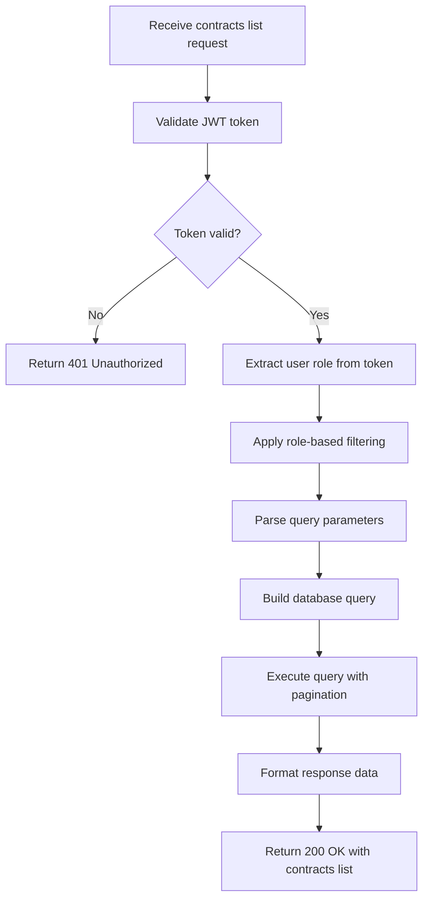

##### GET /api/v1/contracts/{id} - Get Contract Details
**Mô tả**: Lấy chi tiết contract

**Path Parameters**:
- id: Contract ID

**Headers**:
```
Authorization: Bearer <jwt_token>
```

**Output (Success - 200)**:
```json
{
  "_id": "3ef8cdb0-266f-451d-a6f6-fa163502360b",
  "description": "Supply Chain Contract Q1",
  "anchorId": "ANCHOR001",
  "bankId": "BANK001",
  "bankApproved": true,
  "suppliers": [
    {
      "supplierId": "SUP001",
      "name": "ABC Corp",
      "allocatedAmount": 30000.00,
      "approved": true
    }
  ],
  "totalAmount": 50000.00,
  "status": "EXECUTED",
  "fileUrl": "/api/files/contract_3ef8cdb0.pdf",
  "createdAt": "2024-01-01T10:00:00Z"
}
```

**Mã lỗi**:
- 401: Unauthorized
- 403: Insufficient permissions
- 404: Contract not found
- 500: Internal server error

**Flowchart**:
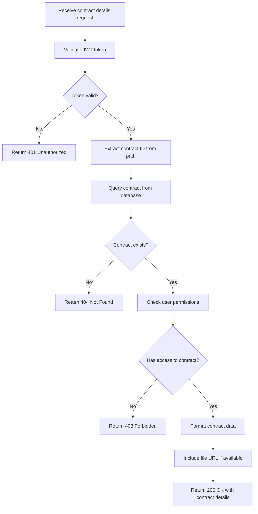

##### POST /api/v1/contracts/{id}/approve-bank - Bank Approve Contract
**Mô tả**: Ngân hàng phê duyệt và phát hành token

**Input**:
```json
{
  "bankId": "BANK001"
}
```

**Headers**:
```
Authorization: Bearer <jwt_token>
```

**Output (Success - 200)**:
```json
{
  "contractId": "3ef8cdb0-266f-451d-a6f6-fa163502360b",
  "tokenId": "token_3ef8cdb0-266f-451d-a6f6-fa163502360b",
  "status": "approved",
  "message": "Contract approved by bank and token issued successfully"
}
```

**Mã lỗi**:
- 400: Invalid request data
- 401: Unauthorized
- 403: Insufficient permissions (not BANK role)
- 404: Contract not found
- 409: Contract already approved
- 500: Internal server error

**Flowchart**:
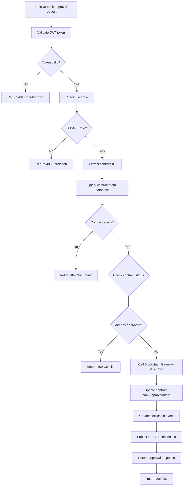

##### POST /api/v1/contracts/{id}/approve - Supplier Approve Contract
**Mô tả**: Supplier phê duyệt phần của mình trong contract

**Path Parameters**:
- id: Contract ID

**Input**:
```json
{
  "supplierId": "SUP001"
}
```

**Headers**:
```
Authorization: Bearer <jwt_token>
```

**Output (Success - 200)**:
```json
{
  "contractId": "3ef8cdb0-266f-451d-a6f6-fa163502360b",
  "supplierId": "SUP001",
  "status": "approved",
  "message": "Contract approved by supplier successfully"
}
```

**Mã lỗi**:
- 400: Invalid request data
- 401: Unauthorized
- 403: Insufficient permissions (not SUPPLIER role)
- 404: Contract not found
- 409: Supplier already approved
- 500: Internal server error

**Flowchart**:
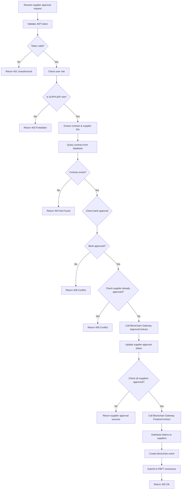

#### 3. Token APIs

##### GET /api/v1/tokens - List Tokens
**Mô tả**: Lấy danh sách tokens

**Headers**:
```
Authorization: Bearer <jwt_token>
```

**Query Parameters**:
- page: 0 (default)
- size: 20 (default)

**Output (Success - 200)**:
```json
{
  "tokens": [
    {
      "_id": "token_3ef8cdb0-266f-451d-a6f6-fa163502360b",
      "contractId": "3ef8cdb0-266f-451d-a6f6-fa163502360b",
      "symbol": "TK-3ef8cdb0",
      "totalSupply": 50000.00,
      "issuer": "SYSTEM",
      "owner": "ANCHOR001",
      "createdAt": "2024-01-01T10:00:00Z"
    }
  ],
  "totalElements": 1,
  "totalPages": 1,
  "currentPage": 0,
  "size": 20
}
```

**Mã lỗi**:
- 401: Unauthorized
- 500: Internal server error

**Flowchart**:
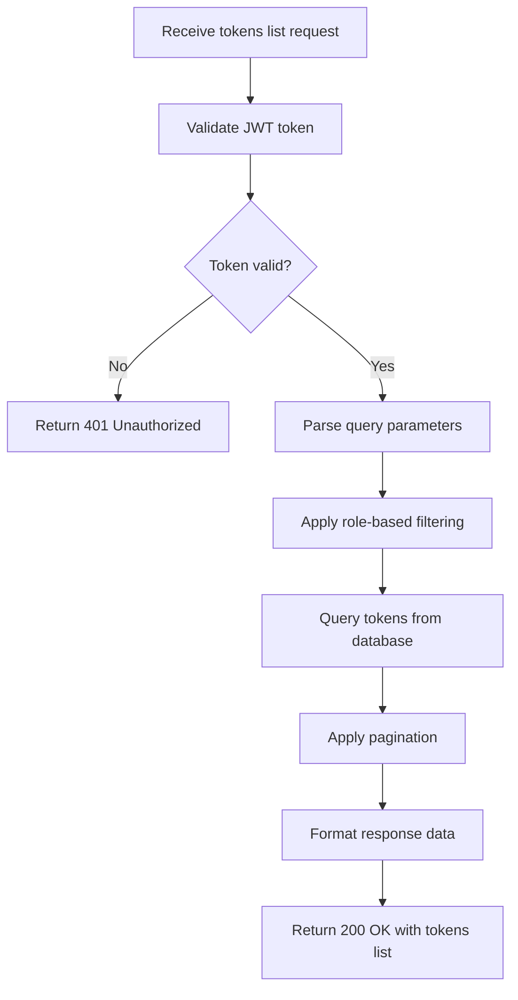

##### GET /api/v1/tokens/{id} - Get Token Details
**Mô tả**: Lấy chi tiết token

**Path Parameters**:
- id: Token ID

**Headers**:
```
Authorization: Bearer <jwt_token>
```

**Output (Success - 200)**:
```json
{
  "_id": "token_3ef8cdb0-266f-451d-a6f6-fa163502360b",
  "contractId": "3ef8cdb0-266f-451d-a6f6-fa163502360b",
  "symbol": "TK-3ef8cdb0",
  "totalSupply": 50000.00,
  "issuer": "SYSTEM",
  "owner": "ANCHOR001",
  "createdAt": "2024-01-01T10:00:00Z"
}
```

**Mã lỗi**:
- 401: Unauthorized
- 404: Token not found
- 500: Internal server error

**Flowchart**:
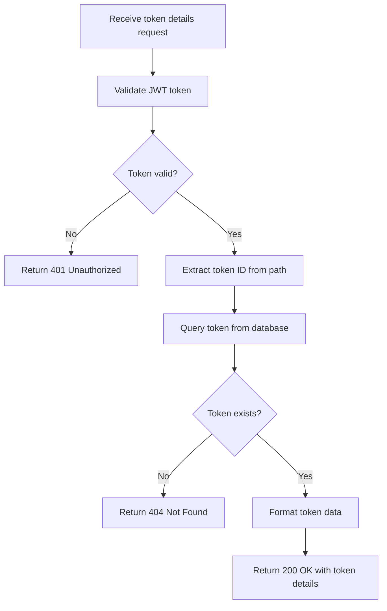

##### POST /api/v1/tokens/transfer - Transfer Token
**Mô tả**: Chuyển token giữa các suppliers

**Input**:
```json
{
  "tokenId": "token_3ef8cdb0-266f-451d-a6f6-fa163502360b",
  "from": "SUP001",
  "to": "SUP002",
  "amount": 10000.00
}
```

**Headers**:
```
Authorization: Bearer <jwt_token>
```

**Output (Success - 200)**:
```json
{
  "transferId": "transfer_1234567890",
  "tokenId": "token_3ef8cdb0-266f-451d-a6f6-fa163502360b",
  "from": "SUP001",
  "to": "SUP002",
  "amount": 10000.00,
  "status": "transferred",
  "message": "Token transferred successfully"
}
```

**Mã lỗi**:
- 400: Invalid transfer data or insufficient balance
- 401: Unauthorized
- 403: Insufficient permissions (not SUPPLIER role)
- 404: Token not found
- 409: Transfer failed (business logic error)
- 500: Internal server error

**Flowchart**:
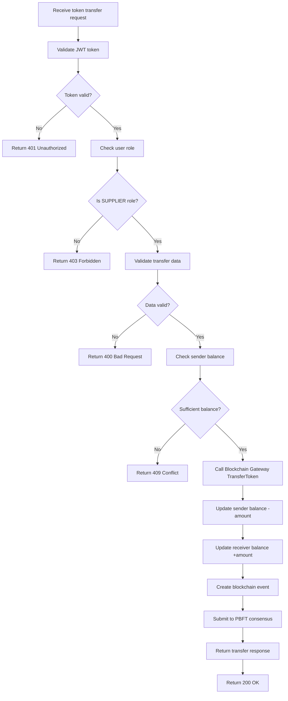

##### POST /api/v1/tokens/settle - Settle Token
**Mô tả**: Supplier tất toán token với bank

**Input**:
```json
{
  "tokenId": "token_3ef8cdb0-266f-451d-a6f6-fa163502360b",
  "supplierId": "SUP001"
}
```

**Headers**:
```
Authorization: Bearer <jwt_token>
```

**Output (Success - 200)**:
```json
{
  "settlementId": "settlement_1234567890",
  "tokenId": "token_3ef8cdb0-266f-451d-a6f6-fa163502360b",
  "supplierId": "SUP001",
  "settledAmount": 25000.00,
  "status": "settled",
  "message": "Token settled successfully with bank"
}
```

**Mã lỗi**:
- 400: Invalid settlement data or no balance to settle
- 401: Unauthorized
- 403: Insufficient permissions (not SUPPLIER role)
- 404: Token not found
- 409: Settlement failed (business logic error)
- 500: Internal server error

**Flowchart**:
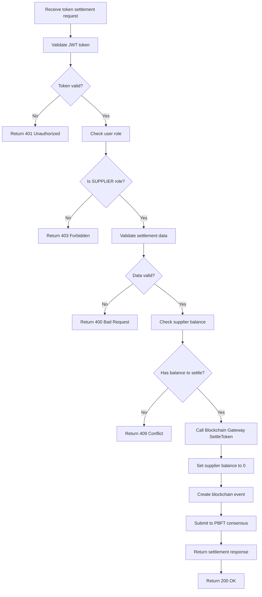

#### 4. Supplier APIs

##### GET /api/v1/suppliers - List Suppliers
**Mô tả**: Lấy danh sách suppliers

**Headers**:
```
Authorization: Bearer <jwt_token>
```

**Output (Success - 200)**:
```json
{
  "suppliers": [
    {
      "id": "SUP001",
      "name": "ABC Corporation",
      "username": "supplier1"
    },
    {
      "id": "SUP002",
      "name": "XYZ Ltd",
      "username": "supplier2"
    }
  ]
}
```

**Mã lỗi**:
- 401: Unauthorized
- 500: Internal server error

**Flowchart**:
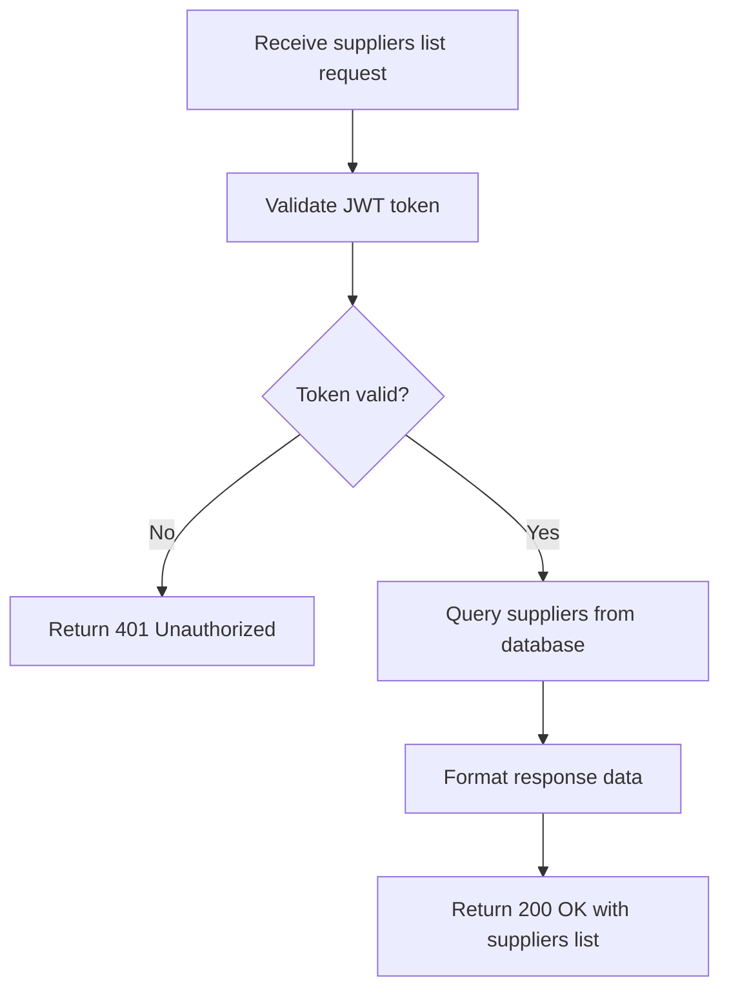

##### GET /api/v1/balances/account/{accountId} - Get Account Balances
**Mô tả**: Lấy balances của một account

**Path Parameters**:
- accountId: Account ID (supplier ID)

**Headers**:
```
Authorization: Bearer <jwt_token>
```

**Output (Success - 200)**:
```json
{
  "accountId": "SUP001",
  "balances": [
    {
      "tokenId": "token_3ef8cdb0-266f-451d-a6f6-fa163502360b",
      "balance": 25000.00,
      "lastUpdated": "2024-01-01T12:00:00Z"
    }
  ]
}
```

**Mã lỗi**:
- 401: Unauthorized
- 403: Insufficient permissions
- 404: Account not found
- 500: Internal server error

**Flowchart**:
```mermaid
flowchart TD
    A[Receive account balances request] --> B[Validate JWT token]
    B --> C{Token valid?}
    C -->|No| D[Return 401 Unauthorized]
    C -->|Yes| E[Extract account ID from path]
    E --> F[Check user permissions]
    F --> G{Has access to account?}
    G -->|No| H[Return 403 Forbidden]
    G -->|Yes| I[Query balances from database]
    I --> J{Account exists?}
    J -->|No| K[Return 404 Not Found]
    J -->|Yes| L[Format balance data]
    L --> M[Return 200 OK with balances]
```

#### 5. Ledger APIs

##### GET /api/v1/contracts/{id}/ledger - Get Contract Ledger
**Mô tả**: Xem lịch sử blockchain của contract

**Path Parameters**:
- id: Contract ID

**Headers**:
```
Authorization: Bearer <jwt_token>
```

**Output (Success - 200)**:
```json
{
  "contractId": "3ef8cdb0-266f-451d-a6f6-fa163502360b",
  "events": [
    {
      "eventId": "evt_1234567890",
      "eventType": "CONTRACT_CREATED",
      "contractId": "3ef8cdb0-266f-451d-a6f6-fa163502360b",
      "actorId": "ANCHOR001",
      "timestamp": "2024-01-01T10:00:00Z",
      "blockNumber": 1,
      "blockHash": "block_hash_123..."
    }
  ],
  "blocks": [
    {
      "blockNumber": 1,
      "timestamp": "2024-01-01T10:00:00Z",
      "hash": "block_hash_123...",
      "previousHash": "genesis",
      "transactionCount": 1
    }
  ]
}
```

**Mã lỗi**:
- 401: Unauthorized
- 403: Insufficient permissions
- 404: Contract not found
- 500: Internal server error

**Flowchart**:
```mermaid
flowchart TD
    A[Receive contract ledger request] --> B[Validate JWT token]
    B --> C{Token valid?}
    C -->|No| D[Return 401 Unauthorized]
    C -->|Yes| E[Extract contract ID from path]
    E --> F[Query contract from database]
    F --> G{Contract exists?}
    G -->|No| H[Return 404 Not Found]
    G -->|Yes| I[Check user permissions]
    I --> J{Has access to contract?}
    J -->|No| K[Return 403 Forbidden]
    J -->|Yes| L[Query events by contractId]
    L --> M[Query blocks containing events]
    M --> N[Derive blockchain state]
    N --> O[Format ledger data]
    O --> P[Return 200 OK with ledger]
```

### Peer Services APIs (Go - Ports 8082-8084)

#### 1. Peer Anchor APIs (Port 8084)

##### POST /contract/create - Create Contract
**Mô tả**: Tạo contract mới và submit lên blockchain

**Input**: Same as Java API

**Output (Success - 200)**:
```json
{
  "contractId": "3ef8cdb0-266f-451d-a6f6-fa163502360b",
  "tokenId": "token_3ef8cdb0-266f-451d-a6f6-fa163502360b",
  "status": "created",
  "message": "Contract created successfully"
}
```

**Mã lỗi**:
- 400: Invalid contract data
- 500: Internal server error (Blockchain Gateway or Orderer failure)

##### GET /contract/{id} - Get Contract Details
**Mô tả**: Lấy chi tiết contract từ local database

**Output**: Same as Java API

##### GET /contract/list - List Contracts
**Mô tả**: Lấy danh sách contracts đã tạo

**Output**: Same as Java API

#### 2. Peer Main Bank APIs (Port 8082)

##### POST /contract/{id}/approve-bank - Bank Approve Contract
**Mô tả**: Bank phê duyệt contract và phát hành token

**Input/Output**: Same as Java API

##### GET /contract/list - List All Contracts
**Mô tả**: Bank xem tất cả contracts

**Output**: Same as Java API

##### GET /contract/{id}/ledger - Get Contract Ledger
**Mô tả**: Xem audit trail của contract

**Output**: Same as Java API

##### GET /token/issued/{bankId} - Get Issued Tokens
**Mô tả**: Bank xem tokens đã phát hành

**Output**: Same as Java API

#### 3. Peer Supplier APIs (Port 8083)

##### POST /contract/{id}/approve - Supplier Approve Contract
**Mô tả**: Supplier phê duyệt contract

**Input/Output**: Same as Java API

##### POST /token/transfer - Transfer Token
**Mô tả**: Chuyển token giữa suppliers

**Input/Output**: Same as Java API

##### POST /token/settle - Settle Token
**Mô tả**: Tất toán token với bank

**Input/Output**: Same as Java API

##### GET /balances/account/{accountId} - Get Account Balances
**Mô tả**: Lấy balances của supplier

**Output**: Same as Java API

### Blockchain Gateway APIs (Go - Port 9090)

#### Smart Contract Methods

##### CreateContract - Tạo Contract
**Input**:
```json
{
  "anchorId": "ANCHOR001",
  "suppliers": [
    {
      "supplierId": "SUP001",
      "name": "ABC Corp",
      "allocatedAmount": 30000.00
    }
  ],
  "totalAmount": 50000.00,
  "description": "Supply Chain Contract",
  "fileHash": "pdf_hash_123..."
}
```

**Output**:
```json
{
  "contractId": "3ef8cdb0-266f-451d-a6f6-fa163502360b",
  "tokenId": "token_3ef8cdb0-266f-451d-a6f6-fa163502360b",
  "status": "success"
}
```

##### ApproveContract - Phê duyệt Contract
**Input**:
```json
{
  "contractId": "3ef8cdb0-266f-451d-a6f6-fa163502360b",
  "supplierId": "SUP001"
}
```

**Output**:
```json
{
  "contractId": "3ef8cdb0-266f-451d-a6f6-fa163502360b",
  "supplierId": "SUP001",
  "status": "approved"
}
```

##### IssueToken - Phát hành Token
**Input**:
```json
{
  "contractId": "3ef8cdb0-266f-451d-a6f6-fa163502360b",
  "issuer": "SYSTEM",
  "totalSupply": 50000.00
}
```

**Output**:
```json
{
  "tokenId": "token_3ef8cdb0-266f-451d-a6f6-fa163502360b",
  "contractId": "3ef8cdb0-266f-451d-a6f6-fa163502360b",
  "status": "issued"
}
```

##### TransferToken - Chuyển Token
**Input**:
```json
{
  "tokenId": "token_3ef8cdb0-266f-451d-a6f6-fa163502360b",
  "from": "SUP001",
  "to": "SUP002",
  "amount": 10000.00
}
```

**Output**:
```json
{
  "transferId": "transfer_1234567890",
  "tokenId": "token_3ef8cdb0-266f-451d-a6f6-fa163502360b",
  "status": "transferred"
}
```

##### SettleToken - Tất toán Token
**Input**:
```json
{
  "tokenId": "token_3ef8cdb0-266f-451d-a6f6-fa163502360b",
  "supplierId": "SUP001"
}
```

**Output**:
```json
{
  "settlementId": "settlement_1234567890",
  "tokenId": "token_3ef8cdb0-266f-451d-a6f6-fa163502360b",
  "settledAmount": 25000.00,
  "status": "settled"
}
```

### Orderer gRPC APIs (Ports 7050-7070)

#### PBFT Consensus APIs

##### SubmitTransaction - Submit Transaction
**Mô tả**: Submit transaction to PBFT consensus

**Input/Output**: Same as protobuf definition above

##### StreamBlocks - Stream Blocks
**Mô tả**: Real-time streaming of finalized blocks

**Input/Output**: Same as protobuf definition above

## Peer Services Architecture

### Overview
Peer services are the endorsing peers in the blockchain network that provide REST API endpoints for different business roles (Anchor, Bank, Supplier). Each peer service:

- **Runs as a standalone Go microservice**
- **Connects to Blockchain Gateway via gRPC**
- **Maintains isolated MongoDB database**
- **Implements role-based business logic**
- **Handles transaction submission to Orderer**

### Peer Service Components

#### 1. **HTTP Server Layer**
- **Framework**: Gorilla Mux router
- **CORS**: Cross-origin resource sharing enabled
- **Health Check**: `/health` endpoint for monitoring
- **Middleware**: Request logging, error handling

#### 2. **Handler Layer**
```go
type Handler struct {
    db              *mongo.Database
    chaincodeClient *chaincodeclient.ChaincodeClient
    peerID          string
}
```

**Key Responsibilities:**
- Route request validation
- Business logic orchestration
- Blockchain Gateway invocation
- Response formatting
- Event logging and block creation

#### 3. **Chaincode Client Layer**
- **gRPC Connection**: Direct connection to Blockchain Gateway
- **Protocol Buffers**: Type-safe RPC communication
- **Error Handling**: Comprehensive error propagation
- **Connection Management**: Graceful reconnection on failures

#### 4. **Database Layer**
- **MongoDB Integration**: Isolated per-peer databases
- **Collections**: contracts, tokens, balances, events, blocks
- **CRUD Operations**: Document-based data storage
- **Indexing**: Optimized query performance

### Peer Service Architecture Diagram

```mermaid
graph TB
    subgraph "Peer Service (e.g., peer-main-bank)"
        subgraph "HTTP Layer"
            HTTP[HTTP Server<br/>Gorilla Mux<br/>Port 8082]
            CORS[CORS Middleware]
            HEALTH[Health Check<br/>/health]
        end

        subgraph "Handler Layer"
            H_CREATE[CreateContract Handler]
            H_APPROVE[ApproveContract Handler]
            H_TRANSFER[TransferToken Handler]
            H_SETTLE[SettleToken Handler]
        end

        subgraph "Chaincode Client"
            GRPC_CLIENT[gRPC Client<br/>Direct to Blockchain Gateway]
            CONTRACT_METHODS[Contract Operations<br/>Create, Approve, Finalize]
            TOKEN_METHODS[Token Operations<br/>Issue, Transfer, Settle]
        end

        subgraph "Database Layer"
            MONGO[MongoDB<br/>Isolated Database]
            COLLECTIONS[contracts, tokens<br/>balances, events, blocks]
        end

        subgraph "Local Blockchain"
            EVENT_LOG[Event Logging<br/>Block Creation<br/>SHA256 Hashing]
        end
    end

    %% Flow
    HTTP --> H_CREATE
    H_CREATE --> GRPC_CLIENT
    GRPC_CLIENT --> CONTRACT_METHODS
    H_CREATE --> MONGO
    H_CREATE --> EVENT_LOG

    %% External connections
    GRPC_CLIENT -.->|gRPC| SCF_CHAINCODE[Blockchain Gateway]
    MONGO -.->|MongoDB| MONGO_SHARED[MongoDB Shared]
```

### Peer Service Workflow

#### **Request Processing Flow:**
```mermaid
sequenceDiagram
    participant Client
    participant HTTP as HTTP Server
    participant Handler
    participant Chaincode as Blockchain Gateway
    participant DB as MongoDB
    participant Orderer

    Client->>HTTP: POST /api/v1/contracts
    HTTP->>Handler: Route to handler
    Handler->>Handler: Validate request
    Handler->>Chaincode: Invoke smart contract
    Chaincode->>Chaincode: Execute business logic
    Chaincode->>Handler: Return result
    Handler->>DB: Log event & create block
    Handler->>Orderer: Submit transaction
    Orderer->>Handler: Transaction accepted
    Handler->>HTTP: Return response
    HTTP->>Client: 200 OK with data
```

#### **Error Handling:**
- **Input Validation**: 400 Bad Request for invalid data
- **Authentication**: 401 Unauthorized for invalid JWT
- **Authorization**: 403 Forbidden for insufficient permissions
- **Not Found**: 404 for missing resources
- **Conflicts**: 409 for business logic conflicts
- **Server Errors**: 500 for internal errors

### Blockchain Gateway Design

#### Overview
Blockchain Gateway là transaction aggregator và gateway service chứa toàn bộ business logic cho Supply Chain Finance operations:

- **gRPC Server**: Runs on port 9090
- **Protocol Buffers**: Type-safe RPC interfaces
- **Transaction Aggregator**: Contract and token management
- **State Management**: In-memory state with MongoDB persistence

#### Blockchain Gateway Architecture

```mermaid
graph TB
    subgraph "Blockchain Gateway (Port 9090)"
        subgraph "gRPC Server Layer"
            GRPC_SERVER[gRPC Server<br/>Protocol Buffers]
            SERVICE[TransactionAggregatorService<br/>Interface Implementation]
        end

        subgraph "Transaction Aggregator Layer"
            CONTRACT_MGMT[Contract Management<br/>Create, Approve, Finalize]
            TOKEN_MGMT[Token Management<br/>Issue, Transfer, Settle]
            VALIDATION[Transaction Processing Rules<br/>Validation Logic]
        end

        subgraph "State Management"
            IN_MEMORY[In-Memory State<br/>Fast Access]
            PERSISTENCE[MongoDB Persistence<br/>Durability]
        end

        subgraph "Contract Models"
            CONTRACT[Contract Struct<br/>ID, Status, Suppliers]
            APPROVAL[Approval Logic<br/>Supplier Validation]
            FINALIZE[Finalization Logic<br/>Token Distribution]
        end

        subgraph "Token Models"
            TOKEN[Token Struct<br/>ID, Balances, Supply]
            TRANSFER[Transfer Logic<br/>Balance Updates]
            SETTLE[Settlement Logic<br/>Bank Clearing]
        end
    end

    %% External connections
    SERVICE -.->|gRPC| PEERS[Peer Services]
    PERSISTENCE -.->|MongoDB| MONGO_SHARED[MongoDB Shared]
```

#### Smart Contract Methods

##### **Contract Operations:**

###### CreateContract
```protobuf
message CreateContractRequest {
  string anchorId = 1;
  repeated string suppliers = 2;
  double totalAmount = 3;
  string fileHash = 4;
}

message ContractResponse {
  string contractId = 1;
  string status = 2;
  string message = 3;
}
```

**Transaction Aggregator:**
1. Validate anchor permissions
2. Generate unique contract ID
3. Initialize contract with PENDING status
4. Store contract metadata
5. Return contract ID

###### ApproveContract
```protobuf
message ApproveContractRequest {
  string contractId = 1;
  string supplierId = 2;
}

message ContractResponse {
  string contractId = 1;
  string status = 2;
  string message = 3;
}
```

**Transaction Aggregator:**
1. Validate supplier permissions for contract
2. Update supplier approval status
3. Check if all suppliers approved
4. Update contract status accordingly

###### FinalizeContract
```protobuf
message FinalizeContractRequest {
  string contractId = 1;
}

message ContractResponse {
  string contractId = 1;
  string status = 2;
  string message = 3;
}
```

**Transaction Aggregator:**
1. Validate all suppliers approved
2. Distribute tokens proportionally
3. Update contract status to EXECUTED
4. Create token transfer records

##### **Token Operations:**

###### IssueToken
```protobuf
message IssueTokenRequest {
  string contractId = 1;
  string issuer = 2;
  double totalSupply = 3;
}

message TokenResponse {
  string tokenId = 1;
  string status = 2;
  string message = 3;
}
```

**Transaction Aggregator:**
1. Validate contract is approved
2. Generate unique token ID
3. Initialize token with total supply
4. Assign initial ownership to issuer
5. Create balance records

###### TransferToken
```protobuf
message TransferTokenRequest {
  string tokenId = 1;
  string from = 2;
  string to = 3;
  double amount = 4;
}

message TokenResponse {
  string tokenId = 1;
  string status = 2;
  string message = 3;
}
```

**Transaction Aggregator:**
1. Validate sender balance sufficient
2. Update sender balance (-amount)
3. Update receiver balance (+amount)
4. Create transfer record
5. Validate total supply conservation

###### SettleToken
```protobuf
message SettleTokenRequest {
  string tokenId = 1;
  string supplierId = 2;
  string bankId = 3;
}

message TokenResponse {
  string tokenId = 1;
  string status = 2;
  string message = 3;
}
```

**Transaction Aggregator:**
1. Validate supplier has balance
2. Remove supplier balance
3. Create settlement record
4. Update token circulation

#### Blockchain Gateway Data Models

##### Contract Model
```go
type Contract struct {
    ID          string    `bson:"_id"`
    AnchorID    string    `bson:"anchorId"`
    Suppliers   []string  `bson:"suppliers"`
    TotalAmount float64   `bson:"totalAmount"`
    Status      string    `bson:"status"` // PENDING | APPROVED | EXECUTED
    FileHash    string    `bson:"fileHash"`
    CreatedAt   time.Time `bson:"createdAt"`
    UpdatedAt   time.Time `bson:"updatedAt"`
}
```

##### Token Model
```go
type Token struct {
    ID          string             `bson:"_id"`
    ContractID  string             `bson:"contractId"`
    Symbol      string             `bson:"symbol"`
    TotalSupply float64            `bson:"totalSupply"`
    Issuer      string             `bson:"issuer"`
    Owner       string             `bson:"owner"`
    Balances    map[string]float64 `bson:"balances"`
    CreatedAt   time.Time          `bson:"createdAt"`
}
```

#### Transaction Processing Rules Validation

##### Contract Rules:
- **Anchor Authorization**: Only anchors can create contracts
- **Supplier Validation**: Only assigned suppliers can approve
- **Approval Quorum**: All suppliers must approve before execution
- **Status Transitions**: PENDING → APPROVED → EXECUTED

##### Token Rules:
- **Single Issuance**: Each contract gets exactly one token
- **Supply Conservation**: Total balance always equals total supply
- **Transfer Validation**: Sufficient balance required
- **Settlement Authorization**: Only token holders can settle

#### Blockchain Gateway Integration Patterns

##### With Peer Services:
```mermaid
sequenceDiagram
    participant Peer as Peer Service
    participant Chaincode as Blockchain Gateway
    participant DB as MongoDB

    Peer->>Chaincode: CreateContract(anchorId, suppliers, amount)
    Chaincode->>Chaincode: Validate business rules
    Chaincode->>DB: Persist contract state
    Chaincode->>Peer: Return contractId
    Peer->>Peer: Log local event
    Peer->>Peer: Submit to Orderer
```

##### Error Handling:
- **Validation Errors**: Return descriptive error messages
- **State Conflicts**: Handle concurrent modifications
- **Database Errors**: Graceful degradation
- **Network Failures**: Retry mechanisms

### Deployment and Scaling

#### Peer Services Deployment:
- **Containerization**: Docker containers for each peer
- **Orchestration**: Docker Compose for local development
- **Kubernetes**: Helm charts for production
- **Load Balancing**: Nginx ingress for API gateway

#### Blockchain Gateway Deployment:
- **Microservice**: Independent scaling
- **Horizontal Scaling**: Multiple instances behind load balancer
- **Database Sharding**: MongoDB sharding for high availability
- **Caching Layer**: Redis for performance optimization

#### Monitoring and Observability:
- **Health Checks**: All services expose `/health` endpoints
- **Metrics**: Prometheus metrics collection
- **Logging**: Structured logging with correlation IDs
- **Tracing**: Distributed tracing for request flows
