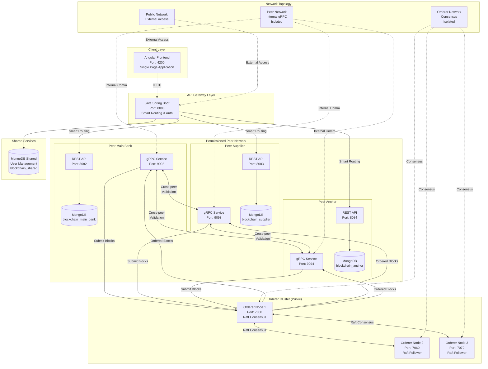
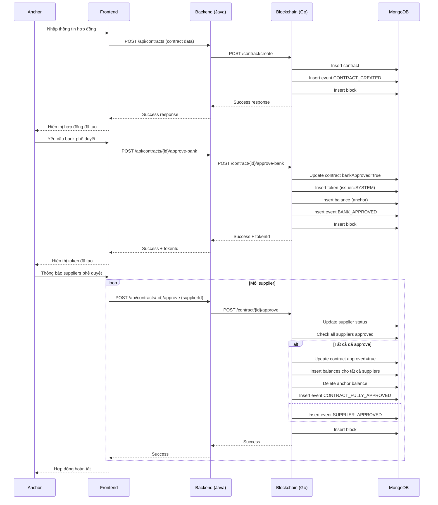
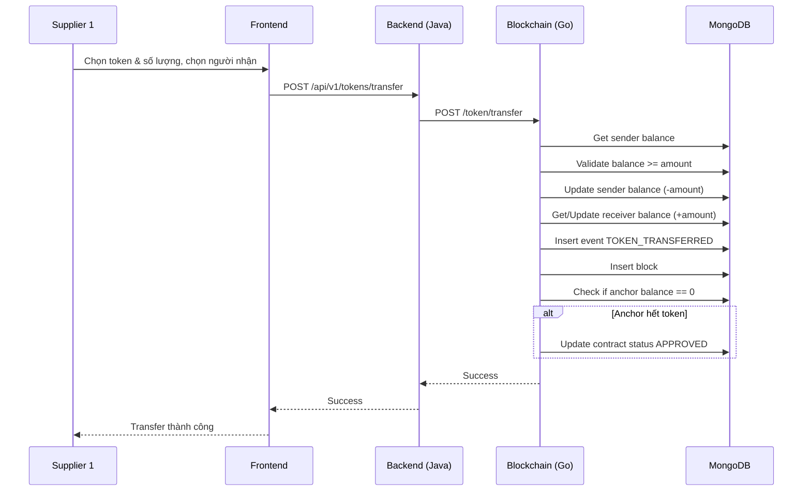
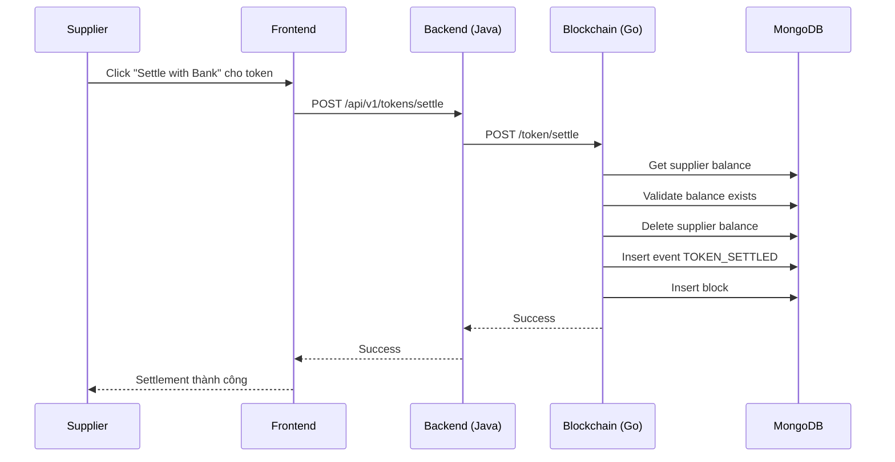
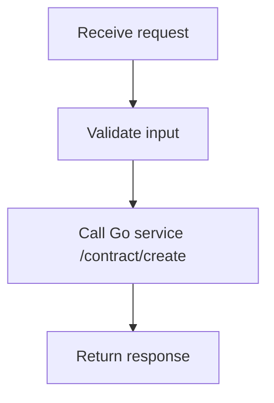
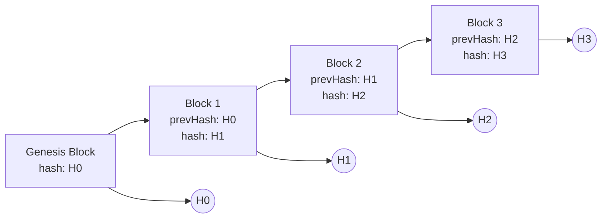
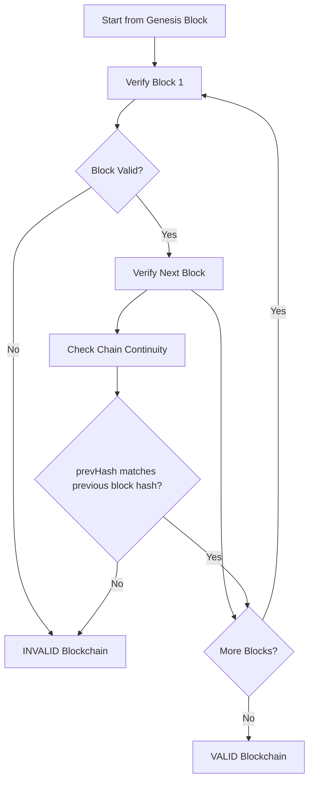
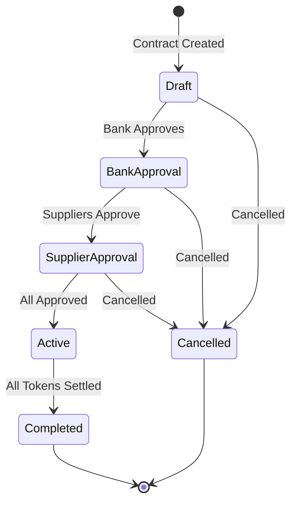
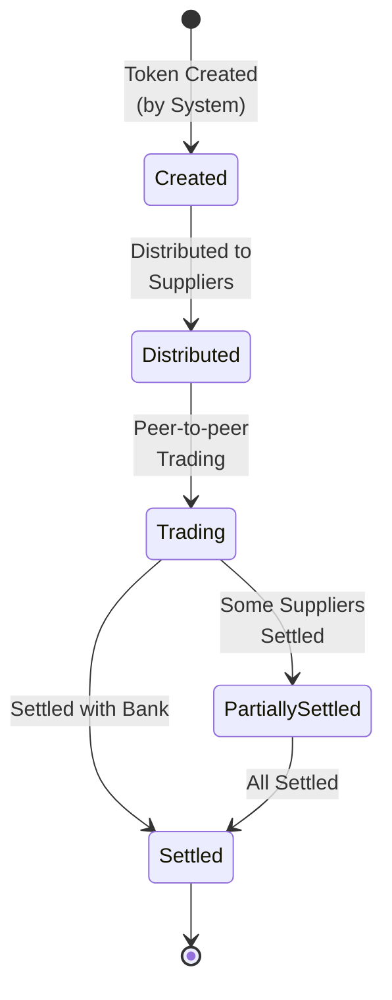

# Tài liệu Thiết kế Hệ thống Blockchain Token Trading

## Mục lục
1. [Tổng quan hệ thống](#tổng-quan-hệ-thống)
2. [Kiến trúc hệ thống](#kiến-trúc-hệ-thống)
3. [Luồng Use Case](#luồng-use-case)
4. [Luồng Sequence Diagram](#luồng-sequence-diagram)
5. [Thiết kế API](#thiết-kế-api)
6. [Thiết kế Database](#thiết-kế-database)
7. [Luồng Xử lý Nghiệp vụ](#luồng-xử-lý-nghiệp-vụ)

## Tổng quan hệ thống

### Mục đích
Hệ thống Blockchain Permissioned Network cho Supply Chain Finance là nền tảng phân quyền với kiến trúc multi-peer node và Orderer cluster. Hệ thống cho phép:
- **Permissioned Network**: 3 peer nodes độc lập (Main Bank, Supplier, Anchor) với World State DB riêng biệt
- **Orderer Cluster**: 3 orderer nodes đảm bảo global consensus và block ordering
- **Smart API Gateway**: Routing thông minh dựa trên business logic và user roles
- **Cross-peer Communication**: gRPC-based communication giữa các peer nodes
- **Immutable Audit Trail**: Global ordering đảm bảo tính nhất quán và không thể thay đổi
- **Scalable Architecture**: Dễ dàng mở rộng thêm peer nodes cho nhiều ngân hàng và suppliers

### Phạm vi
- **Multi-peer Architecture**: Tách biệt logic và data giữa Main Bank, Supplier, và Anchor peers
- **Orderer Cluster**: Global consensus cho tất cả transactions across peers
- **Business Logic Routing**: API Gateway route requests dựa trên user role và operation type
- **Private Networks**: Tách biệt public access và internal peer communication
- **World State Isolation**: Mỗi peer có MongoDB riêng cho data privacy và performance
- **Cross-peer Validation**: gRPC communication để validate transactions across peers

## Kiến trúc hệ thống

### Mô hình kết nối tổng thể với kiến trúc mới



### Kiến trúc Microservices với Multi-peer Network

```
┌─────────────────────────────────────────────────────────────────────┐
│                         Client Layer                                │
│  ┌─────────────────────────────────────────────────────────────┐    │
│  │                 Angular Frontend                           │    │
│  │  - Components: Contract, Token, Supplier, Bank            │    │
│  │  - Services: API calls, Auth, Data management             │    │
│  │  - UI: Material Design, Responsive                         │    │
│  └─────────────────────────────────────────────────────────────┘    │
└─────────────────────────────────────────────────────────────────────┘
                                     │
                        HTTP/REST API (Port 8080)
                                     │
┌─────────────────────────────────────────────────────────────────────┐
│                     Smart API Gateway Layer                         │
│  ┌─────────────────────────────────────────────────────────────┐    │
│  │            Java Spring Boot API Gateway                    │    │
│  │  - Controllers: Contract, Token, Supplier                  │    │
│  │  - PeerRoutingService: Business logic routing              │    │
│  │  - Models: DTOs, Entities                                  │    │
│  │  - Auth: JWT validation, Role-based access                 │    │
│  └─────────────────────────────────────────────────────────────┘    │
└─────────────────────────────────────────────────────────────────────┘
                                     │
                  Smart HTTP Routing (Business Logic Based)
                                     │
┌─────────────────────────────────────────────────────────────────────┐
│                   Permissioned Peer Network                          │
│  ┌─────┬─────┬─────┐    ┌─────┬─────┬─────┐    ┌─────┬─────┐         │
│  │MB   │SUP  │ANC  │    │MB   │SUP  │ANC  │    │MB   │SUP  │ANC  │  │
│  │REST │REST │REST │    │gRPC │gRPC │gRPC │    │DB   │DB   │DB   │  │
│  │API  │API  │API  │    │Srv  │Srv  │Srv  │    │Inst │Inst │Inst │  │
│  └─────┴─────┴─────┘    └─────┴─────┴─────┘    └─────┴─────┴─────┘  │
│     Port: 8082-8084         Port: 9092-9094        Isolated DBs     │
└─────────────────────────────────────────────────────────────────────┘
                                     │
                          gRPC Cross-peer Communication
                                     │
┌─────────────────────────────────────────────────────────────────────┐
│                     Orderer Cluster (Public)                        │
│  ┌─────┬─────┬─────┐    ┌─────────────────────────────┐             │
│  │ORD1 │ORD2 │ORD3 │    │      Raft Consensus         │             │
│  │7050 │7060 │7070 │    │  - Global Block Ordering    │             │
│  └─────┴─────┴─────┘    │  - Transaction Sequencing   │             │
│                         │  - Consensus Protocol       │             │
│                         └─────────────────────────────┘             │
└─────────────────────────────────────────────────────────────────────┘
                                     │
                           Globally Ordered Blocks
                                     │
┌─────────────────────────────────────────────────────────────────────┐
│                    Distributed World State                           │
│  ┌─────┬─────┬─────┬─────┐    ┌─────┬─────┬─────┬─────┐             │
│  │CTR  │TOK  │BAL  │EVT  │    │CTR  │TOK  │BAL  │EVT  │   ...       │
│  │Main │Main│Main │Main │    │Sup  │Sup  │Sup  │Sup  │   ...       │
│  │Bank │Bank│Bank │Bank │    │Bank │Bank │Bank │Bank │             │
│  └─────┴─────┴─────┴─────┘    └─────┴─────┴─────┴─────┘             │
│     Isolated Collections             Isolated Collections            │
└─────────────────────────────────────────────────────────────────────┘
```

### Công nghệ sử dụng với kiến trúc mới

| Layer | Technology | Version | Purpose |
|-------|------------|---------|---------|
| **Frontend** | Angular | 17 | Single Page Application với role-based components |
| **API Gateway** | Java Spring Boot | 3.1.5 | Smart routing, authentication, business logic |
| **Peer Nodes** | Golang | 1.21 | Permissioned blockchain operations, gRPC services |
| **Orderer Cluster** | Golang | 1.21 | Raft consensus, global block ordering |
| **Databases** | MongoDB | 7.x | Isolated World State databases per peer |
| **Communication** | gRPC + REST | - | Cross-peer validation và API access |
| **Container** | Docker | 24.x | Multi-service containerization |
| **Orchestration** | Docker Compose | 2.20 | Complex network topology management |
| **Networks** | Docker Networks | - | Isolated public/private/orderer networks |

## Luồng Use Case

### UC-001: Tạo hợp đồng thương mại
**Actor**: Anchor (Người mua)
**Mô tả**: Anchor tạo hợp đồng mới với danh sách suppliers và thông tin chi tiết
**Điều kiện tiên quyết**: Anchor đã đăng nhập
**Luồng chính**:
1. Anchor nhập thông tin hợp đồng
2. Hệ thống tạo ID hợp đồng
3. Lưu hợp đồng vào database
4. Ghi event và tạo block
5. Thông báo thành công

### UC-002: Ngân hàng phê duyệt hợp đồng
**Actor**: Bank (Ngân hàng)
**Mô tả**: Bank phê duyệt hợp đồng và hệ thống tự động phát hành token
**Điều kiện tiên quyết**: Hợp đồng tồn tại, chưa được bank phê duyệt
**Luồng chính**:
1. Bank chọn hợp đồng cần phê duyệt
2. Hệ thống kiểm tra quyền hạn
3. Cập nhật trạng thái bankApproved = true
4. Tính tổng giá trị hợp đồng
5. Tạo token với Issuer = "SYSTEM"
6. Tạo balance ban đầu cho Anchor
7. Ghi event và tạo block
8. Thông báo thành công

### UC-003: Supplier phê duyệt hợp đồng
**Actor**: Supplier (Người bán)
**Mô tả**: Supplier phê duyệt phần của mình trong hợp đồng
**Điều kiện tiên quyết**: Hợp đồng đã được bank phê duyệt
**Luồng chính**:
1. Supplier chọn hợp đồng cần phê duyệt
2. Hệ thống kiểm tra quyền hạn
3. Cập nhật trạng thái supplier
4. Kiểm tra tất cả suppliers đã phê duyệt
5. Nếu tất cả đã phê duyệt:
   - Phân phối token cho tất cả suppliers
   - Xóa balance của Anchor
   - Cập nhật trạng thái hợp đồng
6. Ghi event và tạo block
7. Thông báo thành công

### UC-004: Chuyển nhượng token
**Actor**: Supplier
**Mô tả**: Supplier chuyển token cho supplier khác
**Điều kiện tiên quyết**: Supplier có balance token > 0
**Luồng chính**:
1. Supplier chọn token và số lượng
2. Chọn người nhận
3. Hệ thống kiểm tra balance đủ
4. Cập nhật balance người gửi (-)
5. Cập nhật balance người nhận (+)
6. Ghi event và tạo block
7. Kiểm tra nếu Anchor hết token thì tự động hoàn tất hợp đồng

### UC-005: Tất toán token với ngân hàng
**Actor**: Supplier
**Mô tả**: Supplier tất toán toàn bộ token với ngân hàng
**Điều kiện tiên quyết**: Supplier có balance token > 0
**Luồng chính**:
1. Supplier chọn token cần tất toán
2. Hệ thống kiểm tra balance
3. Xóa toàn bộ balance của supplier
4. Ghi event tất toán
5. Tạo block
6. Thông báo thành công

### UC-006: Xem lịch sử giao dịch
**Actor**: Tất cả users
**Mô tả**: Xem tất cả events và blocks liên quan đến một hợp đồng
**Luồng chính**:
1. Chọn hợp đồng
2. Query tất cả events liên quan
3. Query blocks chứa events
4. Query balances hiện tại
5. Hiển thị ledger hoàn chỉnh

## Luồng Sequence Diagram

### SD-001: Tạo và phê duyệt hợp đồng hoàn chỉnh



### SD-002: Chuyển nhượng token



### SD-003: Tất toán token



## Thiết kế API

### API Gateway (Java Spring Boot - Port 8080)

#### 1. Contract APIs

##### POST /api/contracts - Create Contract
**Mô tả**: Tạo hợp đồng mới

**Input**:
```json
{
  "buyer": "ANCHOR001",
  "bankId": "BANK001",
  "description": "Supply Chain Contract",
  "suppliers": [
    {
      "supplierId": "SUP001",
      "name": "Supplier 1",
      "allocatedAmount": 50000.00
    }
  ],
  "totalAmount": 50000.00
}
```

**Output**:
```json
{
  "id": "contract_1234567890",
  "status": "success"
}
```

**Mã lỗi**:
- 400: Invalid contract data
- 500: Internal server error

**Flowchart**:


##### POST /api/contracts/{id}/approve-bank - Bank Approve Contract
**Mô tả**: Ngân hàng phê duyệt hợp đồng

**Input**:
```json
{
  "bankId": "BANK001"
}
```

**Output**:
```json
{
  "status": "success",
  "message": "Contract approved by bank successfully",
  "tokenId": "token_contract_123"
}
```

**Mã lỗi**:
- 404: Contract not found
- 403: Bank does not have permission
- 500: Internal server error

#### 2. Token APIs

##### POST /api/v1/tokens/transfer - Transfer Token
**Mô tả**: Chuyển token giữa các tài khoản

**Input**:
```json
{
  "tokenId": "token_contract_123",
  "from": "SUP001",
  "to": "SUP002",
  "amount": 10000.00
}
```

**Output**:
```json
{
  "status": "transferred",
  "message": "Token transferred successfully"
}
```

**Mã lỗi**:
- 400: Invalid transfer data / Insufficient balance
- 404: Token not found
- 500: Internal server error

##### POST /api/v1/tokens/settle - Settle Token
**Mô tả**: Tất toán token với ngân hàng

**Input**:
```json
{
  "tokenId": "token_contract_123",
  "supplierId": "SUP001"
}
```

**Output**:
```json
{
  "status": "settled",
  "message": "Token settled successfully with bank",
  "settledAmount": 25000.00
}
```

**Mã lỗi**:
- 400: Supplier has no balance
- 404: Token not found
- 500: Internal server error

### Blockchain Service APIs (Golang - Port 8081)

#### 1. Contract APIs

##### POST /contract/create
**Input/Output**: Same as Java API

##### POST /contract/{id}/approve-bank
**Input/Output**: Same as Java API

##### POST /contract/{id}/approve
**Input**:
```json
{
  "supplierId": "SUP001"
}
```

**Output**:
```json
{
  "status": "success",
  "message": "Contract approved successfully"
}
```

#### 2. Token APIs

##### POST /token/transfer
**Input/Output**: Same as Java API

##### POST /token/settle
**Input/Output**: Same as Java API

##### GET /token/{id}
**Output**:
```json
{
  "id": "token_contract_123",
  "contractId": "contract_123",
  "symbol": "TK123",
  "total": 50000.00,
  "issuer": "SYSTEM",
  "owner": "ANCHOR001",
  "createdAt": "2024-01-01T10:00:00Z"
}
```

##### GET /tokens
**Output**:
```json
[
  {
    "id": "token_contract_123",
    "contractId": "contract_123",
    "symbol": "TK123",
    "total": 50000.00,
    "issuer": "SYSTEM",
    "owner": "ANCHOR001",
    "createdAt": "2024-01-01T10:00:00Z"
  }
]
```

#### 3. Query APIs

##### GET /contract/list
**Output**:
```json
[
  {
    "_id": "contract_123",
    "description": "Supply Chain Contract",
    "anchorId": "ANCHOR001",
    "bankId": "BANK001",
    "bankApproved": true,
    "suppliers": [...],
    "approved": true,
    "createdAt": "2024-01-01T09:00:00Z"
  }
]
```

##### GET /balances/account/{accountId}
**Output**:
```json
[
  {
    "tokenId": "token_contract_123",
    "account": "SUP001",
    "balance": 25000.00
  }
]
```

## Blockchain Technical Details

### Thuật toán Hash và Cơ chế Blockchain

#### 1. Thuật toán Hash
Hệ thống sử dụng **SHA256** làm thuật toán hash chính cho blockchain:

```go
func calculateBlockHash(blockNumber int64, timestamp, previousHash string, events []string) string {
    hashData := map[string]interface{}{
        "blockNumber":  blockNumber,
        "timestamp":    timestamp,
        "previousHash": previousHash,
        "events":       events,
    }

    jsonData, err := json.Marshal(hashData)
    if err != nil {
        return ""
    }

    hash := sha256.Sum256(jsonData)
    return hex.EncodeToString(hash[:])
}
```

**Đặc điểm của SHA256:**
- **Cryptographic Hash Function**: Một chiều, không thể reverse
- **Deterministic**: Input giống nhau luôn tạo ra output giống nhau
- **Avalanche Effect**: Thay đổi nhỏ trong input tạo ra thay đổi lớn trong output
- **Collision Resistant**: Rất khó tìm 2 inputs khác nhau tạo ra cùng hash

#### 2. Merkle Tree Implementation

Hệ thống sử dụng **Merkle Tree** để tối ưu hóa việc verify các events trong block:

```go
func (b *BlockBuilder) calculateMerkleRoot(eventIds []string) string {
    if len(eventIds) == 0 {
        return b.calculateSHA256("")
    }

    // Calculate SHA256 for each event ID
    hashes := make([]string, len(eventIds))
    for i, eventId := range eventIds {
        hashes[i] = b.calculateSHA256(eventId)
    }

    // Build merkle tree
    for len(hashes) > 1 {
        var newHashes []string
        for i := 0; i < len(hashes); i += 2 {
            left := hashes[i]
            right := ""
            if i+1 < len(hashes) {
                right = hashes[i+1]
            } else {
                right = left // Duplicate last hash if odd number
            }
            newHashes = append(newHashes, b.calculateSHA256(left+right))
        }
        hashes = newHashes
    }

    return hashes[0]
}
```

**Lợi ích của Merkle Tree:**
- **Efficient Verification**: Có thể verify một event mà không cần toàn bộ events
- **Data Integrity**: Phát hiện được thay đổi trong bất kỳ event nào
- **Compact Representation**: Merkle root đại diện cho tất cả events

#### 3. Cách nối các Chain với nhau

Mỗi block được nối với block trước thông qua **Previous Hash**:



**Công thức hash của block:**
```
Block_Hash = SHA256(prevHash + merkleRoot + timestamp)
```

**Genesis Block:**
- `blockNumber = 1`
- `prevHash = "genesis"`
- `hash = SHA256("genesis" + merkleRoot + timestamp)`

#### 4. Block Verification Algorithm

Để verify một block, hệ thống kiểm tra:

```go
func verifyBlock(block Block) bool {
    // 1. Verify block hash
    expectedHash := calculateBlockHash(
        block.BlockNumber,
        block.Timestamp.Format(time.RFC3339),
        block.PrevHash,
        extractEventIds(block.Events)
    )

    if expectedHash != block.Hash {
        return false // Block hash is invalid
    }

    // 2. Verify merkle root
    eventIds := extractEventIds(block.Events)
    expectedMerkleRoot := calculateMerkleRoot(eventIds)

    if expectedMerkleRoot != block.MerkleRoot {
        return false // Merkle root is invalid
    }

    // 3. Verify events exist and are valid
    for _, event := range block.Events {
        if !verifyEvent(event) {
            return false // Event is invalid
        }
    }

    return true // Block is valid
}
```

**Các bước verification:**

1. **Hash Verification**:
   ```
   calculated_hash = SHA256(blockNumber + timestamp + prevHash + events[])
   if calculated_hash != block.hash → INVALID
   ```

2. **Merkle Root Verification**:
   ```
   calculated_merkle = buildMerkleTree(eventIds[])
   if calculated_merkle != block.merkleRoot → INVALID
   ```

3. **Chain Continuity Verification**:
   ```
   if block.prevHash != previousBlock.hash → INVALID
   ```

4. **Event Verification**:
   - Kiểm tra event tồn tại trong database
   - Verify timestamp hợp lệ
   - Kiểm tra business logic rules

#### 5. Blockchain Integrity Verification

Để verify toàn bộ blockchain:



**Verification Rules:**
- **Genesis Block**: prevHash = "genesis"
- **Chain Continuity**: block[N].prevHash == block[N-1].hash
- **No Double Spending**: Token balances không âm, tổng balance = token.total
- **Business Rules**: Contract states hợp lệ, approvals đúng quyền

#### 6. Security Features

**Cryptographic Security:**
- SHA256 collision resistance
- Timestamp prevents replay attacks
- Event ordering đảm bảo causality

**Data Integrity:**
- Merkle tree cho efficient verification
- Block hash chaining
- Immutable audit trail

**Tamper Detection:**
- Bất kỳ thay đổi nào trong events sẽ làm thay đổi merkle root
- Thay đổi merkle root làm thay đổi block hash
- Thay đổi block hash làm đứt chain continuity

## Thiết kế Database

### MongoDB Collections

#### 1. contracts
```javascript
{
  _id: "contract_1234567890",
  description: "Supply Chain Contract Q1 2024",
  anchorId: "ANCHOR001",
  supplierId: "SUP001", // Primary supplier
  bankId: "BANK001",
  bankApproved: true,
  amount: 50000.00,
  suppliers: [
    {
      supplierId: "SUP001",
      name: "ABC Corporation",
      amount: 30000.00,
      status: "APPROVED"
    },
    {
      supplierId: "SUP002",
      name: "XYZ Ltd",
      amount: 20000.00,
      status: "APPROVED"
    }
  ],
  approvers: ["SUP001", "SUP002"],
  approved: true,
  createdAt: "2024-01-01T09:00:00Z",
  status: "APPROVED"
}
```

**Indexes**:
- `{bankId: 1}`
- `{approved: 1}`
- `{bankApproved: 1}`

#### 2. tokens
```javascript
{
  _id: "token_contract_1234567890",
  contractId: "contract_1234567890",
  symbol: "TK567890",
  total: 50000.00,
  issuer: "SYSTEM",
  owner: "ANCHOR001",
  createdAt: "2024-01-01T10:00:00Z"
}
```

**Indexes**:
- `{contractId: 1}`
- `{issuer: 1}`
- `{owner: 1}`

#### 3. balances
```javascript
{
  tokenId: "token_contract_1234567890",
  account: "SUP001",
  balance: 25000.00,
  transferredFrom: "ANCHOR001"
}
```

**Indexes**:
- `{tokenId: 1, account: 1}` (unique compound index)
- `{account: 1}`

#### 4. events
```javascript
{
  eventId: "evt_1234567890",
  eventType: "CONTRACT_CREATED", // or CONTRACT_BANK_APPROVED, SUPPLIER_APPROVED, etc.
  contractId: "contract_1234567890",
  tokenId: "token_contract_1234567890", // optional
  supplierId: "SUP001", // optional
  bankId: "BANK001", // optional
  anchorId: "ANCHOR001", // optional
  totalAmount: 50000.00, // optional
  settledAmount: 25000.00, // optional
  description: "Bank approved contract and system auto-generated token for anchor",
  timestamp: "2024-01-01T10:00:00Z"
}
```

**Indexes**:
- `{contractId: 1}`
- `{tokenId: 1}`
- `{eventType: 1}`
- `{timestamp: 1}`

#### 5. blocks
```javascript
{
  blockNumber: 1,
  timestamp: "2024-01-01T10:00:00Z",
  events: ["evt_1234567890"],
  previousHash: "genesis",
  hash: "a1b2c3d4e5f6...",
  merkleRoot: "m1n2o3p4q5r6..."
}
```

**Indexes**:
- `{blockNumber: 1}` (unique)
- `{timestamp: 1}`

#### 6. users
```javascript
{
  id: "SUP001",
  username: "supplier1",
  password: "$2a$10$encrypted_password",
  role: "SUPPLIER" // ANCHOR, BANK, SUPPLIER
}
```

**Indexes**:
- `{id: 1}` (unique)
- `{username: 1}` (unique)
- `{role: 1}`

### Database Relationships

```
contracts (1) ──── (1) tokens
    │                    │
    │                    │
    └─── suppliers[] ────┼─── (many) balances
                         │
                         └─── (many) events
                              │
                              └─── (many) blocks
```

### Data Flow Patterns

1. **Contract Creation**: `contracts` → `events` → `blocks`
2. **Token Issuance**: `contracts` → `tokens` → `balances` → `events` → `blocks`
3. **Token Transfer**: `balances` → `events` → `blocks`
4. **Token Settlement**: `balances` → `events` → `blocks`

## Luồng Xử lý Nghiệp vụ

### 1. Contract Lifecycle



### 2. Token Lifecycle



### 3. Business Rules

#### Contract Rules
- Chỉ Anchor có thể tạo contract
- Bank phải phê duyệt trước khi suppliers có thể phê duyệt
- Tất cả suppliers phải phê duyệt để contract active
- Contract chỉ có thể bị hủy khi ở trạng thái Draft

#### Token Rules
- Token được tạo tự động bởi hệ thống khi bank phê duyệt
- Token ban đầu thuộc về Anchor
- Token được phân phối cho suppliers khi tất cả đã phê duyệt
- Suppliers có thể chuyển token cho nhau
- Suppliers có thể tất toán token với bank bất cứ lúc nào

#### Balance Rules
- Balance không được âm
- Tổng balance của tất cả accounts cho một token luôn bằng token.total
- Balance được cập nhật atomically trong transfer operations

#### Blockchain Rules
- Mọi operation quan trọng đều tạo event
- Mọi event được ghi vào block
- Block hash được tính toán từ previous block + current data
- Blockchain đảm bảo immutability và audit trail

### 4. Security Considerations

#### Authentication & Authorization
- JWT tokens cho user authentication
- Role-based access control (ANCHOR, BANK, SUPPLIER)
- API-level authorization checks

#### Data Integrity
- Blockchain hashing đảm bảo data integrity
- Database transactions cho multi-document operations
- Audit trail hoàn chỉnh

#### Network Security
- HTTPS cho tất cả communications
- CORS configuration
- Docker network isolation

### 5. Performance Considerations

#### Database Optimization
- Compound indexes cho frequent queries
- Pagination cho large result sets
- Connection pooling

#### Caching Strategy
- Redis cache cho frequently accessed data (future enhancement)
- In-memory caching cho user sessions

#### Scalability
- Horizontal scaling với multiple instances
- Database sharding strategy
- Load balancing configuration

---

*Document Version: 1.0*
*Last Updated: January 2024*
*Author: System Design Team*
