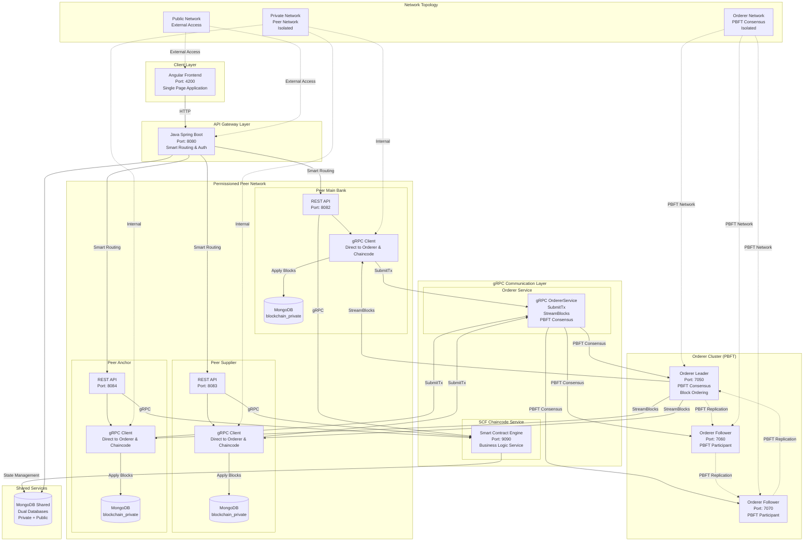
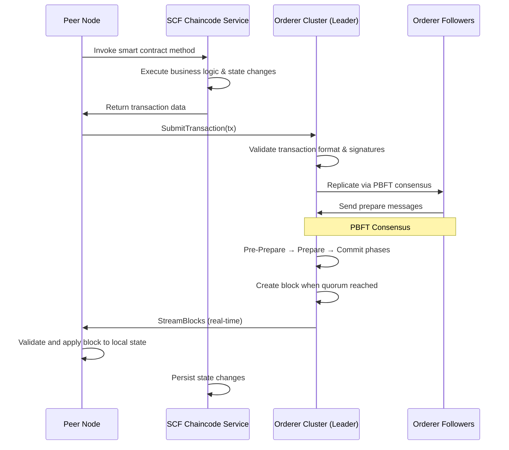
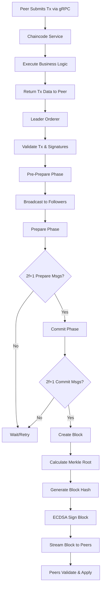
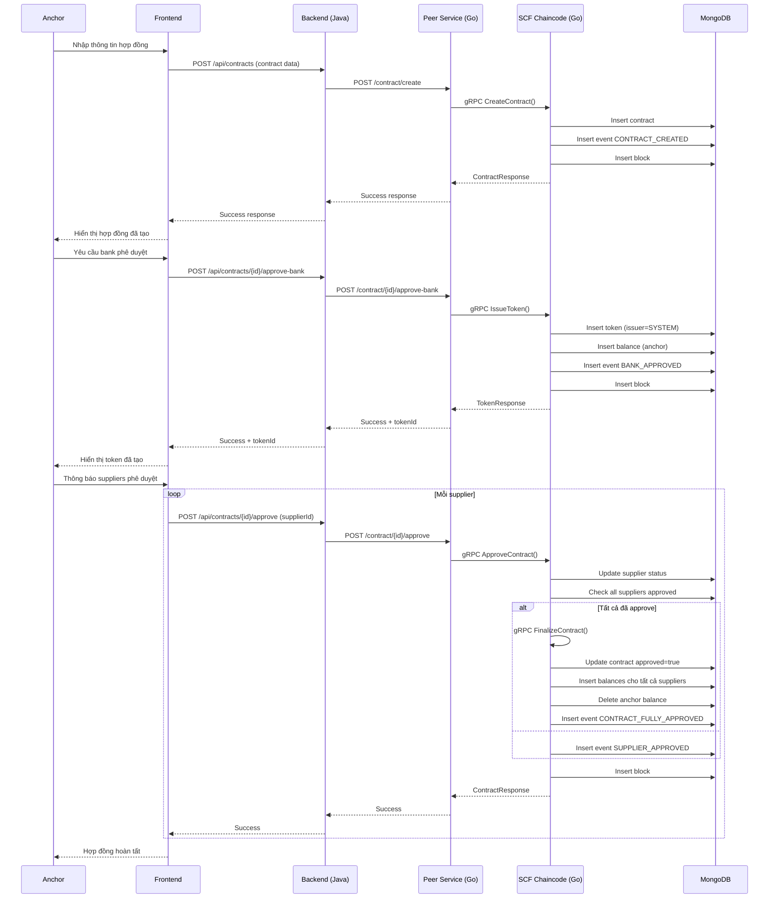
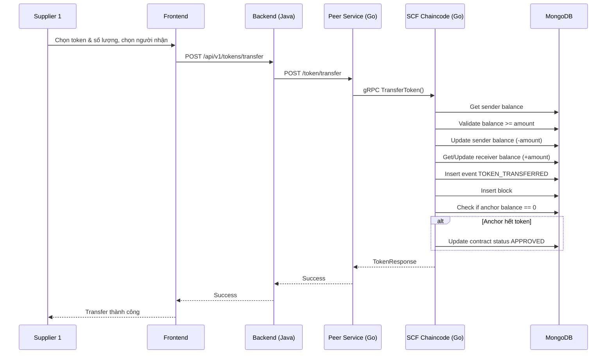
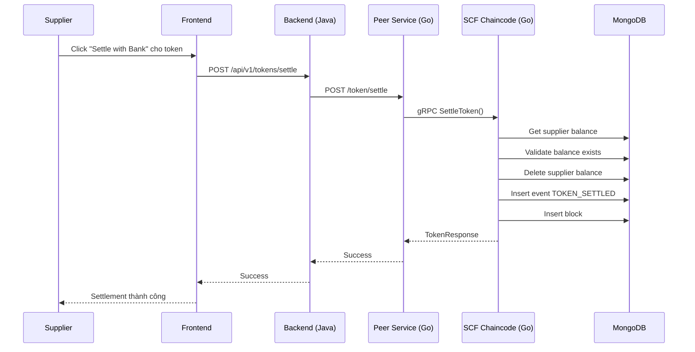

# Tài liệu Thiết kế Hệ thống Blockchain SCF deep tier

## Mục lục
1. [Tổng quan hệ thống](#tổng-quan-hệ-thống)
2. [Kiến trúc hệ thống](#kiến-trúc-hệ-thống)
3. [Luồng Use Case](#luồng-use-case)
4. [Luồng Sequence Diagram](#luồng-sequence-diagram)
5. [Thiết kế API](#thiết-kế-api)
6. [Thiết kế Database](#thiết-kế-database)
7. [Luồng Xử lý Nghiệp vụ](#luồng-xử-lý-nghiệp-vụ)

## Tổng quan hệ thống

### Mục đích
Hệ thống Blockchain Permissioned Network với gRPC Direct Communication cho Supply Chain Finance là nền tảng phân quyền sử dụng hybrid architecture. Hệ thống cho phép:
- **gRPC Direct Communication**: Real-time communication giữa Peer nodes và Orderer cluster
- **PBFT Consensus**: Practical Byzantine Fault Tolerance đảm bảo global transaction ordering
- **SCF Chaincode Service**: Smart contract engine chứa toàn bộ business logic
- **High Throughput**: Direct gRPC streaming với load balancing và connection pooling
- **Fault Tolerance**: PBFT consensus với f=1 fault tolerance trong orderer cluster
- **Real-time Sync**: gRPC streaming đảm bảo peers nhận blocks ngay lập tức

### Phạm vi
- **Direct Communication Architecture**: gRPC làm communication backbone cho tất cả blockchain operations
- **Chaincode Decoupling**: Business logic tách riêng trong SCF Chaincode Service
- **Real-time Processing**: Peers submit transactions và nhận blocks qua persistent gRPC streams
- **PBFT Consensus**: Byzantine fault tolerant consensus với 3f+1 nodes (f=1)
- **Load Distribution**: Client-side load balancing và leader affinity routing
- **Network Isolation**: Private networks cho peers, orderers, và chaincode service

## Kiến trúc hệ thống

### 🆕 **Chaincode Service Integration**

#### Tổng quan kiến trúc mới
Hệ thống đã được nâng cấp với **SCF Chaincode Service** - microservice riêng biệt chứa toàn bộ business logic smart contracts:

- **SCF Chaincode Service**: Smart Contract Engine chạy trên port 9090
- **Peer Services**: REST API gateways sử dụng gRPC clients để invoke chaincode methods
- **Decoupled Architecture**: Business logic tách biệt, dễ maintain và scale
- **State Management**: Chaincode service quản lý tất cả contract và token state

#### Smart Contract Methods
```go
// Contract Management
CreateContract(anchorID, suppliers[], totalAmount, fileHash)
ApproveContract(contractID, supplierID)
FinalizeContract(contractID)

// Token Management
IssueToken(contractID, issuer, totalSupply)
TransferToken(tokenID, from, to, amount)
SettleToken(tokenID, supplierID, bankID)
```

#### gRPC Communication Protocol
- **Protocol Buffers**: Định nghĩa RPC interfaces trong `share/smartcontract.proto`
- **Generated Code**: Auto-generated gRPC clients/servers từ protobuf
- **High Performance**: Binary serialization, bidirectional streaming

### Mô hình kết nối với gRPC Direct Communication & Chaincode Service



### Kiến trúc Microservices với Multi-peer Network

```
┌─────────────────────────────────────────────────────────────────────┐
│                         Client Layer                                │
│  ┌─────────────────────────────────────────────────────────────┐    │
│  │                 Angular Frontend                           │    │
│  │  - Components: Contract, Token, Supplier, Bank            │    │
│  │  - Services: API calls, Auth, Data management             │    │
│  │  - UI: Material Design, Responsive                         │    │
│  └─────────────────────────────────────────────────────────────┘    │
└─────────────────────────────────────────────────────────────────────┘
                                     │
                        HTTP/REST API (Port 8080)
                                     │
┌─────────────────────────────────────────────────────────────────────┐
│                     Smart API Gateway Layer                         │
│  ┌─────────────────────────────────────────────────────────────┐    │
│  │            Java Spring Boot API Gateway                    │    │
│  │  - Controllers: Contract, Token, Supplier                  │    │
│  │  - PeerRoutingService: Business logic routing              │    │
│  │  - Models: DTOs, Entities                                  │    │
│  │  - Auth: JWT validation, Role-based access                 │    │
│  └─────────────────────────────────────────────────────────────┘    │
└─────────────────────────────────────────────────────────────────────┘
                                     │
                  Smart HTTP Routing (Business Logic Based)
                                     │
┌─────────────────────────────────────────────────────────────────────┐
│                   Permissioned Peer Network                          │
│  ┌─────┬─────┬─────┐    ┌─────┬─────┬─────┐    ┌─────┬─────┐         │
│  │MB   │SUP  │ANC  │    │MB   │SUP  │ANC  │    │MB   │SUP  │ANC  │  │
│  │REST │REST │REST │    │gRPC │gRPC │gRPC │    │DB   │DB   │DB   │  │
│  │API  │API  │API  │    │Srv  │Srv  │Srv  │    │Inst │Inst │Inst │  │
│  └─────┴─────┴─────┘    └─────┴─────┴─────┘    └─────┴─────┴─────┘  │
│     Port: 8082-8084         Port: 9092-9094        Isolated DBs     │
└─────────────────────────────────────────────────────────────────────┘
                                     │
                          gRPC Cross-peer Communication
                                     │
┌─────────────────────────────────────────────────────────────────────┐
│                     Orderer Cluster (Public)                        │
│  ┌─────┬─────┬─────┐    ┌─────────────────────────────┐             │
│  │ORD1 │ORD2 │ORD3 │    │      Raft Consensus         │             │
│  │7050 │7060 │7070 │    │  - Global Block Ordering    │             │
│  └─────┴─────┴─────┘    │  - Transaction Sequencing   │             │
│                         │  - Consensus Protocol       │             │
│                         └─────────────────────────────┘             │
└─────────────────────────────────────────────────────────────────────┘
                                     │
                           Globally Ordered Blocks
                                     │
┌─────────────────────────────────────────────────────────────────────┐
│                    Distributed World State                           │
│  ┌─────┬─────┬─────┬─────┐    ┌─────┬─────┬─────┬─────┐             │
│  │CTR  │TOK  │BAL  │EVT  │    │CTR  │TOK  │BAL  │EVT  │   ...       │
│  │Main │Main│Main │Main │    │Sup  │Sup  │Sup  │Sup  │   ...       │
│  │Bank │Bank│Bank │Bank │    │Bank │Bank │Bank │Bank │             │
│  └─────┴─────┴─────┴─────┘    └─────┴─────┴─────┴─────┘             │
│     Isolated Collections             Isolated Collections            │
└─────────────────────────────────────────────────────────────────────┘
```

### Private-Public Blockchain Integration

#### 1. Transaction Submission Flow

Khi một peer node cần thực hiện một blockchain operation, nó sẽ:
1. Invoke SCF Chaincode Service để xử lý business logic
2. Submit transaction trực tiếp lên orderer cluster thông qua gRPC
3. Nhận block stream từ orderer và apply state changes



**Các bước chi tiết:**

1. **Chaincode Invocation**
   - Peer gọi gRPC methods của SCF Chaincode Service
   - Chaincode thực thi business logic và tạo transaction data
   - State changes được persist trong MongoDB

2. **Direct gRPC Submission**
   - Peer submit transaction trực tiếp đến orderer leader qua gRPC
   - Orderer validate transaction format và digital signatures
   - Không còn channel-based permissions

3. **PBFT Consensus**
   - Leader orderer broadcast Pre-Prepare message
   - Followers gửi Prepare messages
   - Quorum 2f+1 signatures để commit block
   - f=1 fault tolerance với 3 nodes

4. **Real-time Block Streaming**
   - Orderer stream finalized blocks trực tiếp đến peers
   - Peers validate blocks và apply state changes
   - Persistent gRPC connections đảm bảo real-time delivery

#### 2. gRPC Communication Protocol

**SCF Chaincode Service Interface:**

```protobuf
service SCFChaincodeService {
  // Contract Management
  rpc CreateContract(CreateContractRequest) returns (CreateContractResponse);
  rpc ApproveContract(ApproveContractRequest) returns (ApproveContractResponse);
  rpc FinalizeContract(FinalizeContractRequest) returns (FinalizeContractResponse);

  // Token Management
  rpc IssueToken(IssueTokenRequest) returns (IssueTokenResponse);
  rpc TransferToken(TransferTokenRequest) returns (TransferTokenResponse);
  rpc SettleToken(SettleTokenRequest) returns (SettleTokenResponse);

  // Query Operations
  rpc GetContract(GetContractRequest) returns (GetContractResponse);
  rpc GetToken(GetTokenRequest) returns (GetTokenResponse);
  rpc GetBalances(GetBalancesRequest) returns (GetBalancesResponse);
}

**Orderer Service Interface:**

```protobuf
service OrdererService {
  // Submit transaction trực tiếp đến orderer cluster
  rpc SubmitTransaction(SubmitTransactionRequest) returns (SubmitTransactionResponse);

  // Streaming blocks từ orderer đến peer
  rpc StreamBlocks(StreamBlocksRequest) returns (stream Block);

  // Query block information
  rpc GetBlockInfo(GetBlockInfoRequest) returns (GetBlockInfoResponse);
}

message SubmitTransactionRequest {
  string transaction_id = 1;    // Unique transaction ID
  string sender_id = 2;         // Peer node ID (peer_main_bank, peer_supplier, etc.)
  string transaction_type = 3;  // CONTRACT_CREATE, TOKEN_TRANSFER, etc.
  bytes transaction_data = 4;   // Serialized transaction payload
  bytes signature = 5;          // Digital signature của peer
  int64 timestamp = 6;          // Unix timestamp của khi submit
}

message SubmitTransactionResponse {
  string transaction_id = 1;
  string status = 2;            // "ACCEPTED", "REJECTED"
  string message = 3;           // Status message
  int64 estimated_commit_time = 4; // Estimated time transaction sẽ được commit
  int64 current_block_height = 5; // Current block height
}

message StreamBlocksRequest {
  int64 start_block = 1;        // Block number bắt đầu stream (0 = từ latest)
  string peer_id = 2;           // Peer ID để authorization
}

message Block {
  int64 block_number = 1;
  int64 timestamp = 2;
  string previous_hash = 3;
  string hash = 4;
  string channel = 5;
  repeated Transaction transactions = 6;
  string merkle_root = 7;
  BlockMetadata metadata = 8;
}

message Transaction {
  string transaction_id = 1;
  string transaction_type = 2;
  bytes transaction_data = 3;
  string sender_id = 4;
  int64 timestamp = 5;
  bytes signature = 6;
  TransactionStatus status = 7;
}

message BlockMetadata {
  string creator_id = 1;        // Orderer node tạo block
  int64 transaction_count = 2;
  string channel = 3;
}

enum TransactionStatus {
  UNKNOWN = 0;
  PENDING = 1;
  COMMITTED = 2;
  FAILED = 3;
}
```

#### 3. Unified Transaction Processing

Hệ thống sử dụng kiến trúc unified cho tất cả transaction types, không phân biệt channels. Tất cả peers có quyền submit transactions và receive blocks:

**Transaction Types:**
- **Contract Operations**: Create, approve, finalize contracts
- **Token Operations**: Issue, transfer, settle tokens
- **Query Operations**: Get contracts, tokens, balances

**Processing Configuration:**

```yaml
transaction_processing:
  orderer_endpoints:
    - "orderer-ord1:7050"
    - "orderer-ord2:7060"
    - "orderer-ord3:7070"
  grpc_service: "OrdererService"
  permissions:
    submit:  # All peers can submit transactions
      - peer_main_bank
      - peer_supplier
      - peer_anchor
    stream:  # All peers can stream blocks
      - peer_main_bank
      - peer_supplier
      - peer_anchor
  block_creation:
    min_transactions: 5      # Create block with at least 5 tx
    max_wait_time: 5000ms    # Or after 5 seconds
    max_block_size: 100      # Maximum 100 tx per block
  pbft_config:
    fault_tolerance: 1       # f=1
    total_nodes: 3           # 3f+1 = 4 nodes minimum, we use 3
    consensus_timeout: 3000ms

#### 4. Consensus và Ordering Mechanism

**PBFT Consensus trong Orderer Cluster:**



**PBFT Ordering Rules:**
1. **Pre-Prepare Phase**: Leader broadcasts proposed block to followers
2. **Prepare Phase**: Followers validate và send prepare messages
3. **Commit Phase**: Quorum 2f+1 signatures required to commit
4. **Fault Tolerance**: f=1 với 3 nodes (tối thiểu 3f+1 = 4 nodes)
5. **Block Creation Triggers**:
   - Minimum transaction count (5 tx)
   - Maximum wait time timeout (5 giây)
   - Maximum block size limit (100 tx)
6. **Block Hash Calculation**: `SHA256(prevBlockHash + merkleRoot + blockTimestamp)`

**PBFT Message Structure:**
```go
type PBFTMessage struct {
    Type          string // "PRE-PREPARE", "PREPARE", "COMMIT"
    ViewNumber    int64
    SequenceNumber int64
    Block         *Block
    SenderID      string
    Signature     []byte
    Timestamp     int64
}
```

#### 5. Error Handling và Recovery

**gRPC Error Codes:**
- `INVALID_ARGUMENT`: Transaction data không đúng format hoặc missing required fields
- `PERMISSION_DENIED`: Peer không có quyền submit lên channel hoặc subscribe blocks
- `NOT_FOUND`: Channel không tồn tại hoặc transaction ID không tìm thấy
- `UNAVAILABLE`: Orderer cluster không thể truy cập (network issues)
- `DEADLINE_EXCEEDED`: gRPC timeout
- `INTERNAL`: Lỗi internal của orderer (consensus failure, storage error)

**Recovery Mechanisms:**
- **Transaction Resubmission**: Failed transactions có thể resubmit với exponential backoff
- **Block Synchronization**: Peers có thể gọi `GetBlocks()` để sync missing blocks
- **Stream Reconnection**: gRPC streams tự động reconnect với resume capability
- **State Validation**: Peers validate blockchain state consistency across network
- **Leader Election**: Raft tự động elect new leader nếu current leader fails

**Connection Management:**
```go
// gRPC Connection với retry logic
func connectToOrderer(endpoint string) (*grpc.ClientConn, error) {
    return grpc.Dial(endpoint,
        grpc.WithTransportCredentials(insecure.NewCredentials()),
        grpc.WithConnectParams(grpc.ConnectParams{
            Backoff:           backoff.DefaultConfig,
            MinConnectTimeout: 5 * time.Second,
        }),
        grpc.WithKeepaliveParams(keepalive.ClientParameters{
            Time:                10 * time.Second,
            Timeout:             5 * time.Second,
            PermitWithoutStream: true,
        }),
    )
}
```

#### 6. Performance Optimizations

**gRPC Streaming:**
- **Bi-directional Streams**: Peers maintain persistent gRPC streams cho real-time block delivery
- **Flow Control**: gRPC flow control prevents memory overflow trong high-throughput scenarios
- **Compression**: Message compression cho large transaction payloads

**Load Balancing & Scaling:**
- **Client-side Load Balancing**: Peers distribute requests across orderer nodes
- **Leader Affinity**: Transaction submissions route to current Raft leader
- **Connection Pooling**: Reused gRPC connections reduce connection overhead

**Caching & Optimization:**
- **Block Cache**: Peers cache recent blocks để reduce validation time
- **Merkle Proofs**: Efficient state proofs cho large blockchains
- **Batch Validation**: Validate multiple transactions together

**Monitoring & Metrics:**
- **gRPC Metrics**: Request latency, error rates, connection health
- **Consensus Metrics**: Leader election time, replication lag
- **Block Metrics**: Creation time, transaction throughput, block size distribution
- **Peer Health**: Sync status, block height, connection stability

**Performance Benchmarks:**
- **Transaction Submission**: <50ms average latency
- **Block Propagation**: <200ms to all peers
- **Block Validation**: <100ms per block
- **Throughput**: 1000+ TPS per channel

### Công nghệ sử dụng với kiến trúc mới

| Layer | Technology | Version | Purpose |
|-------|------------|---------|---------|
| **Frontend** | Angular | 17 | Single Page Application với role-based components |
| **API Gateway** | Java Spring Boot | 3.1.5 | Smart routing, authentication, business logic |
| **Peer Nodes** | Golang | 1.21 | Permissioned blockchain operations, gRPC clients |
| **Orderer Cluster** | Golang | 1.21 | Raft consensus, global transaction ordering |
| **Databases** | MongoDB | 7.x | Isolated World State databases per peer |
| **Communication** | gRPC + REST | - | Direct peer-to-orderer và API access |
| **Consensus** | Raft | - | Distributed consensus protocol |
| **Streaming** | gRPC Streams | - | Real-time block broadcasting |
| **Container** | Docker | 24.x | Multi-service containerization |
| **Orchestration** | Docker Compose | 2.20 | Complex network topology management |
| **Networks** | Docker Networks | - | Isolated public/private/orderer networks |

## Luồng Use Case

### UC-001: Tạo hợp đồng thương mại
**Actor**: Anchor (Người mua)
**Mô tả**: Anchor tạo hợp đồng mới với danh sách suppliers và thông tin chi tiết
**Điều kiện tiên quyết**: Anchor đã đăng nhập
**Luồng chính**:
1. Anchor nhập thông tin hợp đồng
2. Hệ thống tạo ID hợp đồng
3. Lưu hợp đồng vào database
4. Ghi event và tạo block
5. Thông báo thành công

### UC-002: Ngân hàng phê duyệt hợp đồng
**Actor**: Bank (Ngân hàng)
**Mô tả**: Bank phê duyệt hợp đồng và hệ thống tự động phát hành token
**Điều kiện tiên quyết**: Hợp đồng tồn tại, chưa được bank phê duyệt
**Luồng chính**:
1. Bank chọn hợp đồng cần phê duyệt
2. Hệ thống kiểm tra quyền hạn
3. Cập nhật trạng thái bankApproved = true
4. Tính tổng giá trị hợp đồng
5. Tạo token với Issuer = "SYSTEM"
6. Tạo balance ban đầu cho Anchor
7. Ghi event và tạo block
8. Thông báo thành công

### UC-003: Supplier phê duyệt hợp đồng
**Actor**: Supplier (Người bán)
**Mô tả**: Supplier phê duyệt phần của mình trong hợp đồng
**Điều kiện tiên quyết**: Hợp đồng đã được bank phê duyệt
**Luồng chính**:
1. Supplier chọn hợp đồng cần phê duyệt
2. Hệ thống kiểm tra quyền hạn
3. Cập nhật trạng thái supplier
4. Kiểm tra tất cả suppliers đã phê duyệt
5. Nếu tất cả đã phê duyệt:
   - Phân phối token cho tất cả suppliers
   - Xóa balance của Anchor
   - Cập nhật trạng thái hợp đồng
6. Ghi event và tạo block
7. Thông báo thành công

### UC-004: Chuyển nhượng token
**Actor**: Supplier
**Mô tả**: Supplier chuyển token cho supplier khác
**Điều kiện tiên quyết**: Supplier có balance token > 0
**Luồng chính**:
1. Supplier chọn token và số lượng
2. Chọn người nhận
3. Hệ thống kiểm tra balance đủ
4. Cập nhật balance người gửi (-)
5. Cập nhật balance người nhận (+)
6. Ghi event và tạo block
7. Kiểm tra nếu Anchor hết token thì tự động hoàn tất hợp đồng

### UC-005: Tất toán token với ngân hàng
**Actor**: Supplier
**Mô tả**: Supplier tất toán toàn bộ token với ngân hàng
**Điều kiện tiên quyết**: Supplier có balance token > 0
**Luồng chính**:
1. Supplier chọn token cần tất toán
2. Hệ thống kiểm tra balance
3. Xóa toàn bộ balance của supplier
4. Ghi event tất toán
5. Tạo block
6. Thông báo thành công

### UC-006: Xem lịch sử giao dịch
**Actor**: Tất cả users
**Mô tả**: Xem tất cả events và blocks liên quan đến một hợp đồng
**Luồng chính**:
1. Chọn hợp đồng
2. Query tất cả events liên quan
3. Query blocks chứa events
4. Query balances hiện tại
5. Hiển thị ledger hoàn chỉnh

## Luồng Sequence Diagram

### SD-001: Tạo và phê duyệt hợp đồng hoàn chỉnh



### SD-002: Chuyển nhượng token



### SD-003: Tất toán token



## Thiết kế API

### API Gateway (Java Spring Boot - Port 8080)

#### 1. Authentication APIs

##### POST /api/auth/login
**Mô tả**: Xác thực người dùng và trả về JWT token

**Input**:
```json
{
  "username": "bank_user",
  "password": "secure_password"
}
```

**Output (Success - 200)**:
```json
{
  "token": "eyJhbGciOiJIUzI1NiIsInR5cCI6IkpXVCJ9...",
  "user": {
    "id": "BANK001",
    "username": "bank_user",
    "role": "BANK",
    "name": "Main Bank"
  },
  "expiresIn": 3600
}
```

**Mã lỗi**:
- 400: Missing username or password
- 401: Invalid credentials
- 403: Account disabled
- 500: Internal server error

#### 2. Contract APIs

##### POST /api/v1/contracts - Create Contract
**Mô tả**: Anchor tạo hợp đồng mới với file upload

**Input** (FormData):
```
buyer: "ANCHOR001"
bankId: "BANK001"
description: "Supply Chain Contract Q1 2024"
suppliers: [
  {
    "supplierId": "SUP001",
    "name": "ABC Corp",
    "allocatedAmount": 30000.00
  },
  {
    "supplierId": "SUP002",
    "name": "XYZ Ltd",
    "allocatedAmount": 20000.00
  }
]
totalAmount: 50000.00
file: [PDF file upload]
```

**Output (Success - 200)**:
```json
{
  "contractId": "3ef8cdb0-266f-451d-a6f6-fa163502360b",
  "tokenId": "token_3ef8cdb0-266f-451d-a6f6-fa163502360b",
  "status": "created",
  "message": "Contract created successfully"
}
```

**Mã lỗi**:
- 400: Invalid contract data or file format
- 401: Unauthorized (invalid JWT)
- 403: Insufficient permissions (not ANCHOR role)
- 413: File too large (>10MB)
- 422: Invalid PDF file
- 500: Internal server error

##### GET /api/v1/contracts - List Contracts
**Mô tả**: Lấy danh sách contracts theo role

**Headers**:
```
Authorization: Bearer <jwt_token>
```

**Query Parameters**:
- status: "PENDING", "BANK_APPROVED", "EXECUTED"
- page: 0 (default)
- size: 20 (default)

**Output (Success - 200)**:
```json
{
  "contracts": [
    {
      "_id": "3ef8cdb0-266f-451d-a6f6-fa163502360b",
      "description": "Supply Chain Contract Q1",
      "anchorId": "ANCHOR001",
      "bankId": "BANK001",
      "bankApproved": true,
      "totalAmount": 50000.00,
      "status": "EXECUTED",
      "createdAt": "2024-01-01T10:00:00Z"
    }
  ],
  "totalElements": 1,
  "totalPages": 1,
  "currentPage": 0,
  "size": 20
}
```

**Mã lỗi**:
- 401: Unauthorized
- 403: Insufficient permissions
- 500: Internal server error

##### GET /api/v1/contracts/{id} - Get Contract Details
**Mô tả**: Lấy chi tiết contract

**Path Parameters**:
- id: Contract ID

**Headers**:
```
Authorization: Bearer <jwt_token>
```

**Output (Success - 200)**:
```json
{
  "_id": "3ef8cdb0-266f-451d-a6f6-fa163502360b",
  "description": "Supply Chain Contract Q1",
  "anchorId": "ANCHOR001",
  "bankId": "BANK001",
  "bankApproved": true,
  "suppliers": [
    {
      "supplierId": "SUP001",
      "name": "ABC Corp",
      "allocatedAmount": 30000.00,
      "approved": true
    }
  ],
  "totalAmount": 50000.00,
  "status": "EXECUTED",
  "fileUrl": "/api/files/contract_3ef8cdb0.pdf",
  "createdAt": "2024-01-01T10:00:00Z"
}
```

**Mã lỗi**:
- 401: Unauthorized
- 403: Insufficient permissions
- 404: Contract not found
- 500: Internal server error

##### POST /api/v1/contracts/{id}/approve-bank - Bank Approve Contract
**Mô tả**: Ngân hàng phê duyệt và phát hành token

**Input**:
```json
{
  "bankId": "BANK001"
}
```

**Headers**:
```
Authorization: Bearer <jwt_token>
```

**Output (Success - 200)**:
```json
{
  "contractId": "3ef8cdb0-266f-451d-a6f6-fa163502360b",
  "tokenId": "token_3ef8cdb0-266f-451d-a6f6-fa163502360b",
  "status": "approved",
  "message": "Contract approved by bank and token issued successfully"
}
```

**Mã lỗi**:
- 400: Invalid request data
- 401: Unauthorized
- 403: Insufficient permissions (not BANK role)
- 404: Contract not found
- 409: Contract already approved
- 500: Internal server error

##### POST /api/v1/contracts/{id}/approve - Supplier Approve Contract
**Mô tả**: Supplier phê duyệt phần của mình trong contract

**Path Parameters**:
- id: Contract ID

**Input**:
```json
{
  "supplierId": "SUP001"
}
```

**Headers**:
```
Authorization: Bearer <jwt_token>
```

**Output (Success - 200)**:
```json
{
  "contractId": "3ef8cdb0-266f-451d-a6f6-fa163502360b",
  "supplierId": "SUP001",
  "status": "approved",
  "message": "Contract approved by supplier successfully"
}
```

**Mã lỗi**:
- 400: Invalid request data
- 401: Unauthorized
- 403: Insufficient permissions (not SUPPLIER role)
- 404: Contract not found
- 409: Supplier already approved
- 500: Internal server error

#### 3. Token APIs

##### GET /api/v1/tokens - List Tokens
**Mô tả**: Lấy danh sách tokens

**Headers**:
```
Authorization: Bearer <jwt_token>
```

**Query Parameters**:
- page: 0 (default)
- size: 20 (default)

**Output (Success - 200)**:
```json
{
  "tokens": [
    {
      "_id": "token_3ef8cdb0-266f-451d-a6f6-fa163502360b",
      "contractId": "3ef8cdb0-266f-451d-a6f6-fa163502360b",
      "symbol": "TK-3ef8cdb0",
      "totalSupply": 50000.00,
      "issuer": "SYSTEM",
      "owner": "ANCHOR001",
      "createdAt": "2024-01-01T10:00:00Z"
    }
  ],
  "totalElements": 1,
  "totalPages": 1,
  "currentPage": 0,
  "size": 20
}
```

**Mã lỗi**:
- 401: Unauthorized
- 500: Internal server error

##### GET /api/v1/tokens/{id} - Get Token Details
**Mô tả**: Lấy chi tiết token

**Path Parameters**:
- id: Token ID

**Headers**:
```
Authorization: Bearer <jwt_token>
```

**Output (Success - 200)**:
```json
{
  "_id": "token_3ef8cdb0-266f-451d-a6f6-fa163502360b",
  "contractId": "3ef8cdb0-266f-451d-a6f6-fa163502360b",
  "symbol": "TK-3ef8cdb0",
  "totalSupply": 50000.00,
  "issuer": "SYSTEM",
  "owner": "ANCHOR001",
  "createdAt": "2024-01-01T10:00:00Z"
}
```

**Mã lỗi**:
- 401: Unauthorized
- 404: Token not found
- 500: Internal server error

##### POST /api/v1/tokens/transfer - Transfer Token
**Mô tả**: Chuyển token giữa các suppliers

**Input**:
```json
{
  "tokenId": "token_3ef8cdb0-266f-451d-a6f6-fa163502360b",
  "from": "SUP001",
  "to": "SUP002",
  "amount": 10000.00
}
```

**Headers**:
```
Authorization: Bearer <jwt_token>
```

**Output (Success - 200)**:
```json
{
  "transferId": "transfer_1234567890",
  "tokenId": "token_3ef8cdb0-266f-451d-a6f6-fa163502360b",
  "from": "SUP001",
  "to": "SUP002",
  "amount": 10000.00,
  "status": "transferred",
  "message": "Token transferred successfully"
}
```

**Mã lỗi**:
- 400: Invalid transfer data or insufficient balance
- 401: Unauthorized
- 403: Insufficient permissions (not SUPPLIER role)
- 404: Token not found
- 409: Transfer failed (business logic error)
- 500: Internal server error

##### POST /api/v1/tokens/settle - Settle Token
**Mô tả**: Supplier tất toán token với bank

**Input**:
```json
{
  "tokenId": "token_3ef8cdb0-266f-451d-a6f6-fa163502360b",
  "supplierId": "SUP001"
}
```

**Headers**:
```
Authorization: Bearer <jwt_token>
```

**Output (Success - 200)**:
```json
{
  "settlementId": "settlement_1234567890",
  "tokenId": "token_3ef8cdb0-266f-451d-a6f6-fa163502360b",
  "supplierId": "SUP001",
  "settledAmount": 25000.00,
  "status": "settled",
  "message": "Token settled successfully with bank"
}
```

**Mã lỗi**:
- 400: Invalid settlement data or no balance to settle
- 401: Unauthorized
- 403: Insufficient permissions (not SUPPLIER role)
- 404: Token not found
- 409: Settlement failed (business logic error)
- 500: Internal server error

#### 4. Supplier APIs

##### GET /api/v1/suppliers - List Suppliers
**Mô tả**: Lấy danh sách suppliers

**Headers**:
```
Authorization: Bearer <jwt_token>
```

**Output (Success - 200)**:
```json
{
  "suppliers": [
    {
      "id": "SUP001",
      "name": "ABC Corporation",
      "username": "supplier1"
    },
    {
      "id": "SUP002",
      "name": "XYZ Ltd",
      "username": "supplier2"
    }
  ]
}
```

**Mã lỗi**:
- 401: Unauthorized
- 500: Internal server error

##### GET /api/v1/balances/account/{accountId} - Get Account Balances
**Mô tả**: Lấy balances của một account

**Path Parameters**:
- accountId: Account ID (supplier ID)

**Headers**:
```
Authorization: Bearer <jwt_token>
```

**Output (Success - 200)**:
```json
{
  "accountId": "SUP001",
  "balances": [
    {
      "tokenId": "token_3ef8cdb0-266f-451d-a6f6-fa163502360b",
      "balance": 25000.00,
      "lastUpdated": "2024-01-01T12:00:00Z"
    }
  ]
}
```

**Mã lỗi**:
- 401: Unauthorized
- 403: Insufficient permissions
- 404: Account not found
- 500: Internal server error

#### 5. Ledger APIs

##### GET /api/v1/contracts/{id}/ledger - Get Contract Ledger
**Mô tả**: Xem lịch sử blockchain của contract

**Path Parameters**:
- id: Contract ID

**Headers**:
```
Authorization: Bearer <jwt_token>
```

**Output (Success - 200)**:
```json
{
  "contractId": "3ef8cdb0-266f-451d-a6f6-fa163502360b",
  "events": [
    {
      "eventId": "evt_1234567890",
      "eventType": "CONTRACT_CREATED",
      "contractId": "3ef8cdb0-266f-451d-a6f6-fa163502360b",
      "actorId": "ANCHOR001",
      "timestamp": "2024-01-01T10:00:00Z",
      "blockNumber": 1,
      "blockHash": "block_hash_123..."
    }
  ],
  "blocks": [
    {
      "blockNumber": 1,
      "timestamp": "2024-01-01T10:00:00Z",
      "hash": "block_hash_123...",
      "previousHash": "genesis",
      "transactionCount": 1
    }
  ]
}
```

**Mã lỗi**:
- 401: Unauthorized
- 403: Insufficient permissions
- 404: Contract not found
- 500: Internal server error

### Peer Services APIs (Go - Ports 8082-8084)

#### 1. Peer Anchor APIs (Port 8084)

##### POST /contract/create - Create Contract
**Mô tả**: Tạo contract mới và submit lên blockchain

**Input**: Same as Java API

**Output (Success - 200)**:
```json
{
  "contractId": "3ef8cdb0-266f-451d-a6f6-fa163502360b",
  "tokenId": "token_3ef8cdb0-266f-451d-a6f6-fa163502360b",
  "status": "created",
  "message": "Contract created successfully"
}
```

**Mã lỗi**:
- 400: Invalid contract data
- 500: Internal server error (SCF Chaincode or Orderer failure)

##### GET /contract/{id} - Get Contract Details
**Mô tả**: Lấy chi tiết contract từ local database

**Output**: Same as Java API

##### GET /contract/list - List Contracts
**Mô tả**: Lấy danh sách contracts đã tạo

**Output**: Same as Java API

#### 2. Peer Main Bank APIs (Port 8082)

##### POST /contract/{id}/approve-bank - Bank Approve Contract
**Mô tả**: Bank phê duyệt contract và phát hành token

**Input/Output**: Same as Java API

##### GET /contract/list - List All Contracts
**Mô tả**: Bank xem tất cả contracts

**Output**: Same as Java API

##### GET /contract/{id}/ledger - Get Contract Ledger
**Mô tả**: Xem audit trail của contract

**Output**: Same as Java API

##### GET /token/issued/{bankId} - Get Issued Tokens
**Mô tả**: Bank xem tokens đã phát hành

**Output**: Same as Java API

#### 3. Peer Supplier APIs (Port 8083)

##### POST /contract/{id}/approve - Supplier Approve Contract
**Mô tả**: Supplier phê duyệt contract

**Input/Output**: Same as Java API

##### POST /token/transfer - Transfer Token
**Mô tả**: Chuyển token giữa suppliers

**Input/Output**: Same as Java API

##### POST /token/settle - Settle Token
**Mô tả**: Tất toán token với bank

**Input/Output**: Same as Java API

##### GET /balances/account/{accountId} - Get Account Balances
**Mô tả**: Lấy balances của supplier

**Output**: Same as Java API

### SCF Chaincode Service APIs (Go - Port 9090)

#### Smart Contract Methods

##### CreateContract - Tạo Contract
**Input**:
```json
{
  "anchorId": "ANCHOR001",
  "suppliers": [
    {
      "supplierId": "SUP001",
      "name": "ABC Corp",
      "allocatedAmount": 30000.00
    }
  ],
  "totalAmount": 50000.00,
  "description": "Supply Chain Contract",
  "fileHash": "pdf_hash_123..."
}
```

**Output**:
```json
{
  "contractId": "3ef8cdb0-266f-451d-a6f6-fa163502360b",
  "tokenId": "token_3ef8cdb0-266f-451d-a6f6-fa163502360b",
  "status": "success"
}
```

##### ApproveContract - Phê duyệt Contract
**Input**:
```json
{
  "contractId": "3ef8cdb0-266f-451d-a6f6-fa163502360b",
  "supplierId": "SUP001"
}
```

**Output**:
```json
{
  "contractId": "3ef8cdb0-266f-451d-a6f6-fa163502360b",
  "supplierId": "SUP001",
  "status": "approved"
}
```

##### IssueToken - Phát hành Token
**Input**:
```json
{
  "contractId": "3ef8cdb0-266f-451d-a6f6-fa163502360b",
  "issuer": "SYSTEM",
  "totalSupply": 50000.00
}
```

**Output**:
```json
{
  "tokenId": "token_3ef8cdb0-266f-451d-a6f6-fa163502360b",
  "contractId": "3ef8cdb0-266f-451d-a6f6-fa163502360b",
  "status": "issued"
}
```

##### TransferToken - Chuyển Token
**Input**:
```json
{
  "tokenId": "token_3ef8cdb0-266f-451d-a6f6-fa163502360b",
  "from": "SUP001",
  "to": "SUP002",
  "amount": 10000.00
}
```

**Output**:
```json
{
  "transferId": "transfer_1234567890",
  "tokenId": "token_3ef8cdb0-266f-451d-a6f6-fa163502360b",
  "status": "transferred"
}
```

##### SettleToken - Tất toán Token
**Input**:
```json
{
  "tokenId": "token_3ef8cdb0-266f-451d-a6f6-fa163502360b",
  "supplierId": "SUP001"
}
```

**Output**:
```json
{
  "settlementId": "settlement_1234567890",
  "tokenId": "token_3ef8cdb0-266f-451d-a6f6-fa163502360b",
  "settledAmount": 25000.00,
  "status": "settled"
}
```

### Orderer gRPC APIs (Ports 7050-7070)

#### PBFT Consensus APIs

##### SubmitTransaction - Submit Transaction
**Mô tả**: Submit transaction to PBFT consensus

**Input/Output**: Same as protobuf definition above

##### StreamBlocks - Stream Blocks
**Mô tả**: Real-time streaming of finalized blocks

**Input/Output**: Same as protobuf definition above
